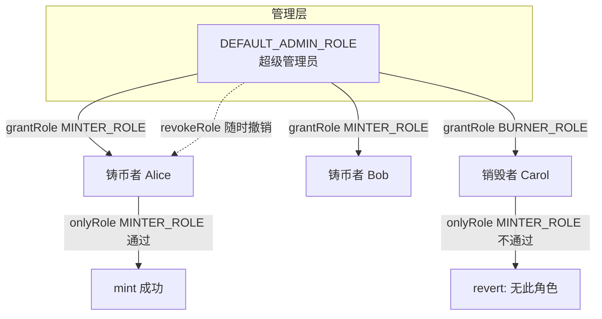

# 03 · 角色权限 AccessControl（Access Control / RBAC）

> AccessControl 用「角色（Role）」做细粒度权限：一种角色可有多个成员，一个合约可有多种角色，比 Ownable 灵活得多。

## 📖 知识讲解

`Ownable` 只有一个 owner，太粗。真实项目常需要：铸币者（minter）一批、销毁者（burner）一批、暂停者（pauser）一批……这就是 **RBAC（基于角色的访问控制）**。

- **角色 = 一个 `bytes32` 常量**，惯例 `keccak256("MINTER_ROLE")`。
- `DEFAULT_ADMIN_ROLE`（值为 `bytes32(0)`）是「超级管理员」，默认是所有角色的**管理员角色**，能 `grantRole` / `revokeRole` 任何角色。
- `onlyRole(ROLE)` 修饰器：调用者必须持有该角色，否则 revert（`AccessControlUnauthorizedAccount`）。
- 核心 API：
  - `grantRole(role, account)` / `revokeRole(role, account)`：授予/撤销（默认由 admin 调）。
  - `hasRole(role, account)`：查询。
  - `renounceRole(role, account)`：自己主动放弃某角色。
  - `_grantRole(...)`：**internal**，用于在构造函数里初始化角色（不做权限检查）。

## 🔄 流程图 / 原理图



## 💻 代码说明

`MyAccessControl.sol` 要点：

```solidity
bytes32 public constant MINTER_ROLE = keccak256("MINTER_ROLE");

constructor(address admin) {
    _grantRole(DEFAULT_ADMIN_ROLE, admin);   // 超级管理员
    _grantRole(MINTER_ROLE, admin);          // 顺带给初始铸币权
}

function mint(uint256 amount) public onlyRole(MINTER_ROLE) { totalMinted += amount; }
```

- 用常量定义 `MINTER_ROLE` / `BURNER_ROLE`。
- 构造函数用 `_grantRole` 给 admin 分配超级管理员角色。
- 业务函数用 `onlyRole(...)` 上锁。

## ▶️ 运行方式

1. Remix 编译 `MyAccessControl.sol`（0.8.20+）。
2. Deploy：`admin` 填账户 A → Deploy。
3. 账户 A 调 `mint(100)` → 成功（A 有 MINTER_ROLE）。
4. 切到账户 B 调 `mint(100)` → **revert**。
5. 用 A 调 `grantRole(MINTER_ROLE_值, B地址)`：
   - `MINTER_ROLE` 的 bytes32 值：先调只读函数 `MINTER_ROLE()` 复制返回值粘进去。
6. 再切 B 调 `mint(100)` → 现在成功。
7. 用 A 调 `revokeRole(MINTER_ROLE_值, B地址)` 撤销，B 再 mint 又会失败。

## ⚠️ 常见坑 / 安全提示

- **别把 `DEFAULT_ADMIN_ROLE` 随便给人**：它能增删所有角色，等同最高权限。
- `grantRole` 只能由「该角色的管理员角色」调用；想改某角色由谁管理，用 `_setRoleAdmin`。
- 忘了在构造函数给自己 `DEFAULT_ADMIN_ROLE` → 部署后谁都没法授权，合约「锁死」。
- 大型项目里超级管理员同样建议托管到**多签**。
- 教学用途，未经审计，勿直接上主网。

## 🔗 官方文档

- Access Control 指南：https://docs.openzeppelin.com/contracts/5.x/access-control
- AccessControl API：https://docs.openzeppelin.com/contracts/5.x/api/access#AccessControl
