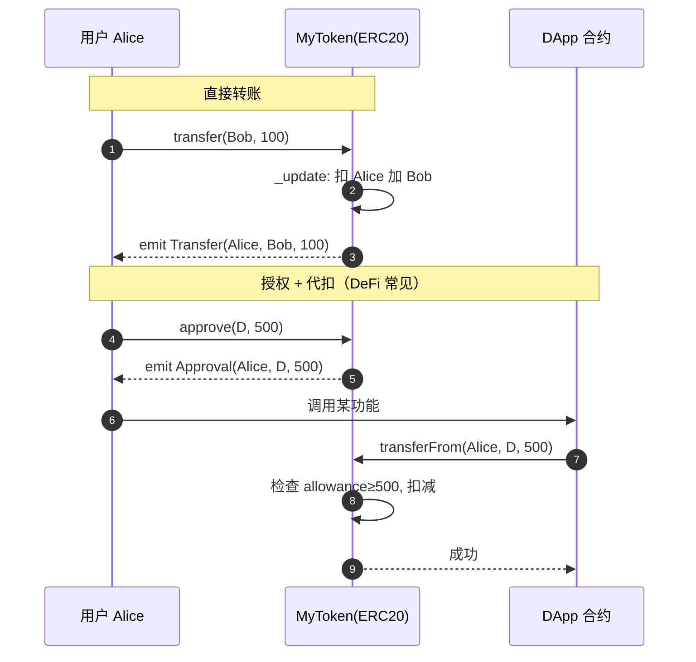

# 04 · 发行 ERC20 代币（ERC20 Token）

> 继承 OpenZeppelin 的 `ERC20`，几行代码就能发行一个符合标准、可在钱包/交易所识别的同质化代币。

## 📖 知识讲解

**ERC20** 是以太坊同质化代币（Fungible Token）标准：每一枚代币完全等价，可用于货币、积分、治理票、质押等。标准规定了一组接口：`totalSupply` / `balanceOf` / `transfer` / `approve` / `transferFrom` / `allowance` 及 `Transfer` / `Approval` 事件。OZ 把这些**全部实现好了**，你只管继承。

关键概念：

- **decimals（小数位）**：默认 18，**仅影响显示**。链上一切计算都用整数——「1.5 枚」实际存的是 `1.5 * 10^18`。
- **`_mint(to, amount)`**：内部铸造函数，增加某地址余额与总供应量。通常在构造函数或受权限保护的 `mint` 里调用。
- **approve / transferFrom 双步授权**：A 先 `approve(合约, 额度)`，合约再 `transferFrom(A, ...)` 把 A 的币转走——这是 DeFi 交互的基础，也是**钓鱼重灾区**。

## 🔄 流程图 / 原理图



## 💻 代码说明

`MyToken.sol` 要点：

```solidity
contract MyToken is ERC20, ERC20Burnable, Ownable {
    constructor(address initialOwner)
        ERC20("MyToken", "MTK")
        Ownable(initialOwner)
    { _mint(initialOwner, 1_000_000 * 10 ** decimals()); }  // 初始 100 万枚

    function mint(address to, uint256 amount) external onlyOwner { _mint(to, amount); }
}
```

- 继承 `ERC20`（核心）+ `ERC20Burnable`（可销毁）+ `Ownable`（增发权限）。
- 构造函数设名称/符号并给 owner 铸初始供应量。
- `mint` 用 `onlyOwner` 保护。想要「固定总量币」就删掉 mint 函数。

## ▶️ 运行方式

1. Remix 编译 `MyToken.sol`（0.8.20+，会自动拉 OZ 依赖）。
2. Deploy：`initialOwner` 填账户 A → Deploy。
3. `balanceOf(A)` → `1000000000000000000000000`（= 100 万 × 10^18）。
4. 调 `transfer(B地址, 1000000000000000000)`（转 1 枚给 B）→ 查 `balanceOf(B)`。
5. 调 `mint(A, 500 * 10^18)` 增发；用 `burn(...)` 销毁自己的币。
6. 想在 MetaMask 里看到它：把合约地址「导入代币」即可（测试网）。

## ⚠️ 常见坑 / 安全提示

- **金额要乘 `10^decimals`**：想给别人 5 枚，得传 `5 * 10**18`，直接传 `5` 只是 5 个最小单位（几乎为 0）。
- **无限授权风险**：给 DApp `approve` 一个天文数字很方便但危险——恶意/被黑的合约能把你的币全转走。建议按需授权，或定期用区块浏览器「Revoke」清理。
- 转账给**合约地址**若对方不处理代币，币可能被永久锁住（ERC20 无 safeTransfer 到合约的接收回调）。
- 教学用途，未经审计，勿直接上主网。

## 🔗 官方文档

- ERC20 指南：https://docs.openzeppelin.com/contracts/5.x/erc20
- ERC20 API（含 Burnable/Permit/Pausable 扩展）：https://docs.openzeppelin.com/contracts/5.x/api/token/erc20
