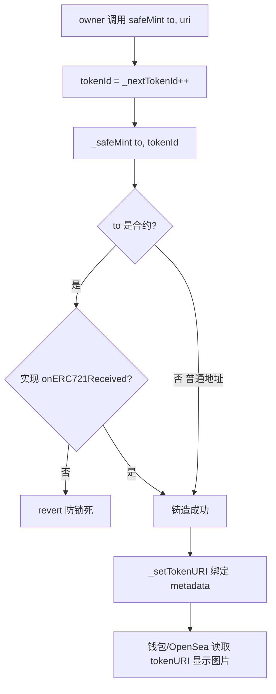

# 05 · 发行 NFT（ERC721）

> 继承 `ERC721` 发行非同质化代币：每个 tokenId 独一无二，可承载头像、艺术品、门票、游戏道具等。

## 📖 知识讲解

**ERC721** 是 NFT（Non-Fungible Token）标准：不同于 ERC20 每枚等价，ERC721 每个 `tokenId` 都是唯一的，不可分割（**没有 decimals**）。核心接口：`ownerOf(tokenId)` / `balanceOf(owner)` / `safeTransferFrom` / `approve` / `setApprovalForAll` / `tokenURI(tokenId)`。

常用扩展：

- **`ERC721URIStorage`**：为**每个 tokenId 单独**存一条 metadata 链接（`_setTokenURI`），适合每个 NFT 内容不同的场景。
- **`ERC721Enumerable`**：支持链上枚举（`totalSupply`、按索引取 tokenId），但更费 gas。

关键方法：

- **`_safeMint(to, tokenId)`** vs `_mint`：`_safeMint` 会检查接收方（若是合约）是否实现 `onERC721Received`，**防止 NFT 转进不会处理它的合约而永久锁死**。铸给用户或转给合约都优先用 safe 版本。
- **`tokenURI(tokenId)`**：返回该 NFT 的 metadata JSON 地址（通常是 `ipfs://...`），钱包/市场据此显示图片和属性。

## 🔄 流程图 / 原理图



## 💻 代码说明

`MyNFT.sol` 要点：

```solidity
contract MyNFT is ERC721URIStorage, Ownable {
    uint256 private _nextTokenId;
    constructor(address initialOwner) ERC721("MyNFT", "MNFT") Ownable(initialOwner) {}

    function safeMint(address to, string memory uri) public onlyOwner returns (uint256) {
        uint256 tokenId = _nextTokenId++;
        _safeMint(to, tokenId);
        _setTokenURI(tokenId, uri);
        return tokenId;
    }
}
```

- 用自增 `_nextTokenId` 分配编号，避免撞号。
- `_safeMint` + `_setTokenURI` 一次铸造并绑定 metadata。
- v5 中 `ERC721URIStorage` 已正确重写 `tokenURI`/`supportsInterface`，与 `Ownable` 组合无冲突。

## ▶️ 运行方式

1. Remix 编译 `MyNFT.sol`（0.8.20+）。
2. Deploy：`initialOwner` 填账户 A → Deploy。
3. 调 `safeMint(B地址, "ipfs://bafy.../1.json")` → 铸出 tokenId `0` 给 B。
4. 验证：`ownerOf(0)` 返回 B；`tokenURI(0)` 返回你填的链接；`balanceOf(B)` = 1。
5. 用 B 调 `transferFrom(B, C, 0)` 把它转给 C（或用 `safeTransferFrom`）。

> metadata JSON 建议格式：`{ "name": "...", "description": "...", "image": "ipfs://.../1.png" }`。

## ⚠️ 常见坑 / 安全提示

- **转给合约用 `safeTransferFrom`**：普通 `transferFrom` 不检查接收方，NFT 可能被锁死。
- `tokenURI` 只存链接，**图片本身在链下**（IPFS/Arweave/中心化服务器）。若用中心化 URL，服务器挂了图就没了——尽量用 IPFS。
- `setApprovalForAll(operator, true)` 会授权 operator 转移你**名下全部** NFT，是钓鱼重灾区，谨慎签署。
- 教学用途，未经审计，勿直接上主网。

## 🔗 官方文档

- ERC721 指南：https://docs.openzeppelin.com/contracts/5.x/erc721
- ERC721 API（含 URIStorage/Enumerable 扩展）：https://docs.openzeppelin.com/contracts/5.x/api/token/erc721
