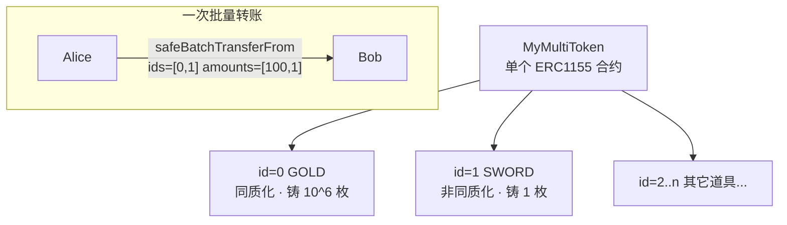

# 06 · 多代币标准（ERC1155）

> 一个合约同时管理**多种**代币，每种用一个 id 区分，既能同质化（金币）也能非同质化（唯一装备），还能批量转账，游戏/道具场景首选。

## 📖 知识讲解

**ERC1155** 是「多代币（Multi-Token）」标准，兼具 ERC20 和 ERC721 的能力：

- **一个合约、多种代币**：用 `id` 区分。`id=0` 可以是金币（同质化，铸 100 万枚），`id=1` 可以是唯一神剑（非同质化，只铸 1 枚）。
- **批量操作**：`safeBatchTransferFrom`、`_mintBatch` 能一次转/铸多种代币，**大幅省 gas**（对比 ERC721 一个个转）。
- **共用一个 URI 模板**：构造函数传入含 `{id}` 占位符的 URI，如 `https://game.example/api/item/{id}.json`，客户端查某 id 时把 `{id}` 换成其 16 进制编号。

核心接口：`balanceOf(account, id)`、`balanceOfBatch`、`safeTransferFrom(from,to,id,amount,data)`、`safeBatchTransferFrom`、`setApprovalForAll`。铸造用 `_mint(to, id, amount, data)` / `_mintBatch(...)`。

> 接收合约需继承 `ERC1155Holder` 才能安全接收，否则 safe 转账会 revert（防锁死）。

## 🔄 流程图 / 原理图



## 💻 代码说明

`MyMultiToken.sol` 要点：

```solidity
contract MyMultiToken is ERC1155, Ownable {
    uint256 public constant GOLD = 0;
    uint256 public constant SWORD = 1;
    constructor(address initialOwner)
        ERC1155("https://game.example/api/item/{id}.json")
        Ownable(initialOwner) {}

    function mint(address to, uint256 id, uint256 amount, bytes memory data) public onlyOwner {
        _mint(to, id, amount, data);
    }
    function mintBatch(address to, uint256[] memory ids, uint256[] memory amounts, bytes memory data)
        public onlyOwner { _mintBatch(to, ids, amounts, data); }
}
```

- 用常量给 id 起名（GOLD / SWORD）。
- `mint` 铸单种，`mintBatch` 一次铸多种。
- `data` 参数一般传空 `0x`（`[]`）。

## ▶️ 运行方式

1. Remix 编译 `MyMultiToken.sol`（0.8.20+）。
2. Deploy：`initialOwner` 填账户 A → Deploy。
3. 铸金币：`mint(A, 0, 1000000, "0x")` → `balanceOf(A, 0)` = 1000000。
4. 铸神剑：`mint(A, 1, 1, "0x")` → `balanceOf(A, 1)` = 1。
5. 批量铸：`mintBatch(B, [0,1], [500,1], "0x")`。
6. 批量查：`balanceOfBatch([B,B], [0,1])` 返回 `[500, 1]`。

> Remix 里数组参数写法：`[0,1]`；bytes 空值写 `0x` 或 `[]`。

## ⚠️ 常见坑 / 安全提示

- **同质/非同质由「铸造数量」决定**：某 id 铸多枚即同质化，只铸 1 枚即 NFT，标准本身不区分。
- 转账给合约：对方须实现 `onERC1155Received` / `onERC1155BatchReceived`（继承 `ERC1155Holder` 最简单），否则 safe 转账 revert。
- `setApprovalForAll` 同样是「一次授权全部代币」，谨慎。
- URI 里的 `{id}` 是**小写 16 进制、补齐 64 位**的规范格式，接口需按标准返回。
- 教学用途，未经审计，勿直接上主网。

## 🔗 官方文档

- ERC1155 指南：https://docs.openzeppelin.com/contracts/5.x/erc1155
- ERC1155 API：https://docs.openzeppelin.com/contracts/5.x/api/token/erc1155
