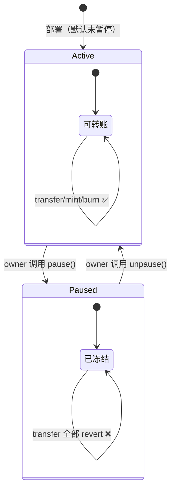

# 07 · 可暂停 Pausable（Pausable）

> 给合约装一个「急停开关」：一旦发现漏洞或被攻击，管理员一键冻结关键操作（如转账），争取止损时间。

## 📖 知识讲解

`Pausable` 维护一个布尔状态 `paused`，并提供两个修饰器：

- `whenNotPaused`：只有**未暂停**时才能执行（保护转账等正常业务）。
- `whenPaused`：只有**已暂停**时才能执行（少见，如「紧急提款」）。

内部函数 `_pause()` / `_unpause()` 切换状态（通常包在 `onlyOwner` 的 `pause()`/`unpause()` 里）。

本模块用 **`ERC20Pausable` 扩展**演示：它内部继承 `Pausable`，并在转账钩子里加了 `whenNotPaused`，所以暂停后**所有转账/mint/burn 都会 revert**。

### v5 关键点

1. **路径变了**：`Pausable` 从 v4 的 `security/Pausable.sol` 移到了 **`utils/Pausable.sol`**。
2. **钩子统一成 `_update`**：v5 把 ERC20 的转账逻辑收敛到一个 `_update(from,to,value)`。当同时继承 `ERC20` 和 `ERC20Pausable` 时，两者都定义了 `_update`，**必须显式重写**并标注 `override(ERC20, ERC20Pausable)`，再 `super._update(...)` 串起调用链——暂停检查就在这条链里。

## 🔄 流程图 / 原理图



## 💻 代码说明

`MyPausableToken.sol` 要点：

```solidity
contract MyPausableToken is ERC20, ERC20Pausable, Ownable {
    function pause()   public onlyOwner { _pause(); }
    function unpause() public onlyOwner { _unpause(); }

    // 关键：解决 ERC20 与 ERC20Pausable 的 _update 冲突
    function _update(address from, address to, uint256 value)
        internal override(ERC20, ERC20Pausable)
    { super._update(from, to, value); }
}
```

- `pause`/`unpause` 用 `onlyOwner` 保护。
- 重写 `_update` 是**编译必需**，否则报「Derived contract must override function _update」。

## ▶️ 运行方式

1. Remix 编译 `MyPausableToken.sol`（0.8.20+）。
2. Deploy：`initialOwner` 填账户 A → Deploy。
3. 正常转账：`transfer(B, 10 * 10^18)` → 成功。
4. owner 调 `pause()` → `paused()` 返回 `true`。
5. 再次 `transfer(B, ...)` → **revert**（`EnforcedPause`）。
6. owner 调 `unpause()` → 转账恢复正常。

## ⚠️ 常见坑 / 安全提示

- **忘记重写 `_update`** 是 v5 最典型的编译错误，务必带 `override(ERC20, ERC20Pausable)`。
- 暂停是**中心化能力**：owner 能随时冻结所有人转账。对用户是把双刃剑——止损 vs. 信任成本，务必在项目文档披露，owner 建议用多签。
- 暂停只影响加了 `whenNotPaused` 的路径；没保护的函数照常能调，别以为「暂停 = 全冻结」。
- 教学用途，未经审计，勿直接上主网。

## 🔗 官方文档

- Pausable API：https://docs.openzeppelin.com/contracts/5.x/api/utils#Pausable
- ERC20Pausable API：https://docs.openzeppelin.com/contracts/5.x/api/token/erc20#ERC20Pausable
