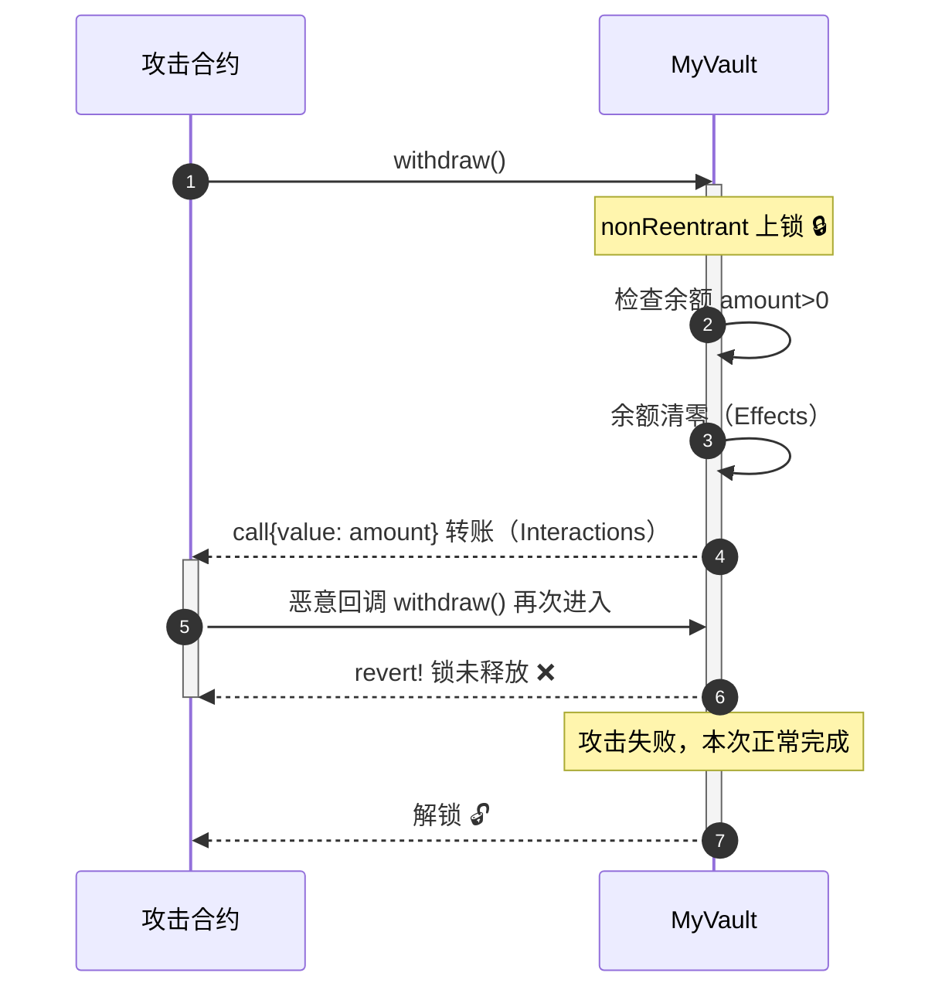

# 08 · 防重入 ReentrancyGuard（Reentrancy Guard）

> 用 `nonReentrant` 修饰器给函数加锁，防住以太坊史上最著名的攻击方式——重入攻击（The DAO 事件的元凶）。

## 📖 知识讲解

**重入攻击（Reentrancy）**：合约用 `call` 给外部地址转 ETH 时，会把控制权交给对方。如果此时**余额还没清零**，恶意合约的 `receive()/fallback()` 就能反过来再调一次 `withdraw`，如此循环，把金库掏空。

两道防线（本模块都用上）：

1. **`ReentrancyGuard` + `nonReentrant`**：内部用一个状态变量当「锁」。进入函数上锁，退出解锁；执行期间若被重入，会 revert（`ReentrancyGuardReentrantCall`）。
2. **Checks-Effects-Interactions（检查—生效—交互）顺序**：先做检查，再改状态（清零余额），**最后**才与外部交互（转账）。即使没锁，先清零也能挡住大部分重入。

> v5 关键点：`ReentrancyGuard` 从 v4 的 `security/` 移到了 **`utils/ReentrancyGuard.sol`**。

## 🔄 流程图 / 原理图



## 💻 代码说明

`MyVault.sol` 要点：

```solidity
contract MyVault is ReentrancyGuard {
    mapping(address => uint256) private _balances;

    function deposit() external payable { _balances[msg.sender] += msg.value; }

    function withdraw() external nonReentrant {
        uint256 amount = _balances[msg.sender];
        require(amount > 0, "no balance");
        _balances[msg.sender] = 0;                        // Effects 先清零
        (bool ok, ) = msg.sender.call{value: amount}(""); // Interactions 最后转账
        require(ok, "transfer failed");
    }
}
```

- `withdraw` 加 `nonReentrant`（锁）。
- 严格按 检查 → 清零 → 转账 顺序（即使去掉锁也较安全，双保险）。

## ▶️ 运行方式

1. Remix 编译 `MyVault.sol`（0.8.20+）。
2. Deploy（无构造参数）。
3. 存款：在部署面板顶部 **VALUE** 填 `1` 选 **Ether**，调 `deposit()`。
4. `balanceOf(你的地址)` → `1000000000000000000`（1 ETH）。
5. 调 `withdraw()` → ETH 退回，余额清零。
6. （进阶）自己写个恶意合约在 `receive()` 里回调 `withdraw`，会看到攻击被 revert 挡下。

## ⚠️ 常见坑 / 安全提示

- **顺序 > 锁**：哪怕加了 `nonReentrant`，也永远遵循 Checks-Effects-Interactions；两者叠加最稳。
- **跨函数重入**：锁只保护单个函数。若 `withdraw` 和 `claim` 共享状态却各自独立，攻击者可能在 `withdraw` 内重入 `claim`——对相关函数都加 `nonReentrant` 或共享同一把锁。
- 用 `call` 转账（而非已过时的 `transfer/send`）时更要警惕，因为 `call` 转发全部 gas，给了攻击者执行空间。
- 教学用途，未经审计，勿直接上主网。

## 🔗 官方文档

- ReentrancyGuard API：https://docs.openzeppelin.com/contracts/5.x/api/utils#ReentrancyGuard
- 安全最佳实践：https://docs.openzeppelin.com/contracts/5.x/
