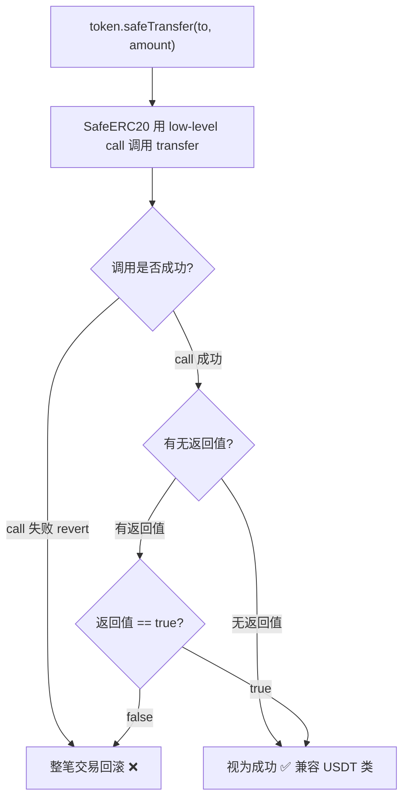

# 09 · 安全转账 SafeERC20（SafeERC20）

> 用 `safeTransfer` / `safeTransferFrom` 包装 ERC20 调用，兼容那些「不返回值 / 失败不 revert」的不规范代币，杜绝「悄悄失败」。

## 📖 知识讲解

ERC20 标准要求 `transfer`/`approve` 返回 `bool`，但现实很骨感：

- **有的代币不返回值**（如老版 USDT）：直接 `token.transfer(...)` 在严格 ABI 解码下会 revert 或行为诡异。
- **有的失败不 revert 而返回 `false`**：如果你不检查返回值，就会把「失败」当「成功」，酿成资损。

**`SafeERC20`** 是一个库（library），用 `using SafeERC20 for IERC20` 把安全方法「附加」到 `IERC20` 类型上：

- `safeTransfer` / `safeTransferFrom`：兼容「无返回值」代币；返回 `false` 或调用失败时**立即 revert**，绝不静默失败。
- `forceApprove`：兼容「必须先把授权清零、再设新值」的代币（USDT 就是这种），一步搞定。
- `safeIncreaseAllowance` / `safeDecreaseAllowance`：安全增减授权。

> v5 中已移除 v4 的 `safeApprove`，统一用 `forceApprove` / `safeIncreaseAllowance`。

## 🔄 流程图 / 原理图



## 💻 代码说明

`MySafeTransfer.sol` 要点：

```solidity
contract MySafeTransfer {
    using SafeERC20 for IERC20;                       // 给 IERC20 附加安全方法

    function pull(IERC20 token, address from, uint256 amount) external {
        token.safeTransferFrom(from, address(this), amount);   // 需 from 先 approve 本合约
    }
    function push(IERC20 token, address to, uint256 amount) external {
        token.safeTransfer(to, amount);
    }
    function approveSpender(IERC20 token, address spender, uint256 amount) external {
        token.forceApprove(spender, amount);          // 兼容 USDT 式「必须先清零」
    }
}
```

- `using SafeERC20 for IERC20` 是关键，之后就能写 `token.safeTransfer(...)`。
- `pull` 前提：`from` 已对本合约 `approve` 足额。

## ▶️ 运行方式

本模块需要**一个 ERC20 代币**配合，推荐串联模块 04：

1. 先部署模块 04 的 `MyToken`（记地址为 `TKN`，owner 为账户 A，A 持有全部币）。
2. 部署本模块 `MySafeTransfer`（记地址为 `SAFE`）。
3. 账户 A 在 `TKN` 上调 `approve(SAFE, 100 * 10^18)`，授权 SAFE 代扣。
4. 调 `SAFE.pull(TKN地址, A地址, 100 * 10^18)` → 把 100 枚从 A 拉进 SAFE 合约；查 `TKN.balanceOf(SAFE)` = 100 枚。
5. 调 `SAFE.push(TKN地址, B地址, 40 * 10^18)` → 从 SAFE 安全转 40 枚给 B。

## ⚠️ 常见坑 / 安全提示

- **凡是与外部/未知 ERC20 交互，一律用 SafeERC20**，别直接 `transfer`/`transferFrom`——这是 DeFi 集成的铁律。
- `pull`（内部用 `transferFrom`）前，对方必须先 `approve`，否则 revert。
- `forceApprove` 会直接覆盖旧额度；若担心「授权竞态」，用 `safeIncreaseAllowance` / `safeDecreaseAllowance`。
- SafeERC20 解决「调用安全」，但不防「恶意代币逻辑」（如转账里埋后门）。对接不明代币仍需评估。
- 教学用途，未经审计，勿直接上主网。

## 🔗 官方文档

- SafeERC20 API：https://docs.openzeppelin.com/contracts/5.x/api/token/erc20#SafeERC20
- ERC20 工具集：https://docs.openzeppelin.com/contracts/5.x/api/token/erc20#utilities
