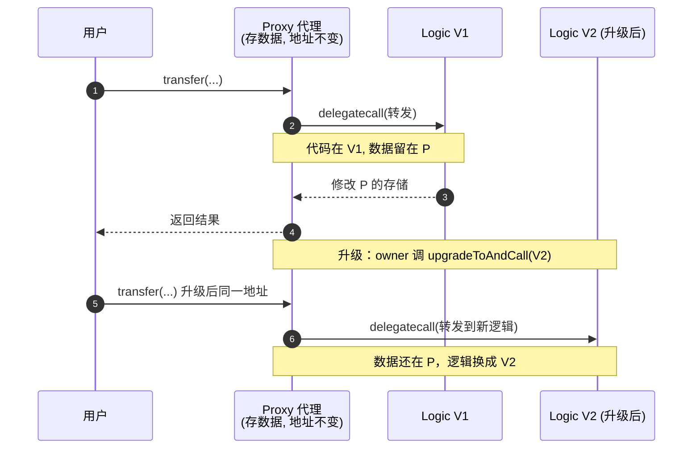

# 10 · 可升级合约与 UUPS 代理（Upgradeable / UUPS Proxy）

> 合约一旦部署字节码不可改。用「代理模式」把**数据**和**逻辑**拆开，就能在保留数据、保持地址不变的前提下升级逻辑——UUPS 是当前推荐方案。

## 📖 知识讲解

### 为什么需要代理

普通合约部署后代码永久不可变，改 bug/加功能只能重新部署，但那样**地址变了、数据也丢了**。代理模式解决之：

- **Proxy（代理合约）**：用户始终交互的地址，**存储所有数据（state）**。它自己没有业务逻辑，收到调用后用 `delegatecall` 转发给逻辑合约。
- **Implementation（逻辑合约）**：只放业务代码，**不存数据**。升级 = 让 Proxy 指向一个新的逻辑合约地址。
- **`delegatecall` 的精髓**：逻辑合约的代码在**代理的存储上下文**里执行，所以数据始终留在代理里。

### Transparent vs UUPS

| | Transparent 透明代理 | **UUPS**（推荐） |
|---|---|---|
| 升级逻辑放哪 | 代理合约里 | **逻辑合约里**（`_authorizeUpgrade`） |
| 部署成本 | 较高（代理更重） | 更低、更省 gas |
| 关键要求 | — | 逻辑合约必须实现升级授权，否则不可升级 |

### UUPS 的三条铁律

1. **不能用 constructor 初始化状态**（构造函数只在逻辑合约部署时跑，而数据在代理里）→ 改用 `initialize()` + `initializer` 修饰器，且**只能调一次**；父合约用 `__Xxx_init()` 初始化。
2. 逻辑合约的 constructor 里调 `_disableInitializers()`，**防止有人直接对逻辑合约调 `initialize` 抢占**。
3. 实现 `_authorizeUpgrade(address)` 并加权限（这里 `onlyOwner`），否则**任何人都能升级** = 灾难。

> 用的是独立包 **`@openzeppelin/contracts-upgradeable`**（每个合约带 `Upgradeable` 后缀）。

## 🔄 流程图 / 原理图



## 💻 代码说明

`MyTokenUpgradeable.sol` 要点：

```solidity
contract MyTokenUpgradeable is
    Initializable, ERC20Upgradeable, OwnableUpgradeable, UUPSUpgradeable {

    /// @custom:oz-upgrades-unsafe-allow constructor
    constructor() { _disableInitializers(); }        // 铁律 2

    function initialize(address initialOwner) public initializer {   // 铁律 1
        __ERC20_init("UpgradeableToken", "UPT");
        __Ownable_init(initialOwner);
        __UUPSUpgradeable_init();
        _mint(initialOwner, 1000 * 10 ** decimals());
    }

    function _authorizeUpgrade(address) internal override onlyOwner {} // 铁律 3
}
```

- 继承全部换成 `...Upgradeable` 版本。
- `initialize` 里用 `__Xxx_init` 逐个初始化父合约。
- `_authorizeUpgrade` 用 `onlyOwner` 锁住升级权。

## ▶️ 运行方式

> 升级的完整流程一般用 Hardhat + `@openzeppelin/hardhat-upgrades` 插件（自动部署代理并做存储安全校验）。在 Remix 里可用 **OpenZeppelin 官方 Remix 插件**或手动部署 `ERC1967Proxy` 演示概念：

**Remix 概念演示（手动）：**
1. 编译 `MyTokenUpgradeable.sol`（0.8.20+，会拉取 contracts-upgradeable 包）。
2. 先部署逻辑合约 `MyTokenUpgradeable`（无参构造）→ 记地址 `IMPL`。
3. 部署 `@openzeppelin/contracts/proxy/ERC1967/ERC1967Proxy.sol`，构造参数：
   - `implementation` = `IMPL`
   - `data` = `initialize(你的地址)` 的 ABI 编码（可用 Remix 的「encode」或 Logic 合约面板生成 calldata）。
4. 在 Remix 用 **"At Address"** 以 `MyTokenUpgradeable` 的 ABI 挂到**代理地址**上交互——此时 `balanceOf(你)` = 1000 枚，数据存在代理里。
5. 升级：部署一个新逻辑合约 V2，用 owner 调代理的 `upgradeToAndCall(V2, 0x)`，地址与数据不变、逻辑已更新。

**推荐生产做法（Hardhat）：**
```js
const proxy = await upgrades.deployProxy(MyTokenUpgradeable, [owner], { kind: 'uups' });
// 升级：await upgrades.upgradeProxy(proxy, MyTokenUpgradeableV2);
```

## ⚠️ 常见坑 / 安全提示

- **存储布局只能追加**：升级时绝不能删除/改类型/调换已有状态变量顺序，否则「存储错位」污染数据。生产务必用 OZ Upgrades 插件自动校验。
- **`_authorizeUpgrade` 忘加权限 = 谁都能升级**，等于把合约拱手让人。
- 逻辑合约的 constructor 必须 `_disableInitializers()`，否则可被人抢先 `initialize`。
- 别在可升级合约里用**普通** constructor 设状态，也别用 `immutable`/`constant` 存本应可变的数据。
- 升级权是巨大的中心化权力，建议交多签 + 时间锁（Timelock）。
- 教学用途，未经审计，勿直接上主网。

## 🔗 官方文档

- Upgradeable 合约文档：https://docs.openzeppelin.com/contracts/5.x/upgradeable
- 代理与 UUPS 详解：https://docs.openzeppelin.com/contracts/5.x/api/proxy
- Upgrades Plugins（Hardhat/Foundry）：https://docs.openzeppelin.com/upgrades-plugins/
