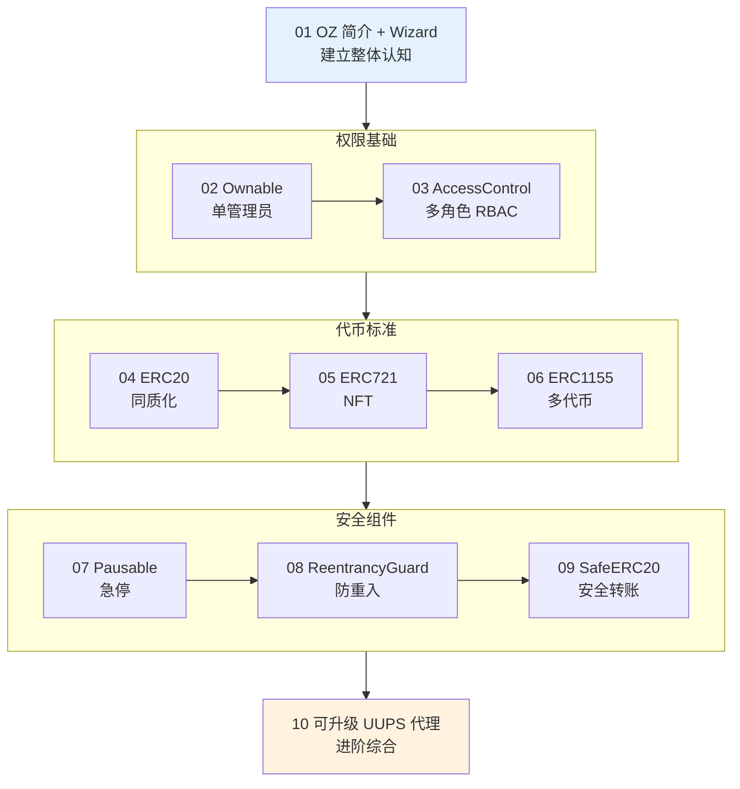

# 05 · OpenZeppelin 标准合约库（OpenZeppelin Contracts v5.x）

> 本工程带你「站在巨人肩膀上」写合约：通过继承 OpenZeppelin 这套久经审计的标准库，用最少代码实现代币、NFT、权限、防重入、可升级等常见需求，全部可在 Remix 免安装编译部署。

## 📖 OpenZeppelin 是什么

OpenZeppelin Contracts（OZ）是以太坊生态**最广泛使用、久经实战审计**的智能合约标准库。ERC20/721/1155 代币、Ownable/AccessControl 权限、Pausable/ReentrancyGuard 安全组件……这些「地基」它都实现好了，你只需**继承 + 少量定制**，既省 90% 样板代码，又大幅降低漏洞风险。

- **版本**：本工程统一使用 **v5.x**（当前主流稳定版），并已对照[官方文档](https://docs.openzeppelin.com/contracts/5.x/)核对语法。
- **设计哲学**：组合（composition）——每种能力是一个可继承模块，按需拼装。
- **在 Remix 直接用**：Remix 在线 IDE 原生支持 `import "@openzeppelin/contracts/..."` 的 npm 路径，自动拉取源码，**无需本地安装**。

### v5 vs v4 三大必知变化

| 变化 | 说明 | 影响模块 |
|---|---|---|
| `Ownable(initialOwner)` | 构造函数强制显式传 owner（v4 默认部署者） | 02、04~07、10 |
| `security/` → `utils/` | `Pausable`、`ReentrancyGuard` 移动了路径 | 07、08 |
| 钩子统一为 `_update` | 取代 v4 的 `_beforeTokenTransfer` 等 | 07 |

## 🗂️ 模块索引

| 模块 | 知识点 | 核心合约 / 用法 | 关键 v5 语法 |
|---|---|---|---|
| [01-intro-and-wizard](./01-intro-and-wizard/) | OZ 简介 + Contracts Wizard | `WizardToken.sol` | npm import、Wizard 生成 |
| [02-ownable](./02-ownable/) | 所有权 Ownable | `MyOwnable.sol` | `Ownable(initialOwner)`、`onlyOwner` |
| [03-access-control-roles](./03-access-control-roles/) | 角色权限 RBAC | `MyAccessControl.sol` | `AccessControl`、`onlyRole`、`_grantRole` |
| [04-erc20](./04-erc20/) | 发行 ERC20 代币 | `MyToken.sol` | `ERC20`、`_mint`、decimals |
| [05-erc721](./05-erc721/) | 发行 NFT | `MyNFT.sol` | `ERC721URIStorage`、`_safeMint` |
| [06-erc1155](./06-erc1155/) | 多代币标准 | `MyMultiToken.sol` | `ERC1155`、`_mint`/`_mintBatch` |
| [07-pausable](./07-pausable/) | 可暂停急停开关 | `MyPausableToken.sol` | `ERC20Pausable`、重写 `_update` |
| [08-reentrancy-guard](./08-reentrancy-guard/) | 防重入攻击 | `MyVault.sol` | `nonReentrant`、CEI 顺序 |
| [09-safe-erc20](./09-safe-erc20/) | 安全转账 | `MySafeTransfer.sol` | `using SafeERC20 for IERC20` |
| [10-upgradeable-proxy](./10-upgradeable-proxy/) | 可升级 / UUPS 代理 | `MyTokenUpgradeable.sol` | `Initializable`、`UUPSUpgradeable` |

## 🧭 学习路线

**建议节奏**：01 打底 → 02/03 学会「谁能调」→ 04~06 掌握三大代币 → 07~09 补齐安全底线 → 10 挑战可升级架构（综合前面所有知识）。

## ▶️ Remix 统一运行说明

所有 `.sol` 合约均可在 [Remix](https://remix.ethereum.org) 免安装运行：

1. 打开 Remix，在 `contracts/` 下新建 `.sol` 文件，粘贴对应模块合约内容。
2. **Solidity Compiler** 面板：编译器版本选 `0.8.20` 或更高 → 点 **Compile**。
   （Remix 会自动从 npm 拉取 `@openzeppelin/contracts` 依赖，首次稍等几秒。）
3. **Deploy & Run Transactions** 面板：
   - **Environment** 选 **Remix VM (Cancun)**（本地沙盒，免费测试账户，零风险）。
   - 若构造函数需要 `initialOwner`，从账户列表复制第 1 个地址填入。
   - 点 **Deploy**。
4. 在下方 **Deployed Contracts** 展开，点各函数按钮调用；橙色按钮会发交易，蓝色为只读查询。
5. 各模块 README 的「运行方式」有针对性的分步验证步骤（含预期返回值）。

> 进阶（模块 10 的升级演示）建议改用 Hardhat + `@openzeppelin/hardhat-upgrades` 插件，能自动部署代理并做存储安全校验。

## ⚠️ 安全底线（全工程通用）

- **只用测试网 / Remix VM**，绝不使用主网真实资产。
- **绝不在代码/仓库出现真实私钥、助记词、API Key**。
- 涉及 `approve` / `setApprovalForAll` 的操作说明钓鱼与无限授权风险。
- 所有合约标注「**教学用途，未经审计，勿直接上主网**」；真实上线前需专业审计。

## 🔗 官方文档

- OpenZeppelin Contracts v5.x：https://docs.openzeppelin.com/contracts/5.x/
- Contracts Wizard：https://wizard.openzeppelin.com/
- API 参考总目录：https://docs.openzeppelin.com/contracts/5.x/api/access
- Remix IDE：https://remix.ethereum.org
