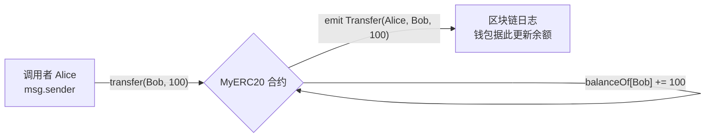
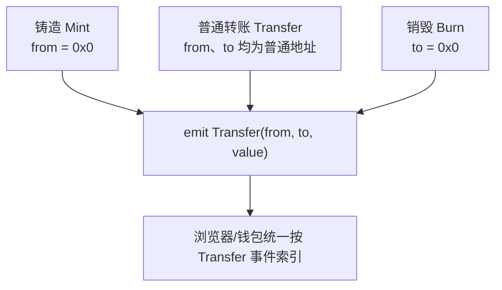

# 01 · ERC-20 同质化代币（ERC-20 Fungible Token）

> ERC-20 是以太坊上「可互换代币」的通用接口标准。它规定了一组固定的函数和事件，让钱包、交易所、DeFi 协议可以用**同一套代码**处理成千上万种不同的代币（USDT、DAI、UNI……）。

## 📖 知识讲解

### 什么是「同质化」（Fungible）
同质化 = 每一个代币单位完全等价、可互换。你手里的 1 个 USDT 和我手里的 1 个 USDT 没有任何区别，就像人民币的两张 100 元钞票等价。这与 NFT（非同质化，每个都独一无二）相反。

### ERC-20 为什么重要
在 ERC-20 出现之前，每个代币都各写各的接口，钱包要为每种代币单独适配。ERC-20（2015 年提出，EIP-20 定稿）统一了接口，只要一个代币实现了这套标准，任何支持 ERC-20 的钱包/DApp 都能立刻识别它。这就是「标准」的力量。

### ERC-20 的 6 个核心方法 + 2 个事件

| 类型 | 签名（对照 EIP-20 原文） | 作用 |
|------|--------------------------|------|
| 查询 | `totalSupply() → uint256` | 代币总发行量 |
| 查询 | `balanceOf(address) → uint256` | 查某地址余额 |
| 查询 | `allowance(address owner, address spender) → uint256` | 查 owner 授权给 spender 的剩余额度 |
| 写入 | `transfer(address to, uint256 value) → bool` | 我把自己的币转给 to |
| 写入 | `approve(address spender, uint256 value) → bool` | 授权 spender 可花我的币 |
| 写入 | `transferFrom(address from, address to, uint256 value) → bool` | spender 代替 from 转账（需先 approve）|
| 事件 | `Transfer(address indexed from, address indexed to, uint256 value)` | 每次转账/铸造/销毁触发 |
| 事件 | `Approval(address indexed owner, address indexed spender, uint256 value)` | 每次授权触发 |

> 另有 3 个**可选**元数据方法：`name()`、`symbol()`、`decimals()`。虽然标准里标为 optional，但实务中几乎所有代币都实现。

### 关于 `decimals`（小数位）
以太坊没有浮点数。所谓「1 个代币」在链上其实是一个大整数。`decimals = 18` 表示 `1 个代币 = 10^18` 个最小单位。所以「转 1.5 个代币」在合约里传的参数是 `1_500000000000000000`。USDT/USDC 用的是 `decimals = 6`。**前端显示时要除以 `10^decimals`**。

## 🔄 流程图 / 原理图

### 直接转账 `transfer` 流程



### 铸造 / 转账 / 销毁 在同一个 Transfer 事件里的三种形态



## 💻 代码说明

见 [`MyERC20.sol`](./MyERC20.sol)。这是**手写的最小实现**，逐行注释了标准每个方法的语义：

- 用 `mapping(address => uint256) public balanceOf` 存余额，`public` 让 Solidity 自动生成符合 `balanceOf(address)` 签名的 getter。
- 用**嵌套 mapping** `allowance[owner][spender]` 存授权额度。
- `transfer` 与 `transferFrom` 复用内部 `_transfer`，减少重复。
- Solidity `^0.8.x` 内置整数溢出检查，减法余额不足会自动 `revert`，**无需再引入 SafeMath**。

> ⚠️ **教学用途**。生产环境请勿手写，直接继承经过审计的 OpenZeppelin：
> ```solidity
> import "@openzeppelin/contracts/token/ERC20/ERC20.sol";
> contract MyToken is ERC20 {
>     constructor() ERC20("MyToken", "MTK") {
>         _mint(msg.sender, 1000 * 10 ** decimals());
>     }
> }
> ```

## ▶️ 运行方式（Remix）

1. 打开 [Remix IDE](https://remix.ethereum.org)。
2. 新建文件 `MyERC20.sol`，粘贴本模块合约代码。
3. 左侧 **Solidity Compiler**，选择编译器 `0.8.20+`，点 **Compile**。
4. 左侧 **Deploy & Run Transactions**，Environment 选 **Remix VM (Cancun)**。
5. 在构造参数里填：`_name = "My Token"`，`_symbol = "MTK"`，`_initialSupply = 1000`，点 **Deploy**。
6. 展开部署好的合约实例，试着调用：
   - `balanceOf` 填你的部署地址 → 应返回 `1000000000000000000000`（1000 × 10^18）。
   - `transfer`，`_to` 填 Remix 账户列表里的另一个地址，`_value` 填 `100000000000000000000`（100 个）→ 交易成功。
   - 再查两个地址的 `balanceOf` 验证余额变化。
7. 在下方 Terminal 里点开交易，能看到 `Transfer` 事件日志。

## ⚠️ 常见坑 / 安全提示

- **decimals 陷阱**：给用户转「1 个币」要传 `1 * 10^decimals`，直接传 `1` 只会转 `10^-18` 个。前端务必用 `parseUnits` / `formatUnits`。
- **transfer 返回值**：标准要求返回 `bool`。有些老代币（如早期 USDT）**不按标准返回 bool**，直接用 `require(token.transfer(...))` 会 revert，生产中建议用 OpenZeppelin 的 `SafeERC20`。
- **不要用 transfer 给合约转账并期望回调**：ERC-20 的 `transfer` 不会通知接收方合约（这是 ERC-777 才有的 hook）。给合约充值一般走「approve + 合约主动 transferFrom」模式。
- **教学合约无权限控制**：本例构造时一次性铸造，没有 `mint`/`burn`/`Ownable`，请勿当生产模板。

## 🔗 官方文档

- EIP-20 原文：https://eips.ethereum.org/EIPS/eip-20
- ethereum.org 代币标准（中文）：https://ethereum.org/zh/developers/docs/standards/tokens/erc-20/
- OpenZeppelin ERC20：https://docs.openzeppelin.com/contracts/5.x/erc20
