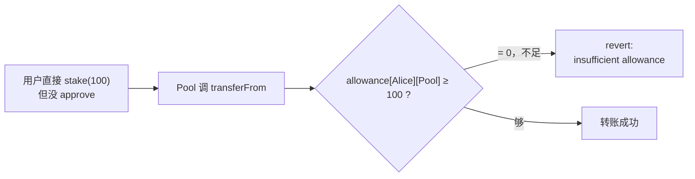

# 02 · ERC-20 授权模型（Approve + TransferFrom Flow）

> ERC-20 里最容易搞混、也最容易出安全事故的就是「授权模型」：你先 `approve` 授权一个合约，合约再用 `transferFrom` 主动从你账户拉币。理解这套两步流程，是理解所有 DeFi 交互（Uniswap 兑换、质押、借贷）的前提。

## 📖 知识讲解

### 为什么需要「授权」这一步
ERC-20 的 `transfer` 只是改两个 `balanceOf` 数字并发个 `Transfer` 事件，**它不会调用接收方合约的任何代码**。也就是说，你直接 `transfer` 给 Uniswap 合约，Uniswap 根本「不知道」钱到了、更不知道要为你兑换什么。

解决办法就是**反过来**：不让用户「推」币给合约，而是让合约「拉」币。于是有了两步：

1. **`approve(spender, amount)`**：用户在**代币合约**上登记「我允许 spender 这个合约花我最多 amount 个币」。这只是改了个 `allowance` 数字，币还在用户账户里。
2. **`transferFrom(user, to, amount)`**：spender 合约在自己的业务函数里调用代币合约的 `transferFrom`，把用户的币拉走。代币合约会检查 `allowance` 够不够、够则扣减额度并转账。

一句话：**approve 是「批额度」，transferFrom 是「按额度扣款」**，很像信用卡的「授信额度 + 刷卡」。

### `allowance` 是怎么存的
```solidity
mapping(address => mapping(address => uint256)) allowance;
// allowance[owner][spender] = 剩余可花额度
```
每次 `transferFrom` 成功后，`allowance[owner][spender]` 会被扣减 `amount`（除非是无限授权，见下文）。

## 🔄 流程图 / 原理图

### approve + transferFrom 完整时序图（用户在 DEX 质押代币）

```mermaid
sequenceDiagram
    autonumber
    actor User as 用户 Alice
    participant Token as ERC-20 代币合约
    participant Pool as 质押池合约 (Spender)

    Note over User,Pool: 第 1 步：授权（一笔交易）
    User->>Token: approve(Pool 地址, 100)
    Token->>Token: allowance[Alice][Pool] = 100
    Token-->>User: emit Approval(Alice, Pool, 100)

    Note over User,Pool: 第 2 步：调用业务，合约主动拉币（另一笔交易）
    User->>Pool: stake(100)
    Pool->>Token: transferFrom(Alice, Pool, 100)
    Token->>Token: 检查 allowance[Alice][Pool] ≥ 100 ✅
    Token->>Token: allowance[Alice][Pool] -= 100  → 变 0
    Token->>Token: balanceOf[Alice] -= 100 ; balanceOf[Pool] += 100
    Token-->>Pool: emit Transfer(Alice, Pool, 100)
    Pool->>Pool: staked[Alice] += 100
    Pool-->>User: 质押成功
```

### 如果忘了 approve 会怎样



## 💻 代码说明

见 [`TokenSpender.sol`](./TokenSpender.sol)，里面有两个合约：

- **`MiniToken`**：极简 ERC-20，重点看 `approve` 和 `transferFrom`。注意 `transferFrom` 里的 `require(allowed >= value)` 就是「额度检查」，以及 `if (allowed != type(uint256).max)` 表示**无限授权时不扣减额度**（省 gas 的常见优化）。
- **`StakingPool`**：模拟 DEX / 质押池。它的 `stake()` 内部调用 `token.transferFrom(msg.sender, address(this), amount)` 主动拉币。这就是所有 DeFi 合约收币的标准姿势。

## ▶️ 运行方式（Remix）

1. Remix 新建 `TokenSpender.sol`，粘贴代码，用 `0.8.20+` 编译（一个文件里有 3 个合约）。
2. 部署 **MiniToken**（无构造参数），记下它的地址，此时你（部署者）有 1000 个币。
3. 部署 **StakingPool**，构造参数 `_token` 填上一步 MiniToken 的地址，记下 Pool 地址。
4. **先不授权，直接踩坑**：在 StakingPool 上调用 `stake`，`amount` 填 `100000000000000000000`（100 个）→ 交易 **revert：insufficient allowance**。这证明必须先授权。
5. **正确流程**：
   - 在 **MiniToken** 上调 `approve`，`spender` 填 Pool 地址，`value` 填 `100000000000000000000` → 成功。
   - 用 `allowance` 查 `owner=你`、`spender=Pool`，应返回 100 个。
   - 回到 **StakingPool** 调 `stake(100000000000000000000)` → 成功。
   - 再查 MiniToken 的 `balanceOf(Pool 地址)` = 100 个；`allowance` 归 0。

## ⚠️ 常见坑 / 安全提示

### 无限授权（Unlimited Approval）风险 🔴
为了让用户不必每次交易都授权一次，很多 DApp 会请求你 `approve(spender, type(uint256).max)`（约等于无限额度）。好处是省 gas、体验顺滑；**坏处是一旦该 spender 合约有漏洞或本身是恶意钓鱼合约，它可以在任何时候把你钱包里这种币全部 `transferFrom` 走**，无需你再签名。历史上多起盗币事件都源于此。

**防护建议：**
- 用 [Revoke.cash](https://revoke.cash) 或 Etherscan 的 Token Approvals 页面**定期检查并撤销**用不到的授权。
- 撤销 = 再发一笔 `approve(spender, 0)`。
- 对不信任的合约，宁可每次授权「精确额度」而非无限。

### approve 竞态（Race Condition / 双花授权）
经典问题：把额度从 100 改成 50 时，若攻击者盯着内存池，可能在你的「改额度」交易前抢先花掉旧的 100，再花新的 50，共花 150。**缓解**：先 `approve(spender, 0)` 再 `approve(spender, 新值)`；或使用 `increaseAllowance` / `decreaseAllowance`（部分实现提供）；根本方案见 06 模块的 EIP-2612 permit。

### 别把 approve 的对象搞错
`approve` 的 `spender` 必须是**将来会调用 transferFrom 的那个合约**（如 Router / Pool），不是代币合约本身，也不是收款人。授权给错误地址等于白授权。

## 🔗 官方文档

- EIP-20 原文（approve/transferFrom 定义）：https://eips.ethereum.org/EIPS/eip-20
- ethereum.org ERC-20（中文）：https://ethereum.org/zh/developers/docs/standards/tokens/erc-20/
- 撤销授权工具：https://revoke.cash
- OpenZeppelin SafeERC20（安全封装）：https://docs.openzeppelin.com/contracts/5.x/api/token/erc20#SafeERC20
