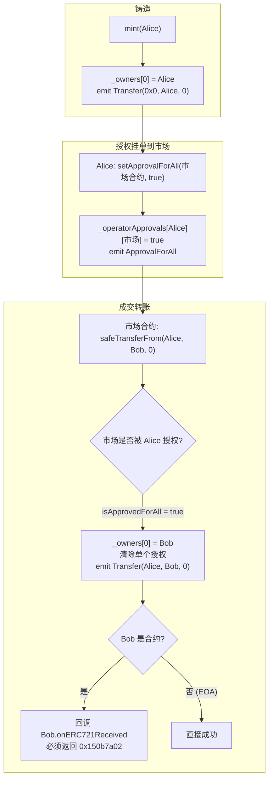
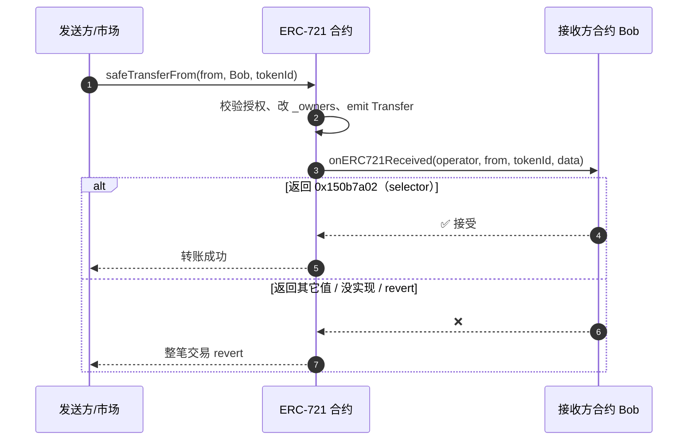

# 03 · ERC-721 非同质化代币 / NFT（Non-Fungible Token）

> ERC-721 是「NFT」的标准接口。和 ERC-20 每个币都等价不同，ERC-721 里**每一个 tokenId 都独一无二、不可分割、不可互换**——用来表示数字艺术品、收藏品、域名、游戏道具、门票等。

## 📖 知识讲解

### 同质化 vs 非同质化
- **ERC-20**：只记「谁有多少个」——`balanceOf[addr] = 数量`。币之间无差别。
- **ERC-721**：记「哪个 token 属于谁」——`ownerOf[tokenId] = 地址`。每个 tokenId 是一件独立的东西。

所以 ERC-721 的核心数据结构从「地址 → 数量」变成了**「tokenId → 拥有者」的产权登记簿**。

### ERC-721 的核心接口

| 类型 | 签名（对照 EIP-721） | 作用 |
|------|----------------------|------|
| 查询 | `balanceOf(address owner) → uint256` | owner 持有几个 NFT |
| 查询 | `ownerOf(uint256 tokenId) → address` | 某个 tokenId 归谁 |
| 转账 | `transferFrom(address from, address to, uint256 tokenId)` | 转移（不检查接收方，可能丢币）|
| 转账 | `safeTransferFrom(from, to, tokenId[, data])` | **安全**转移，若 to 是合约会回调确认 |
| 授权 | `approve(address to, uint256 tokenId)` | 授权某人转移「某一个」NFT |
| 授权 | `getApproved(uint256 tokenId) → address` | 查某 NFT 被授权给谁 |
| 授权 | `setApprovalForAll(address operator, bool approved)` | 授权某人管理「我全部」NFT（市场挂单用）|
| 授权 | `isApprovedForAll(owner, operator) → bool` | 查是否全权授权 |
| 事件 | `Transfer(from, to, tokenId)` | 三个参数**都 indexed** |
| 事件 | `Approval(owner, approved, tokenId)` | 单个授权 |
| 事件 | `ApprovalForAll(owner, operator, approved)` | 全权授权 |

> **元数据扩展 ERC721Metadata**：`name()`、`symbol()`、`tokenURI(tokenId)`。`tokenURI` 是 NFT 的灵魂——它指向描述这个 NFT 长什么样的 JSON（图片、属性），详见 04 模块。

### `safeTransferFrom` 为什么「安全」
如果你用普通 `transferFrom` 把 NFT 转给一个**不懂 NFT 的合约**（比如某个不小心填错的合约地址），这个 NFT 就永远卡在里面取不出来了。`safeTransferFrom` 会在转账后调用接收方合约的 `onERC721Received`，只有接收方**明确返回魔术值** `0x150b7a02`（即 `onERC721Received.selector`）才算成功，否则整笔交易 revert，从而避免「转进黑洞」。给 EOA（普通钱包地址）转账则不触发此检查。

## 🔄 流程图 / 原理图

### NFT 铸造 → 授权 → 安全转账全流程

### safeTransferFrom 的接收方校验

## 💻 代码说明

见 [`MyERC721.sol`](./MyERC721.sol)，手写最小 NFT，重点：

- 核心是 `mapping(uint256 => address) _owners`——tokenId 到拥有者的产权簿。
- **两级授权**：`_tokenApprovals`（单个 token）+ `_operatorApprovals`（全部 token，市场挂单靠它）。`_isApprovedOrOwner` 把三种权限（本人 / 单个授权 / 全权）合一判断。
- `Transfer`/`Approval` 的 `tokenId` 参数是 **indexed**（ERC-20 里对应位置是不 indexed 的 `value`，这是二者事件的重要区别）。
- `_checkOnERC721Received` 用 `to.code.length > 0` 判断接收方是否合约，是则要求回调返回 `onERC721Received.selector`。
- `mint` 时 `from = address(0)`，与 ERC-20 铸造约定一致。

> ⚠️ **教学用途**。生产直接用 OpenZeppelin ERC721（含 `_safeMint`、枚举扩展、gas 优化）。

## ▶️ 运行方式（Remix）

1. Remix 新建 `MyERC721.sol`，粘贴代码，`0.8.20+` 编译（含 1 个 interface + 1 个合约）。
2. 部署 `MyERC721`，构造参数 `_name = "My NFT"`，`_symbol = "MNFT"`。
3. 调 `mint`，`to` 填你的地址 → 交易成功，返回 `tokenId = 0`。Terminal 里可见 `Transfer(0x0, 你, 0)`。
4. 调 `ownerOf(0)` → 返回你的地址；`balanceOf(你)` → 1。
5. 调 `tokenURI(0)` → 返回 `https://example.com/nft/0.json`。
6. **授权 + 转账演示**：
   - `approve`，`to` 填 Remix 另一账户 B，`tokenId = 0`。
   - 切换到账户 B（Remix 顶部 Account 下拉），调 `transferFrom(你, B, 0)` → 成功，`ownerOf(0)` 变 B。
7. 试试给 EOA 用 `safeTransferFrom` 成功；如果 `to` 填一个没实现 `onERC721Received` 的合约地址会 revert（体现「安全」）。

## ⚠️ 常见坑 / 安全提示

- **`transferFrom` vs `safeTransferFrom`**：给合约地址转 NFT 一律优先 `safeTransferFrom`，否则可能永久锁死。给交易所/市场之外的合约转账尤其小心。
- **`setApprovalForAll` 是全权授权**：授权给市场合约意味着它能转走你**该集合下所有** NFT。只授权给可信市场（OpenSea、Blur 等官方合约），用完/不用了记得撤销。钓鱼网站最爱骗你签 `setApprovalForAll`。
- **`ownerOf` 对不存在的 tokenId 会 revert**，查询前注意。
- **`tokenId` 不必连续、可自定义**：本例用自增，真实项目也可用哈希或指定 id。
- **枚举（totalSupply / tokenByIndex）不在核心 ERC-721 里**，属于可选的 ERC721Enumerable 扩展，链上枚举很费 gas，大集合慎用。

## 🔗 官方文档

- EIP-721 原文：https://eips.ethereum.org/EIPS/eip-721
- ethereum.org ERC-721（中文）：https://ethereum.org/zh/developers/docs/standards/tokens/erc-721/
- OpenZeppelin ERC721：https://docs.openzeppelin.com/contracts/5.x/erc721
