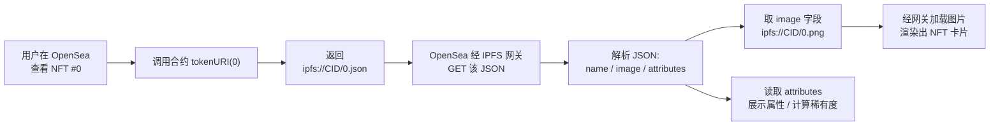
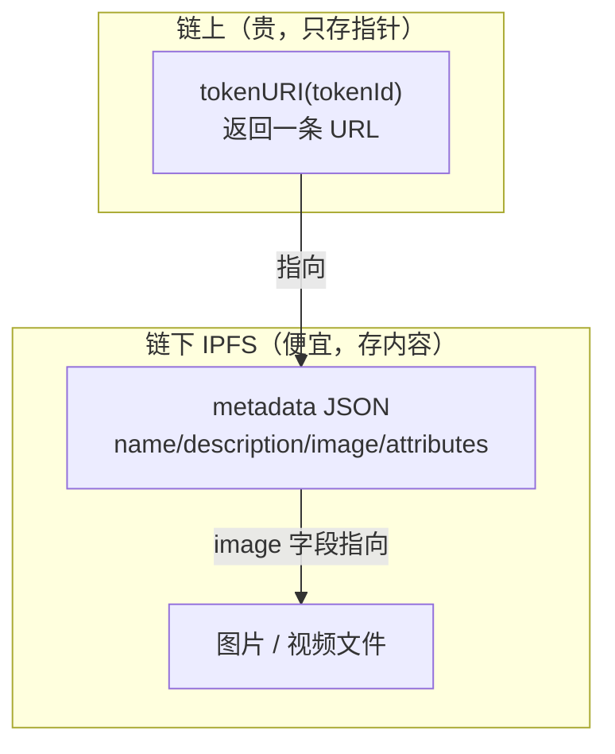

# 04 · ERC-721 元数据（tokenURI 与 JSON Metadata）

> NFT 的图片、名字、属性到底存在哪？答案是：**链上只存一个 `tokenURI`（指向 JSON 的 URL），真正的图片和属性都在链下**（通常是 IPFS）。本模块讲清这条「链上指针 → 链下 JSON → 图片」的数据链路，以及 OpenSea 通行的元数据规范。

## 📖 知识讲解

### 为什么图片不上链
以太坊链上存储极其昂贵（1 KB 数据要花不少 gas），一张几百 KB 的 PNG 直接上链成本天文数字。所以标准的做法是：

```
链上（合约）        链下（IPFS / 服务器）
tokenURI(0)  ─────▶ metadata.json ─────▶ image (PNG/MP4)
"ipfs://.../0.json"   { "image": "..." }
```

链上合约只保存一个 `tokenURI(tokenId)` 方法，返回一条 URL；这条 URL 指向一个 JSON 文件；JSON 里的 `image` 字段又指向真正的图片文件。钱包和 OpenSea 就是顺着这条链渲染出你看到的 NFT。

### `tokenURI` 是怎么拼出来的
最常见写法是 **Base URI + tokenId + `.json`**：

```solidity
return string(abi.encodePacked(baseURI, tokenId, ".json"));
// baseURI = "ipfs://bafy.../"
// tokenId = 0  →  "ipfs://bafy.../0.json"
```

一整个 NFT 集合（如 10000 个）共用一个 baseURI（一个 IPFS 目录），目录里放 `0.json`、`1.json` …… 每个 JSON 描述对应编号的那张图。

### OpenSea 元数据 JSON 规范（事实标准）
ERC-721 标准本身只规定 JSON 里应有 `name` / `description` / `image`。OpenSea 在此基础上扩展出被业界广泛采用的字段（见 [`metadata-example.json`](./metadata-example.json)）：

| 字段 | 说明 |
|------|------|
| `name` | NFT 名称，如 "My NFT #0" |
| `description` | 描述，支持 Markdown |
| `image` | 图片 URL（`ipfs://…` 或 `https://…`）|
| `external_url` | 点击图片跳转的外链 |
| `animation_url` | 动图/视频/3D/HTML 等富媒体 |
| `background_color` | 六位十六进制背景色（不带 #）|
| `attributes` | **属性数组**，决定稀有度、可筛选 |

`attributes` 里每一项：
- 普通属性：`{ "trait_type": "背景", "value": "星空" }`
- 数值属性：加 `"display_type": "number"` 或 `"boost_percentage"` / `"boost_number"`
- 日期属性：`"display_type": "date"`，`value` 用 Unix 时间戳
- 进度条：给数值加 `"max_value"`

### `ipfs://` 与网关
JSON 和图片一般存 IPFS，地址形如 `ipfs://<CID>/0.png`。浏览器不能直接打开 `ipfs://`，需通过**网关**转成 https，例如 `https://ipfs.io/ipfs/<CID>/0.png`。用 IPFS 的原因：内容寻址（CID 由内容哈希得出），**内容一改 CID 就变**，从而保证 NFT 元数据不可被偷偷篡改。

## 🔄 流程图 / 原理图

### 从 tokenId 到最终图片的解析链路



### 链上 vs 链下 存储分工



## 💻 代码说明

- [`MetadataNFT.sol`](./MetadataNFT.sol)：聚焦 `tokenURI` 的拼接。构造时传入 `baseURI`，`tokenURI(id)` 返回 `baseURI + id + ".json"`。这就是绝大多数 PFP 项目的做法。
- [`metadata-example.json`](./metadata-example.json)：一份符合 OpenSea 规范的完整示例 JSON，含各种 `display_type` 的属性写法，可直接照抄改造。

> 进阶：也有**全链上 NFT**（on-chain NFT），把 SVG 图直接在 `tokenURI` 里用 Base64 data URI 返回，不依赖 IPFS（如 Loot、部分艺术项目），代价是更高 gas 和逻辑复杂度。

## ▶️ 运行方式（Remix）

1. Remix 部署 `MetadataNFT.sol`，构造参数：`_name = "My NFT"`，`_symbol = "MNFT"`，`baseURI = "ipfs://bafyExampleCID/"`。
2. 调 `mint(你的地址)` → 得到 tokenId 0。
3. 调 `tokenURI(0)` → 返回 `ipfs://bafyExampleCID/0.json`。这就是钱包会去请求的地址。
4. 把本模块的 `metadata-example.json` 想象成那个 URL 返回的内容，对照字段理解 OpenSea 如何渲染。
5. （可选）把 JSON 和一张图片真上传到 [Pinata](https://pinata.cloud) / [NFT.Storage](https://nft.storage) 拿到真实 CID，替换 baseURI，即可在测试网 + OpenSea Testnet 看到真实展示。

## ⚠️ 常见坑 / 安全提示

- **中心化 URL 风险**：若 `baseURI` 指向自己的服务器（`https://myapi.com/...`），服务器挂了或跑路，NFT 图片就全没了。用 **IPFS + 固定 CID** 才能保证持久与不可篡改。
- **元数据可变性**：如果合约允许改 `baseURI`（有的项目留了 `setBaseURI`），发行方就能「偷换」你的 NFT 图片。买之前留意合约是否锁定元数据。
- **`.json` 后缀要与你上传的文件名一致**：拼接规则和实际文件命名不匹配是新手最常见的「图片不显示」原因。
- **OpenSea 缓存**：改了元数据后 OpenSea 不会实时刷新，需要在页面上点 "Refresh metadata"。
- **`attributes` 的 value 类型**：字符串属性用来筛选，数值属性配 `display_type`，两者混淆会导致展示异常。

## 🔗 官方文档

- EIP-721 Metadata JSON Schema：https://eips.ethereum.org/EIPS/eip-721
- OpenSea 元数据标准：https://docs.opensea.io/docs/metadata-standards
- ethereum.org ERC-721（中文）：https://ethereum.org/zh/developers/docs/standards/tokens/erc-721/
- IPFS 简介：https://docs.ipfs.tech/concepts/what-is-ipfs/
