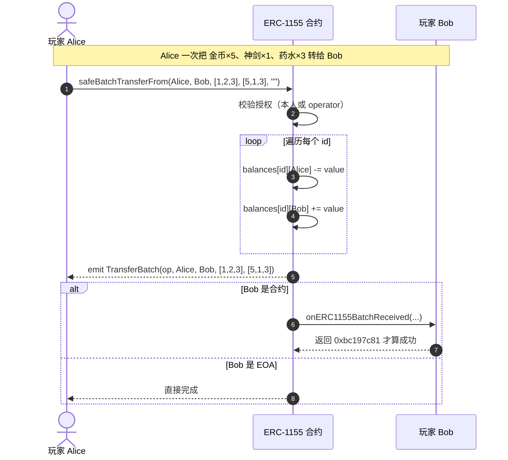

# 05 · ERC-1155 多代币标准（Multi-Token / 半同质化）

> ERC-1155 是「一个合约管理无数种代币」的标准。同一个合约里，id=1 可以是 1000 个等价的金币（同质化），id=2 可以是全世界唯一的一把神剑（非同质化），还能**一次交易批量转移多种代币**。它是游戏道具、半同质化门票的最佳选择。

## 📖 知识讲解

### ERC-20 / ERC-721 / ERC-1155 的核心区别
- **ERC-20**：一个合约 = 一种同质化代币。数据是 `balanceOf[account]`（一维）。
- **ERC-721**：一个合约 = 一个 NFT 集合，每个 tokenId 唯一。数据是 `ownerOf[tokenId]`。
- **ERC-1155**：一个合约 = 多种代币。数据是 **`balances[id][account]`（二维）**：既有 id 维度（哪种代币），又有 account 维度（谁持有），而且每种可以有任意数量。

### 「半同质化」（Semi-Fungible）是什么
一个 id 下可以有多个（数量 > 1）→ 表现得像 ERC-20（同质）；也可以让某个 id 只铸造 1 个 → 表现得像 ERC-721（非同质）。所以 ERC-1155 天然覆盖「同质 + 非同质 + 介于两者之间」。典型例子：演唱会门票——同一场次(id)的票彼此等价(同质)，不同场次(不同 id)不等价。

### 三大杀手锏
1. **一个合约多种代币**：游戏里成百上千种道具不必各部署一个合约，省 gas、好管理。
2. **批量转账 `safeBatchTransferFrom`**：一笔交易把「5 个金币 + 1 把剑 + 3 瓶药水」一起转走，比 ERC-20/721 逐个转省大量 gas。
3. **批量查询 `balanceOfBatch`**：一次读多组 (账户, id) 余额。

### 核心接口

| 类型 | 签名（对照 EIP-1155） | 作用 |
|------|----------------------|------|
| 查询 | `balanceOf(address account, uint256 id) → uint256` | 某人某 id 的数量 |
| 查询 | `balanceOfBatch(address[] accounts, uint256[] ids) → uint256[]` | 批量查余额 |
| 转账 | `safeTransferFrom(from, to, id, value, data)` | 转某 id 的 value 个 |
| 转账 | `safeBatchTransferFrom(from, to, ids[], values[], data)` | 批量转多种 |
| 授权 | `setApprovalForAll(operator, approved)` | 全权授权（**没有单个授权**）|
| 授权 | `isApprovedForAll(owner, operator) → bool` | 查全权授权 |
| 事件 | `TransferSingle(operator, from, to, id, value)` | 单种转移 |
| 事件 | `TransferBatch(operator, from, to, ids[], values[])` | 批量转移 |
| 事件 | `ApprovalForAll(owner, operator, approved)` | 授权 |
| 事件 | `URI(value, id)` | 元数据 URI 变更 |
| 元数据 | `uri(uint256 id) → string` | 所有 id 共用模板，含 `{id}` 占位符 |

> **`{id}` 占位符约定**：`uri()` 返回如 `https://game.com/api/item/{id}.json`，客户端要把 `{id}` 替换成该 tokenId 的 **64 位、补零的十六进制**（不带 0x）。这样一个模板服务所有 id。
>
> **注意**：ERC-1155 的转账**全部是 safe 版**（自带接收方校验），没有非 safe 的 `transferFrom`；授权也**只有全权** `setApprovalForAll`，不像 ERC-721 还能单个授权。

## 🔄 流程图 / 原理图

### 批量转账 safeBatchTransferFrom（一笔交易转多种道具）



### 二维余额表：一个合约装下多种代币

```mermaid
flowchart TB
    subgraph 合约内部 balances[id][account]
    direction LR
    ID1["id=1 金币<br/>Alice:1000  Bob:500"]
    ID2["id=2 神剑<br/>Alice:1  Bob:0"]
    ID3["id=3 药水<br/>Alice:20  Bob:8"]
    end
    ID1-.->|"同质化"| N1["数量>1，彼此等价"]
    ID2-.->|"非同质化"| N2["数量=1，独一无二"]
```

## 💻 代码说明

见 [`MyERC1155.sol`](./MyERC1155.sol)：

- 核心是 `mapping(uint256 => mapping(address => uint256)) _balances`，即 `balances[id][account]`——比 ERC-20 多了 id 维度。
- `safeBatchTransferFrom` 用一个 `for` 循环处理多个 id，`ids` 与 `values` 数组一一对应、**长度必须相等**。
- 转账全部走 safe 校验：接收方是合约时，单转要回 `0xf23a6e61`（`onERC1155Received.selector`），批量转要回 `0xbc197c81`（`onERC1155BatchReceived.selector`），否则 revert。
- 授权只有 `setApprovalForAll`。
- `uri()` 对所有 id 返回同一模板字符串。

> ⚠️ 教学用途。生产用 OpenZeppelin ERC1155（含供应量追踪、URI 扩展等）。

## ▶️ 运行方式（Remix）

1. Remix 部署 `MyERC1155.sol`，构造参数 `uri_ = "https://game.com/api/item/{id}.json"`。
2. `mint(你, 1, 1000)` 铸 1000 个 id=1（金币）；`mint(你, 2, 1)` 铸 1 个 id=2（神剑）。
3. `balanceOf(你, 1)` → 1000；`balanceOf(你, 2)` → 1。
4. 批量查：`balanceOfBatch([你,你], [1,2])` → `[1000, 1]`。
5. **批量转账**：`safeBatchTransferFrom(你, 账户B, [1,2], [100,1], [])`（`data` 传空 `[]` 或 `0x`）→ 成功；再查 B 的余额验证。
6. 若把 `to` 填成一个没实现接收接口的合约地址，会 revert（体现 safe）。

## ⚠️ 常见坑 / 安全提示

- **数组长度必须匹配**：`ids` 和 `values`（以及 `balanceOfBatch` 的 `accounts`/`ids`）长度不等会直接 revert。
- **`{id}` 十六进制补零**：元数据 URI 里 `{id}` 要替换成 64 位十六进制小写补零，不是十进制。前端拼错会导致图片加载失败。
- **只有全权授权**：`setApprovalForAll` 一授就是「该合约下我所有 id 的所有代币」，权力很大，谨慎授权、及时撤销。
- **转账全是 safe**：给合约地址转 1155 代币，对方必须实现 `IERC1155Receiver`，否则收不了——这是特性不是 bug。
- **没有 decimals 概念**：ERC-1155 的 value 就是整数「个数」，不像 ERC-20 有小数位；要表达可分数量需自己约定。

## 🔗 官方文档

- EIP-1155 原文：https://eips.ethereum.org/EIPS/eip-1155
- ethereum.org ERC-1155（中文）：https://ethereum.org/zh/developers/docs/standards/tokens/erc-1155/
- OpenZeppelin ERC1155：https://docs.openzeppelin.com/contracts/5.x/erc1155
