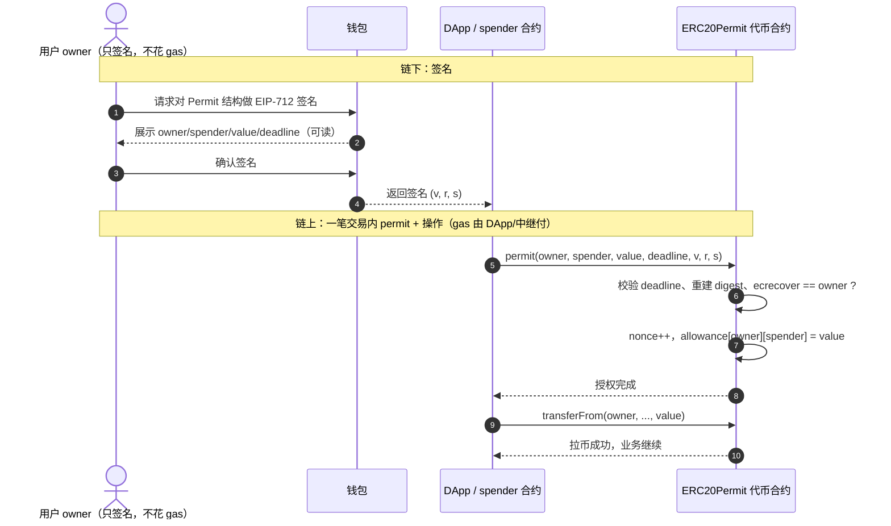
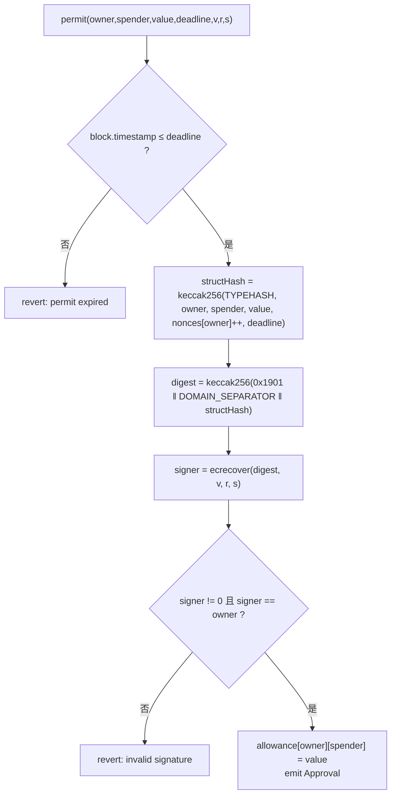

# 06 · ERC-20 Permit 签名授权（EIP-2612）

> 传统 ERC-20 授权要先发一笔 `approve` 交易（用户掏 gas、等确认），再发第二笔交易做实际操作，体验很割裂。**EIP-2612 permit** 让用户改为「链下签个名」，把签名交给对方或合约去调用 `permit()` 完成授权——用户自己不发交易、不花 gas，还能把「授权 + 操作」合并进一笔交易。

## 📖 知识讲解

### 痛点：两笔交易 + 两次 gas
用 Uniswap 兑换一个新代币，传统流程是：
1. 交易一：`approve(Router, amount)` —— 花 gas、等上链。
2. 交易二：`swap(...)`（内部 `transferFrom`）—— 再花 gas。

对新手极不友好，且「先授权后有余额被别人抢跑」等问题也存在。

### permit 的思路：把授权变成「一个签名」
EIP-2612 给 ERC-20 增加了 `permit`。用户用私钥对一段**结构化数据**（owner、spender、value、nonce、deadline）做 **EIP-712 签名**。这只是「签名」不是「交易」，**不花 gas、不上链**。得到签名 `(v, r, s)` 后：

- 交给 **spender 合约**：合约在自己的业务函数里先调 `permit(...)` 完成授权，再 `transferFrom` 拉币——**一笔交易搞定授权+操作**。
- 或交给 **中继者（relayer）**：由中继者发交易付 gas，实现用户侧的「gasless 授权」。

> 说清楚「免 gas」的含义：**permit() 这笔交易本身仍然要花 gas，但付钱的是调用者（spender/中继者），不是签名的 owner**。owner 端只签名，零 gas、零交易。

### permit 的三个新成员（对照 EIP-2612）

| 成员 | 签名 | 作用 |
|------|------|------|
| `permit(owner, spender, value, deadline, v, r, s)` | 核验签名并完成授权 | 核心方法 |
| `nonces(address owner) → uint256` | 每个 owner 一个自增计数器 | 防重放：每次 permit 后 +1，旧签名作废 |
| `DOMAIN_SEPARATOR() → bytes32` | EIP-712 域分隔符 | 把「合约名/版本/链id/合约地址」绑进签名，防跨链跨合约重放 |

### 被签署的到底是什么（EIP-712）
最终签名的摘要 `digest` 是：
```
digest = keccak256( 0x1901 ‖ DOMAIN_SEPARATOR ‖ structHash )
structHash = keccak256( PERMIT_TYPEHASH, owner, spender, value, nonce, deadline )
PERMIT_TYPEHASH = keccak256("Permit(address owner,address spender,uint256 value,uint256 nonce,uint256 deadline)")
```
合约用 `ecrecover(digest, v, r, s)` 从签名恢复出签名者地址，只有**恢复出的地址 == owner** 才算合法，进而执行 `approve`。`deadline` 保证签名有时效，`nonce` 保证一个签名只能用一次。EIP-712 的好处是钱包能把这段结构化数据**人类可读地**展示给用户，而不是一串看不懂的十六进制。

## 🔄 流程图 / 原理图

### permit 一步授权（对比传统两步）



### permit 内部校验逻辑



## 💻 代码说明

- [`ERC20Permit.sol`](./ERC20Permit.sol)：在最小 ERC-20 上增加 `permit` / `nonces` / `DOMAIN_SEPARATOR`。重点看：
  - `PERMIT_TYPEHASH` 字符串必须与标准**逐字节一致**，否则签名对不上。
  - `nonces[owner]++`：读取当前 nonce 用于本次签名校验，并自增使旧签名失效（防重放）。
  - `ecrecover(digest, v, r, s)` 恢复签名者，必须 `!= address(0)` 且 `== owner`。
  - `DOMAIN_SEPARATOR` 缓存构造时的 chainId，链分叉后重算，防跨链重放。
- [`sign-permit.js`](./sign-permit.js)：用 ethers v6 的 `signTypedData` 生成 permit 签名并拆出 `(v, r, s)`，演示 owner 侧「只签名不发交易」。

> ⚠️ 教学用途。生产直接用 OpenZeppelin `ERC20Permit`（已处理各种边界，还支持 EIP-5267）。

## ▶️ 运行方式

**合约（Remix）**
1. 部署 `ERC20Permit.sol`，构造 `_name="Permit Token"`、`_symbol="PMT"`、`_initialSupply=1000`。
2. 调 `nonces(你的地址)` → 0；`DOMAIN_SEPARATOR()` 看域分隔符。
3. permit 的完整验证需要一段真实签名，建议配合下方脚本在本地链跑通。

**签名脚本（Node）**
1. `npm init -y && npm i ethers`（package.json 里加 `"type":"module"`）。
2. 起一条本地链（如 `npx hardhat node`）并部署本合约，把地址填进 `sign-permit.js`。
3. `node sign-permit.js` → 打印出 `(v, r, s)`。把这些参数连同 owner/spender/value/deadline 传给合约 `permit(...)`，随后 `allowance[owner][spender]` 即变为 value。

## ⚠️ 常见坑 / 安全提示

- **钓鱼签名 🔴**：permit 是「签个名就能授权」，恶意网站可能诱导你签一个 `spender = 攻击者`、`value = 无限` 的 Permit，一旦你签了，攻击者就能把该代币全部转走。**签名前务必看清钱包弹窗里的 spender 和 value**，不明来源的签名请求一律拒绝。
- **不是所有 ERC-20 都支持 permit**：EIP-2612 是可选扩展，只有实现了它的代币（如 USDC、DAI 的变体、UNI 等）才有 `permit`。DAI 用的是**更早的非标准 permit 接口**（参数不同），对接时要区分。
- **deadline 要合理**：太长的 deadline = 签名长期有效 = 风险窗口大；建议短时效。
- **nonce 顺序性**：签名必须按 nonce 递增使用，跳号或重复会校验失败。
- **域分隔符要对**：`name`/`version`/`chainId`/`verifyingContract` 任一对不上，`ecrecover` 出来的地址就不等于 owner，permit 失败。

## 🔗 官方文档

- EIP-2612 原文：https://eips.ethereum.org/EIPS/eip-2612
- EIP-712 结构化签名：https://eips.ethereum.org/EIPS/eip-712
- OpenZeppelin ERC20Permit：https://docs.openzeppelin.com/contracts/5.x/api/token/erc20#ERC20Permit
