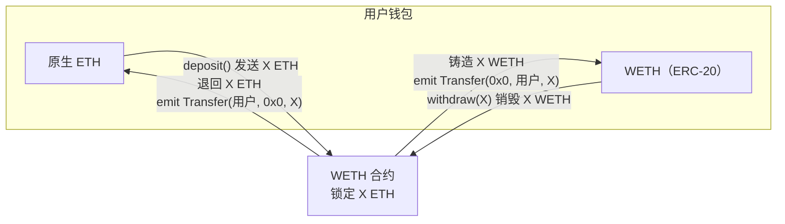
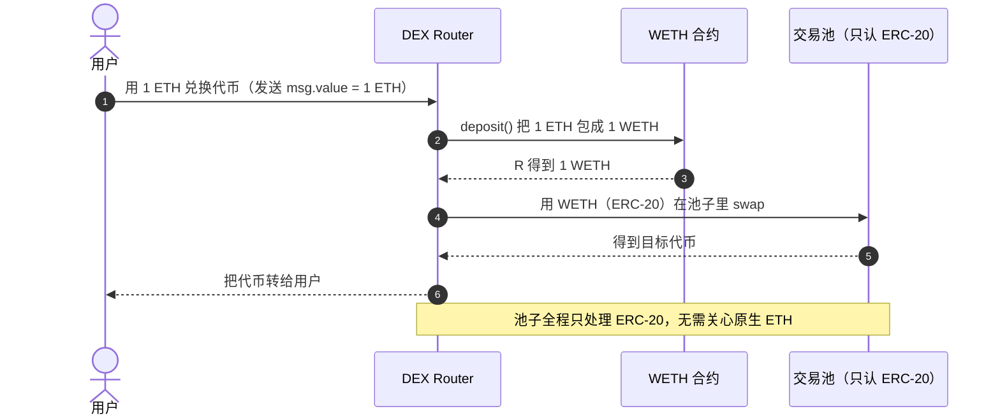

# 07 · Wrapped ETH（WETH · 包装以太币）

> WETH 是把原生 ETH「包装」成 ERC-20 代币的合约，与 ETH 永远 1:1 兑换。为什么要多此一举？因为**原生 ETH 本身不是 ERC-20**，不符合 `approve` / `transferFrom` 那套接口，而绝大多数 DeFi 协议（Uniswap、借贷、DEX）只认 ERC-20。WETH 让 ETH 也能进入这个统一的代币世界。

## 📖 知识讲解

### 问题：ETH 比 ERC-20「早」，却不兼容 ERC-20
以太坊先有原生货币 ETH，后来（2015）才有 ERC-20 标准。ETH 的转账走的是底层 `msg.value` / `call`，**没有 `balanceOf`、`transfer`、`approve`、`transferFrom` 这些方法**，也不发 `Transfer` 事件。结果是：一个只会处理 ERC-20 的合约（比如 Uniswap 的通用池子逻辑）没法直接处理 ETH，否则每个协议都要为「ETH」和「ERC-20」写两套分支代码。

### 解法：把 ETH 包装成 ERC-20
WETH 合约提供两个动作：
- **`deposit()`（存 ETH 换 WETH）**：你给合约转 X 个 ETH，合约就给你铸造 X 个 WETH（一种标准 ERC-20）。ETH 被锁进合约。
- **`withdraw(X)`（销 WETH 取 ETH）**：你销毁 X 个 WETH，合约把 X 个 ETH 退给你。

因为 ETH 和 WETH 都是 18 位小数，所以永远 **1 WETH = 1 ETH**。合约里始终锁着与 WETH 流通量**完全等值的 ETH**（`totalSupply == 合约 ETH 余额`），这个不变量保证任何人随时能 1:1 赎回，WETH 不会脱锚。

### 有了 WETH 之后
DeFi 协议只需实现「ERC-20 版」逻辑：遇到 ETH，就先在入口把 ETH 包成 WETH，内部一律按 ERC-20 处理，出口再解包成 ETH 还给用户。代码统一、可组合。这也是为什么你在 Uniswap 用 ETH 交易时，底层其实走的是 WETH。

## 🔄 流程图 / 原理图

### 包装与解包（deposit / withdraw）1:1 循环

### 为什么 DeFi 要 WETH（时序）

## 💻 代码说明

见 [`WETH.sol`](./WETH.sol)，对照经典主网 **WETH9** 逻辑的最小实现：

- `deposit()` 是 `payable`：`msg.value`（随交易发来的 ETH）等量铸造成 WETH，发 `Transfer(0x0, sender, value)`（铸造）+ `Deposit` 事件。
- `receive()`：直接给合约地址转 ETH 也会自动触发 `deposit()`，方便钱包直接转账即包装。
- `withdraw(wad)`：销毁 WETH，用 `call{value: wad}` 把 ETH 退回，发 `Transfer(sender, 0x0, wad)`（销毁）+ `Withdrawal` 事件。
- `totalSupply()` 直接返回 `address(this).balance`——体现「锁定 ETH == WETH 总量」的不变量。
- 其余 `approve`/`transfer`/`transferFrom` 就是标准 ERC-20，让 WETH 能被任何协议当普通代币用。

> ⚠️ 教学用途。生产**不要自己部署 WETH**，直接用各链官方已部署的 WETH 合约地址（主网 WETH9、测试网亦有官方部署）。

## ▶️ 运行方式（Remix）

1. Remix 部署 `WETH.sol`（Environment 用 Remix VM，账户自带测试 ETH）。
2. **包装**：在 **Deploy & Run** 面板顶部的 `VALUE` 输入框填 `1`、单位选 `Ether`，然后点合约的 `deposit` 按钮 → 你存入 1 ETH。
3. 调 `balanceOf(你的地址)` → `1000000000000000000`（1 WETH）；`totalSupply()` → 同值。
4. **当普通 ERC-20 用**：`transfer` 给另一个账户一些 WETH，验证余额变化。
5. **解包**：调 `withdraw`，`wad` 填 `1000000000000000000` → 销毁 1 WETH，账户 ETH 余额增加约 1（减去 gas）。
6. 也可以直接用 `VALUE` 发送 ETH 到合约地址（触发 `receive` → `deposit`），观察同样铸造出 WETH。

## ⚠️ 常见坑 / 安全提示

- **WETH ≠ ETH，但等值**：钱包里 WETH 和 ETH 是两个「资产」，很多新手困惑「我的 ETH 怎么变少了」——其实是被包成 WETH 了，`withdraw` 即可换回。
- **付 gas 只能用 ETH**：WETH 不能直接付 gas，钱包里要留足原生 ETH。
- **每条链的 WETH 地址不同**：主网、Arbitrum、Base…各有各的官方 WETH 合约地址，别用错。有些链的「包装原生币」叫 WMATIC、WBNB 等，原理相同。
- **`withdraw` 用 `call` 退款**：若接收方是合约且 `receive`/`fallback` 会 revert，取款会失败（本例已 `require` 检查）。
- **不要自部署当生产**：官方 WETH 经过多年实战，自己写的没必要也有风险。

## 🔗 官方文档

- WETH 介绍（wtf 与官方汇总）：https://weth.io/
- 主网 WETH9 合约（Etherscan）：https://etherscan.io/token/0xC02aaA39b223FE8D0A0e5C4F27eAD9083C756Cc2
- ethereum.org ERC-20（中文）：https://ethereum.org/zh/developers/docs/standards/tokens/erc-20/
