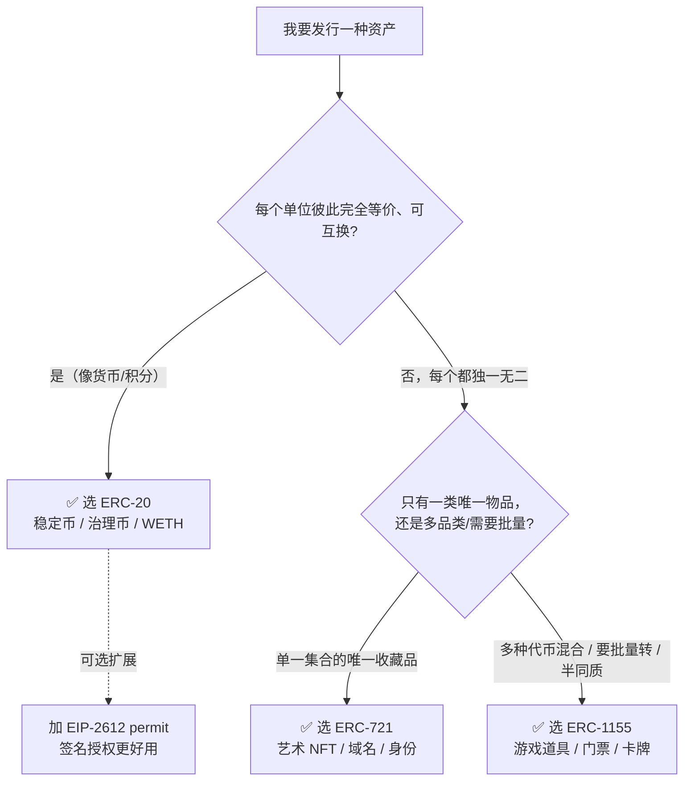
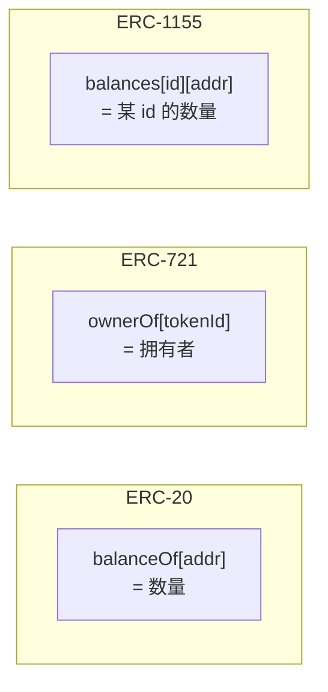

# 08 · 三大代币标准对比与选型（ERC-20 vs 721 vs 1155）

> 学完前面的模块，最后一步是把 ERC-20 / ERC-721 / ERC-1155 放在一起横向对比，建立「什么场景该选哪个标准」的判断力。本模块是纯讲解 + 决策图，无合约。

## 📖 知识讲解

### 一句话区分
- **ERC-20**：一个合约 = 一种**可互换**代币（货币、积分、治理票）。核心是「数量」。
- **ERC-721**：一个合约 = 一个**唯一**物品的集合（艺术品、域名、身份）。核心是「哪一个」。
- **ERC-1155**：一个合约 = **多种**代币混合（游戏道具、门票），可同质可非同质，还能批量转。核心是「多品类 + 批量」。

### 三大标准核心对比表

| 维度 | ERC-20 | ERC-721 | ERC-1155 |
|------|--------|---------|----------|
| 全称 | Fungible Token | Non-Fungible Token | Multi Token |
| 一个合约管理 | 1 种代币 | 1 个集合（多个唯一 token）| 多种代币（任意混合）|
| 是否同质化 | 同质（可互换）| 非同质（唯一）| 半同质（可同可非）|
| 核心数据结构 | `balanceOf[addr]` | `ownerOf[tokenId]` | `balances[id][addr]` |
| 是否可分割 | 可（decimals 小数）| 不可（整个）| 不可分割（按个）|
| 余额语义 | 有多少个币 | 有几个 NFT | 每个 id 有多少个 |
| 转账方法 | `transfer` / `transferFrom` | `transferFrom` / `safeTransferFrom` | `safeTransferFrom` / `safeBatchTransferFrom` |
| 批量转账 | ❌（逐笔）| ❌（逐个）| ✅ 原生批量，省 gas |
| 授权粒度 | 按额度 `approve` | 单个 `approve` + 全权 `setApprovalForAll` | 仅全权 `setApprovalForAll` |
| 接收方安全校验 | 无（transfer 不回调）| `safeTransferFrom` 校验 `onERC721Received` | 全部转账都校验 `onERC1155Received` |
| 元数据 | name/symbol/decimals | `tokenURI(id)` 每个独立 | `uri(id)` 用 `{id}` 模板共享 |
| Transfer 事件 value | 不 indexed（金额）| tokenId **indexed** | 有 Single / Batch 两种 |
| 典型用途 | 稳定币、治理币、WETH | 艺术 NFT、域名、身份凭证 | 游戏道具、门票、卡牌 |
| 对应 EIP | EIP-20 | EIP-721 | EIP-1155 |
| 常用扩展 | EIP-2612 permit | ERC721Metadata / Enumerable | ERC1155MetadataURI |

### 关键差异细讲
1. **可分割性**：ERC-20 有 `decimals`，能转 0.5 个；ERC-721/1155 按「个」计，最小单位是 1。
2. **授权模型**：ERC-20 授权的是「额度」；ERC-721 能授权「某一个」也能「全部」；ERC-1155 只能「全部」。
3. **安全转账**：ERC-20 的 `transfer` 不通知接收合约（易把币转进黑洞）；721/1155 的 safe 版会回调校验，更安全。
4. **gas 效率**：批量操作时 ERC-1155 一骑绝尘（一笔交易转多种），是它相对 721 的最大优势。
5. **合约数量**：发 1000 种游戏道具，用 721 要么一个合约塞 1000 个 tokenId（都唯一），用 1155 一个合约就能表达「1000 种，每种任意数量」，更贴合游戏经济。

## 🔄 流程图 / 原理图

### 选型决策树

### 三种数据结构对照

## 💻 代码说明

本模块无合约，是对 01–07 模块的总结。想看各标准的手写实现，回到对应模块：

- ERC-20 → [`../01-erc20-fungible/MyERC20.sol`](../01-erc20-fungible/MyERC20.sol)
- ERC-721 → [`../03-erc721-nft/MyERC721.sol`](../03-erc721-nft/MyERC721.sol)
- ERC-1155 → [`../05-erc1155-multi-token/MyERC1155.sol`](../05-erc1155-multi-token/MyERC1155.sol)
- Permit → [`../06-erc20-permit/ERC20Permit.sol`](../06-erc20-permit/ERC20Permit.sol)
- WETH → [`../07-weth/WETH.sol`](../07-weth/WETH.sol)

## ▶️ 运行方式

本模块为对比讲解，无需运行。建议做法：把 01/03/05 三个合约都部署到 Remix VM，亲手对比它们的 `balanceOf`（20 一个参数 vs 1155 两个参数）、转账方法、授权方法的差异，体会「同质 / 非同质 / 多代币」在接口上的直接体现。

## ⚠️ 常见坑 / 选型提示

- **不要用 ERC-20 硬凑 NFT**：需要「每个唯一」就上 721/1155，别用多个 ERC-20 合约模拟。
- **游戏/多品类优先 1155**：品类多、要批量转、要省 gas，1155 通常优于给每种道具单独发 721/20。
- **单件高价值艺术品用 721**：721 生态（OpenSea 展示、稀有度工具）对「1 集合 = N 个唯一」的支持最成熟。
- **半同质场景选 1155**：门票（同场次等价、跨场次不等价）、限量版这类介于同质与非同质之间的资产，1155 最贴切。
- **别忘可组合性**：想让代币能进 DeFi（做市、抵押），优先标准 ERC-20（或 WETH 化的 ETH），非标准接口会被很多协议拒之门外。
- **一律用 OpenZeppelin 生产**：手写实现只为学习，真上线用经过审计的 OZ，规避重入、溢出、接收校验等坑。

## 🔗 官方文档

- ethereum.org 代币标准总览（中文）：https://ethereum.org/zh/developers/docs/standards/tokens/
- EIP-20：https://eips.ethereum.org/EIPS/eip-20
- EIP-721：https://eips.ethereum.org/EIPS/eip-721
- EIP-1155：https://eips.ethereum.org/EIPS/eip-1155
- OpenZeppelin Contracts：https://docs.openzeppelin.com/contracts/5.x/tokens
