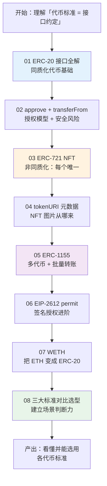

# 06 · 代币标准（Token Standards / ERC）

> 「标准」是以太坊生态可组合性的基石。正因为大家都遵守 ERC-20 / ERC-721 / ERC-1155 这几套固定接口，一个钱包才能识别成千上万种代币，一个 DEX 才能给任意代币做市。本工程带你**从零手写**这些标准的最小实现，彻底看懂每个接口在做什么，并对照官方 EIP 与生产级 OpenZeppelin。

## 📖 代币标准简介

代币标准（Token Standard）就是一份「接口约定」：规定代币合约必须实现哪些函数、发哪些事件。合约只要遵守约定，任何支持该标准的钱包、浏览器、DApp 就能开箱即用地与之交互。

- **ERC-20**：可互换代币（货币/积分/治理），核心 `balanceOf` + `transfer` + `approve/transferFrom`。
- **ERC-721**：非同质化代币 NFT（唯一收藏品），核心 `ownerOf` + `tokenURI` + `safeTransferFrom`。
- **ERC-1155**：多代币标准（游戏道具/门票），一个合约管多种、支持批量转账。
- **扩展**：EIP-2612（permit 签名授权）、WETH（把 ETH 包装成 ERC-20）。

> ERC = Ethereum Request for Comments；被采纳后以 EIP（Ethereum Improvement Proposal）编号定稿。本工程所有接口签名均对照官方 EIP 原文核对。

## 📚 模块索引

| 模块 | 知识点 | 手写合约 | 你会学到 |
|------|--------|----------|----------|
| [01-erc20-fungible](./01-erc20-fungible/) | ERC-20 接口全解 | `MyERC20.sol` | 6 方法 + 2 事件、decimals、铸造 |
| [02-erc20-approve-flow](./02-erc20-approve-flow/) | approve + transferFrom 授权模型 | `TokenSpender.sol` | 授权时序、无限授权风险、DeFi 收币模式 |
| [03-erc721-nft](./03-erc721-nft/) | ERC-721 NFT 接口 | `MyERC721.sol` | ownerOf、两级授权、safeTransferFrom 校验 |
| [04-erc721-metadata](./04-erc721-metadata/) | tokenURI 与 JSON 元数据 | `MetadataNFT.sol` + `metadata-example.json` | 链上指针→链下 JSON→图片、OpenSea 规范 |
| [05-erc1155-multi-token](./05-erc1155-multi-token/) | 多代币 / 批量转账 | `MyERC1155.sol` | 二维余额、半同质、批量转账省 gas |
| [06-erc20-permit](./06-erc20-permit/) | EIP-2612 签名授权 | `ERC20Permit.sol` + `sign-permit.js` | EIP-712 签名、permit、防钓鱼 |
| [07-weth](./07-weth/) | Wrapped ETH | `WETH.sol` | 为什么包装 ETH、deposit/withdraw 1:1 |
| [08-token-comparison](./08-token-comparison/) | 三大标准对比与选型 | —（纯讲解）| 对比表 + 选型决策树 |

## 🗺️ 学习路线

推荐顺序：**01 → 02** 打牢 ERC-20 与授权（后续所有 DeFi 交互的基础）→ **03 → 04** 理解 NFT 与元数据 → **05** 掌握多代币 → **06 → 07** 学两个高频扩展 → **08** 总结选型。

## ▶️ 运行说明（Remix 为主）

本工程合约均可在浏览器免安装运行：

1. 打开在线 IDE [Remix](https://remix.ethereum.org)。
2. 新建文件，把对应模块的 `.sol` 复制进去。
3. **Solidity Compiler** 面板选 `0.8.20+` 编译器，点 Compile。
4. **Deploy & Run Transactions** 面板，Environment 选 **Remix VM**（内置测试账户，各带 100 测试 ETH）。
5. 按各模块 README 的「运行方式」填构造参数、部署、调用函数，在 Terminal 观察事件日志。
6. 需要签名/脚本的模块（06）另附 `node` 脚本，按其 README 用 ethers v6 运行。

## ⚠️ 通用安全底线

- 本工程所有手写合约均标注**「教学用途，未经审计，勿直接上主网」**。生产环境一律使用经过审计的 [OpenZeppelin Contracts](https://docs.openzeppelin.com/contracts/5.x/)。
- 只在 **Remix VM / 测试网（Sepolia 等）** 操作，**绝不使用主网真实资产**。
- **绝不在代码/仓库出现真实私钥、助记词、API Key**；示例私钥仅为公开测试账户。
- 涉及 `approve` / `permit` 的授权与签名，务必看清 spender 与额度，警惕**无限授权**与**钓鱼签名**。

## 🔗 官方文档

- 代币标准总览（中文）：https://ethereum.org/zh/developers/docs/standards/tokens/
- EIP-20：https://eips.ethereum.org/EIPS/eip-20 ｜ EIP-721：https://eips.ethereum.org/EIPS/eip-721
- EIP-1155：https://eips.ethereum.org/EIPS/eip-1155 ｜ EIP-2612：https://eips.ethereum.org/EIPS/eip-2612
- OpenZeppelin Tokens：https://docs.openzeppelin.com/contracts/5.x/tokens
