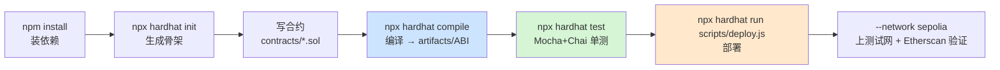

# 01 · Hardhat 安装与项目初始化（Hardhat Setup）
> 从零建立一个 Hardhat 工程，认识安装方式、初始化命令与标准目录结构，为后续所有模块打地基。

## 📖 知识讲解

**Hardhat** 是以太坊智能合约的主流开发框架（JavaScript/TypeScript 生态），提供编译、测试、部署、调试、本地链一条龙能力。它的核心特点是**任务（task）+ 插件（plugin）**架构，绝大多数能力（连接钱包、跑测试、验证源码）都由插件提供，其中官方大礼包 **`@nomicfoundation/hardhat-toolbox`** 一次装齐日常所需。

### 版本说明（重要）
- 本合集使用 **Hardhat 2.x（写作时最新为 v2.28.6）**，配套 `hardhat-toolbox v5`、`ethers v6`、`Mocha + Chai`。这是目前最成熟、教程最多的组合，也是本工程 10 个模块的技术栈。
- 官方已发布 **Hardhat 3**（默认改用 `viem` + Node 内置测试运行器 `node:test`，配置文件为 `.ts`）。它是较大的范式变化，本教学不采用；等你掌握 HH2 后再迁移即可。Hardhat 2 官方支持到 2027-06-01。

### 标准目录结构
```
my-project/
├── contracts/          ← Solidity 源码（*.sol）
├── test/               ← 测试文件（*.test.js）
├── scripts/            ← 部署 / 交互脚本（deploy.js 等）
├── artifacts/          ← 编译产物（ABI + bytecode），自动生成，应 gitignore
├── cache/              ← 编译缓存，自动生成，应 gitignore
├── hardhat.config.js   ← 配置文件（编译器 / 网络 / 插件）
└── package.json
```

## 🔄 流程图 / 原理图

Hardhat 工程从初始化到跑通的完整生命周期（本合集贯穿始终的主线）：



## 💻 代码说明

- `hardhat.config.js`：工程的大脑。第一行 `require("@nomicfoundation/hardhat-toolbox")` 引入插件大礼包；`solidity: "0.8.28"` 指定编译器版本。
- `contracts/Lock.sol`：Hardhat 脚手架自带的经典示例合约（定时锁仓），带完整中文注释。

> 本合集把**依赖统一放在工程根目录** `07-dev-tools-hardhat/package.json`，只需在根目录 `npm install` 一次，再进入任意模块运行 `npx hardhat`（Node 会自动向上层目录查找 `node_modules`）。这样避免每个模块都重复安装。

## ▶️ 运行方式

前置：Node.js **v18+**（推荐 v20/v22 LTS）。

```bash
# 1) 在工程根目录一次性安装所有模块共用的依赖
cd 07-dev-tools-hardhat
npm install

# 2) 进入本模块，编译一下验证环境 OK
cd 01-hardhat-setup
npx hardhat compile
# 成功后会看到 Compiled 1 Solidity file successfully，并生成 artifacts/ 与 cache/

# 查看 Hardhat 所有可用命令
npx hardhat help
```

### 想从零手动初始化一个全新工程？（了解即可）
```bash
mkdir demo && cd demo
npm init -y
npm install --save-dev hardhat@hh2          # 装 Hardhat 2 最新版
npx hardhat init                            # 交互式：选 "Create a JavaScript project"
npm install --save-dev @nomicfoundation/hardhat-toolbox
```

## ⚠️ 常见坑 / 安全提示

- **Node 版本过低**会报错，务必 v18+。用 `node -v` 检查。
- `artifacts/`、`cache/`、`node_modules/` 都是自动产物，**必须 gitignore**（本工程已配置）。
- `npx hardhat init` 交互式命令**无法在 CI / 非交互终端跑**；自动化用 `--init` 模板方式（HH3）或直接提交现成 `hardhat.config.js`（本工程做法）。
- 绝不把私钥、助记词写进代码或配置；一律用 `.env`（见 07 模块）。合约默认「教学用途，未经审计，勿上主网」。

## 🔗 官方文档

- Hardhat 2 快速开始：https://v2.hardhat.org/hardhat-runner/docs/getting-started
- hardhat-toolbox：https://v2.hardhat.org/hardhat-runner/plugins/nomicfoundation-hardhat-toolbox
- Hardhat 3（了解新范式）：https://hardhat.org/docs
