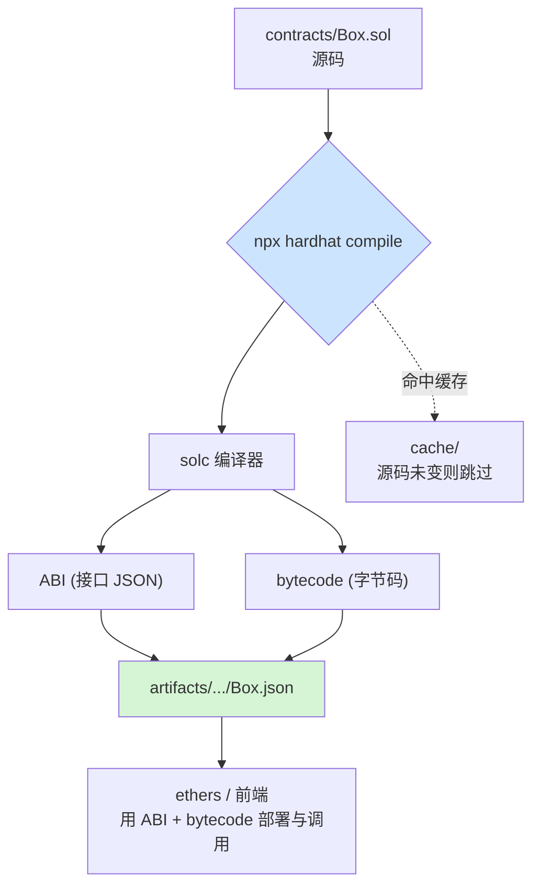

# 02 · 编译合约与产物（Compile / Artifacts / ABI）
> 理解 `npx hardhat compile` 干了什么：把 `.sol` 源码编译成 **字节码**（部署到链上）和 **ABI**（供前端/脚本调用），产物落在 `artifacts/`。

## 📖 知识讲解

编译是把人写的 Solidity 翻译成 EVM 能执行的机器码的过程。Hardhat 用 `solc` 编译器完成，产出两样关键东西：

| 产物 | 是什么 | 给谁用 |
|------|--------|--------|
| **bytecode（字节码）** | 部署到链上的十六进制机器码 | 部署交易 |
| **ABI（Application Binary Interface）** | 合约的“接口说明书”（JSON），描述有哪些函数、参数、事件 | 前端 / ethers / 测试脚本 编解码调用数据 |

编译结果存放在 `artifacts/contracts/Box.sol/Box.json`，里面同时含 `abi` 和 `bytecode`。`cache/` 存缓存，源码没变时**增量编译**、直接跳过。

### 编译器配置要点
- `version`：编译器版本，用 `0.8.x` 近版本。
- `optimizer`：优化器。`runs=200` 是最常用折中——数值越大越优化“运行时调用成本”，越小越优化“部署成本”。
- 一个工程可配置**多个编译器版本**（当依赖的合约用了不同 pragma 时）。

## 🔄 流程图 / 原理图



## 💻 代码说明

- `hardhat.config.js`：展示 `solidity` 的对象写法（含 `optimizer`）。
- `contracts/Box.sol`：一个含 1 个 event、2 个函数（`store` 写 / `retrieve` 读）的最小合约，便于观察 ABI 结构。
- `scripts/read-artifact.js`：用 `hre.artifacts.readArtifact("Box")` 读产物，打印 ABI 条目和字节码长度，直观看到“编译到底产出了什么”。

## ▶️ 运行方式

```bash
# （首次）在工程根目录 07-dev-tools-hardhat 执行 npm install
cd 02-compile

# 编译：生成 artifacts/ 与 cache/
npx hardhat compile

# 读产物，打印 ABI 与字节码
npx hardhat run scripts/read-artifact.js

# 强制全量重新编译（清缓存）
npx hardhat clean && npx hardhat compile
```

## ⚠️ 常见坑 / 安全提示

- **pragma 与配置版本不匹配**：`.sol` 里 `pragma solidity ^0.8.28` 要能被 config 的 `version` 满足，否则报 “No compiler … found”。
- 改了源码但 `npx hardhat compile` 说 “Nothing to compile”，是命中了 `cache/`；用 `npx hardhat clean` 清掉即可。
- `artifacts/`、`cache/` 是产物，**别提交到 git**（已 gitignore）。
- ABI 是公开信息不敏感；但**优化器设置会影响验证源码**（见 07 模块，验证时的编译配置必须与部署时完全一致）。

## 🔗 官方文档

- 编译合约：https://v2.hardhat.org/hardhat-runner/docs/guides/compile-contracts
- artifacts API：https://v2.hardhat.org/hardhat-runner/docs/advanced/artifacts
- solidity 配置：https://v2.hardhat.org/hardhat-runner/docs/config#solidity-configuration
