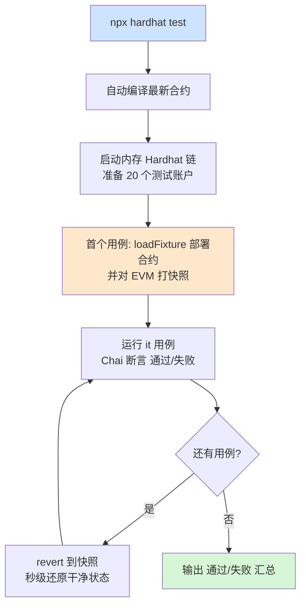

# 03 · 编写单元测试（Testing with Mocha + Chai + ethers）
> 用 `npx hardhat test` 跑自动化测试：`Mocha` 组织用例、`Chai` 做断言、`ethers v6` 部署与调用合约，`loadFixture` 让每个用例都在干净又快速的环境里运行。

## 📖 知识讲解

测试是智能合约开发的**生命线**——合约一旦上链不可改，bug 代价极高，因此“先测后部”是铁律。Hardhat 的测试栈（由 toolbox 提供）：

- **Mocha**：测试框架，用 `describe()` 分组、`it()` 写单个用例。
- **Chai + hardhat-chai-matchers**：断言库。matchers 补充了合约专用断言：
  - `.to.emit(合约, "事件").withArgs(...)`：断言触发了事件。
  - `.to.be.revertedWith("信息")` / `.revertedWithCustomError(...)`：断言交易回滚。
  - `.to.changeEtherBalances(...)` / `.changeTokenBalances(...)`：断言余额增减。
- **ethers v6**：`getSigners()` 拿测试账户、`getContractFactory().deploy()` 部署合约。
- **network-helpers 的 `loadFixture`**：核心提效工具。它第一次运行 fixture 部署合约，之后每个用例用 **EVM 快照回滚** 秒回到那个状态，既隔离又快。

### 为什么用 fixture 而不是 `beforeEach` 里重新部署？
`beforeEach` 每次都真部署一遍（慢）；`loadFixture` 只部署一次、其余靠快照恢复（快），且状态天然隔离。

## 🔄 流程图 / 原理图



## 💻 代码说明

- `contracts/Token.sol`：极简代币，含 `transfer`、`balanceOf`、`Transfer` 事件、余额不足 `require`——正好覆盖各类断言。
- `test/Token.test.js`：
  - `deployTokenFixture()`：一次性描述“部署 + 拿账户”，配 `loadFixture` 复用。
  - 覆盖：初始分配、owner、普通转账、`changeTokenBalances`、`emit ... withArgs`、`revertedWith`。
  - `token.connect(addr1)`：用另一个账户身份发交易。

## ▶️ 运行方式

```bash
# （首次）在工程根目录 07-dev-tools-hardhat 执行 npm install
cd 03-testing

# 跑全部测试
npx hardhat test

# 只跑某个文件
npx hardhat test test/Token.test.js

# 顺带打印 gas 报告（见 09 模块）
REPORT_GAS=true npx hardhat test
```
预期输出：`Token 合约` 下 6 个用例全部 ✓ 通过。

## ⚠️ 常见坑 / 安全提示

- **ethers v6 语法**与 v5 不同：v6 用 `token.target` 取地址、`await token.getAddress()`、`ethers.parseEther("1")`（无 `utils.` 前缀）。本合集统一 v6。
- 断言交易失败要 `await expect(tx).to.be.revertedWith(...)`——**别漏 `await`**，否则断言可能提前通过（假绿）。
- `loadFixture` 的 fixture 函数**不要带参数**、且应为纯部署逻辑；带随机性会破坏快照复用。
- 测试只在本地内存链跑，**不花真钱**；但仍要按“像上主网一样”严格覆盖边界条件（溢出、权限、重入）。

## 🔗 官方文档

- 测试合约：https://v2.hardhat.org/hardhat-runner/docs/guides/test-contracts
- chai 匹配器：https://v2.hardhat.org/hardhat-chai-matchers/docs/overview
- network-helpers / loadFixture：https://v2.hardhat.org/hardhat-network-helpers/docs/overview
