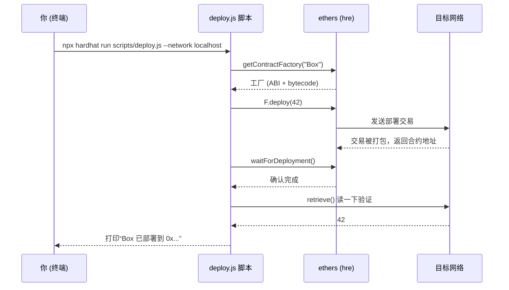

# 04 · 部署脚本（Deploy Scripts）
> 用一个 `scripts/deploy.js` + `npx hardhat run` 把合约部署到不同网络，掌握 `getContractFactory → deploy → waitForDeployment → getAddress` 的标准四步。

## 📖 知识讲解

“部署”= 发一笔特殊交易，把合约**字节码**写到链上并得到一个**合约地址**。Hardhat 里最经典的方式是写一个普通 Node 脚本，用 `npx hardhat run` 执行——脚本里通过全局 `hre`（Hardhat Runtime Environment）拿到已注入的 `ethers`。

标准四步（ethers v6）：
1. `const F = await ethers.getContractFactory("Box")` —— 拿合约工厂（含 ABI + 字节码）。
2. `const box = await F.deploy(参数)` —— 发部署交易，传构造参数。
3. `await box.waitForDeployment()` —— 等待被打包确认。
4. `await box.getAddress()` —— 取到合约地址（v6 也可用 `box.target`）。

`--network` 决定部署到哪：
- 不加 `--network`：部署到**临时内存链**，脚本一结束就销毁（适合快速验证）。
- `--network localhost`：部署到你用 `npx hardhat node` 启动的**常驻本地节点**（见 05 模块），部署结果会保留。
- `--network sepolia`：部署到**测试网**（需在 config 配 RPC + 私钥，见 07 模块）。

## 🔄 流程图 / 原理图



## 💻 代码说明

- `contracts/Box.sol`：构造函数带参数 `initialValue`，演示“带构造参数的部署”。
- `scripts/deploy.js`：完整四步；额外打印部署者地址与余额、部署后立即调用 `retrieve()` 自检。

## ▶️ 运行方式

```bash
# （首次）在工程根目录 07-dev-tools-hardhat 执行 npm install
cd 04-deploy-scripts

# 方式 A：部署到临时内存链（最省事，跑完即销毁）
npx hardhat run scripts/deploy.js

# 方式 B：部署到常驻本地节点（分两个终端）
# 终端1：启动本地链（见 05 模块）
npx hardhat node
# 终端2：部署上去
npx hardhat run scripts/deploy.js --network localhost
```

## ⚠️ 常见坑 / 安全提示

- 部署到 `--network localhost` **前必须先 `npx hardhat node`**，否则连不上会报 ECONNREFUSED。
- 不加 `--network` 时链是**临时的**，部署地址每次都变、脚本一结束就没了——别拿它当持久环境。
- 上测试网/主网时，**私钥只放 `.env` 且 gitignore**（见 07），脚本/配置里绝不硬编码私钥。
- 部署脚本要有**幂等意识与确认等待**（`waitForDeployment`），真实网络出块慢，漏等确认会读到旧状态。
- 进阶：官方推荐用 **Hardhat Ignition**（声明式部署，自动追踪已部署合约、可断点续部）替代手写脚本，链接见下。

## 🔗 官方文档

- 部署合约：https://v2.hardhat.org/hardhat-runner/docs/guides/deploying
- Hardhat Ignition（声明式部署）：https://v2.hardhat.org/ignition
- ethers v6 合约部署：https://docs.ethers.org/v6/
