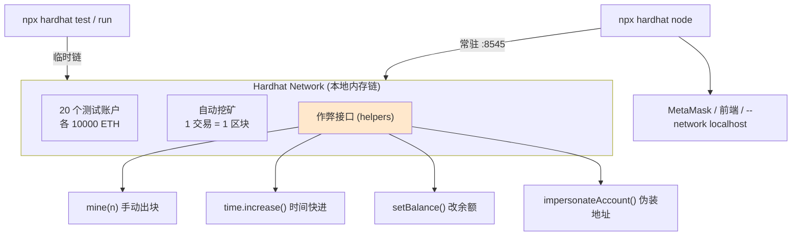

# 05 · 内置本地链 Hardhat Network（账户 / 挖矿 / 时间旅行）
> 认识 Hardhat 自带的内存以太坊链：20 个满额测试账户、即时出块，还能**手动挖矿、时间快进、凭空改余额、伪装任意地址**——这些开发利器只有本地链才有。

## 📖 知识讲解

**Hardhat Network** 是一条运行在内存里的本地以太坊链，专为开发测试而生。两种用法：

1. **内嵌模式**：跑 `npx hardhat test` / `npx hardhat run` 时自动起一条**临时**链，命令结束就销毁。
2. **常驻节点**：`npx hardhat node` 起一个监听 `http://127.0.0.1:8545` 的**持久** JSON-RPC 节点，MetaMask / 前端 / 其他脚本可连它（`--network localhost`）。

它的“超能力”（真实网络绝对做不到，来自 `network-helpers`）：
- **默认账户**：20 个账户，每个预充 10000 ETH，私钥公开（**仅限本地**）。
- **即时/定时出块**：默认自动挖矿（一交易一块）；也可设 `interval` 模拟真实出块节奏。
- `mine(n)`：手动挖 n 个空块。
- `time.increase(秒)`：**时间旅行**，测试“锁仓到期、质押解锁、拍卖结束”等时间相关逻辑。
- `setBalance(addr, wei)`：任意改余额。
- `impersonateAccount(addr)`：**伪装成任意地址**发交易（配合 08 分叉主网，可操控巨鲸账户）。

## 🔄 流程图 / 原理图



## 💻 代码说明

- `hardhat.config.js`：`networks.hardhat` 里注释展示 `chainId`、`mining`（自动 vs 定时）、`accounts`（数量/余额）等可调项。
- `scripts/network-demo.js`：依次演示查看账户、`mine(5)`、`time.increase(7天)`、`setBalance`、`impersonateAccount` 六个能力。

## ▶️ 运行方式

```bash
# （首次）在工程根目录 07-dev-tools-hardhat 执行 npm install
cd 05-hardhat-network

# 演示各种“作弊能力”
npx hardhat run scripts/network-demo.js

# 启动常驻本地节点（会打印 20 个账户地址 + 私钥），另开终端连它
npx hardhat node
```
启动 `node` 后，可把 MetaMask 网络加为 `http://127.0.0.1:8545`、Chain ID `31337`，导入打印出的测试私钥体验。

## ⚠️ 常见坑 / 安全提示

- **`npx hardhat node` 打印的私钥是全网公开的固定测试私钥**——**绝对不要**往这些地址转真实资产，也别把它们用在测试网/主网。
- 内嵌临时链每次重启状态清零；要持久环境请用 `npx hardhat node`。
- Chain ID 默认 `31337`；MetaMask 里 Chain ID 填错会连不上或报 nonce 错误。
- 时间旅行、改余额只影响**本地链**；这是测试手段，不是真的能在主网改钱。

## 🔗 官方文档

- Hardhat Network：https://v2.hardhat.org/hardhat-network/docs/overview
- network-helpers：https://v2.hardhat.org/hardhat-network-helpers/docs/reference
- 运行独立节点：https://v2.hardhat.org/hardhat-runner/docs/getting-started#connecting-a-wallet-or-dapp-to-hardhat-network
