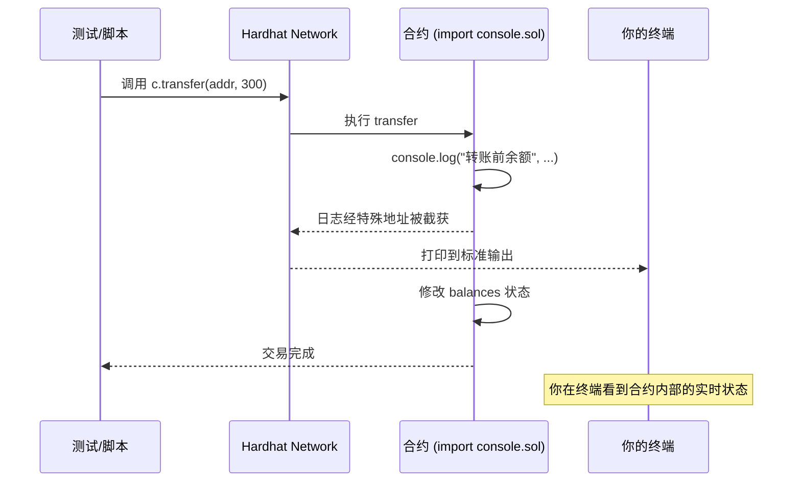

# 06 · 用 console.log 调试合约（Solidity console.log）
> 在 `.sol` 里 `import "hardhat/console.sol"` 后，就能像写 JS 一样在合约中 `console.log(...)`，运行测试/脚本时直接打印到终端——定位合约内部状态的神器。

## 📖 知识讲解

Solidity 本身没有 `print`，链上也没有标准输出。Hardhat 提供了一个特殊库 **`hardhat/console.sol`**：在合约里引入它并调用 `console.log`，当合约跑在 **Hardhat Network** 上时，日志会被 Hardhat 截获并打印到你的终端。

- 支持类型：`uint`、`int`、`string`、`bool`、`address`、`bytes` 等。
- 支持占位符：`console.log("x=%s y=%d", a, b)`。
- 有便捷别名：`console.logUint(...)`、`console.logAddress(...)` 等。
- **不改变合约行为**，也**不消耗真实 gas 逻辑**（只在本地链有效）；一旦部署到真实网络，这些调用无输出，但仍占字节码——所以**上主网前应删除**。

它和 03 的测试断言互补：断言判断“对不对”，`console.log` 告诉你“过程中发生了什么”。

## 🔄 流程图 / 原理图



## 💻 代码说明

- `contracts/ConsoleDemo.sol`：`import "hardhat/console.sol"`，在 `transfer` 里打印调用者、金额、转账前后余额，展示普通参数与 `%s` 占位符两种写法。
- `test/ConsoleDemo.test.js`：调用 `transfer` 触发这些日志——跑测试时留意终端输出。

## ▶️ 运行方式

```bash
# （首次）在工程根目录 07-dev-tools-hardhat 执行 npm install
cd 06-console-log

# 跑测试，观察终端里合约打印的调试信息
npx hardhat test
```
你会在 `✓` 用例附近看到 `transfer 调用者: 0x...`、`转账后 - 我的余额: 700, 对方余额: 300` 等日志。

## ⚠️ 常见坑 / 安全提示

- **中文/非 ASCII 要用 `unicode"..."`**：Solidity 普通字符串字面量只允许 ASCII，`console.log("调用者")` 会报 `Invalid character in string`；必须写 `console.log(unicode"调用者")`（本模块合约已这样处理）。
- **只在 Hardhat Network 有效**：部署到 Sepolia/主网后 `console.log` 不会有任何输出。
- **上主网前请删除** `import "hardhat/console.sol"` 及所有 `console.log`——它们会平白增加字节码体积和部署成本。
- 参数类型要匹配重载；打印结构体/数组需逐字段打印。
- 它是**调试工具，不是日志系统**；链上要对外“广播”信息请用 `event`（可被前端监听、可被索引），而非 console。

## 🔗 官方文档

- console.log 调试：https://v2.hardhat.org/hardhat-network/docs/reference#console.log
- Solidity 调试指南：https://v2.hardhat.org/tutorial/debugging-with-hardhat-network
