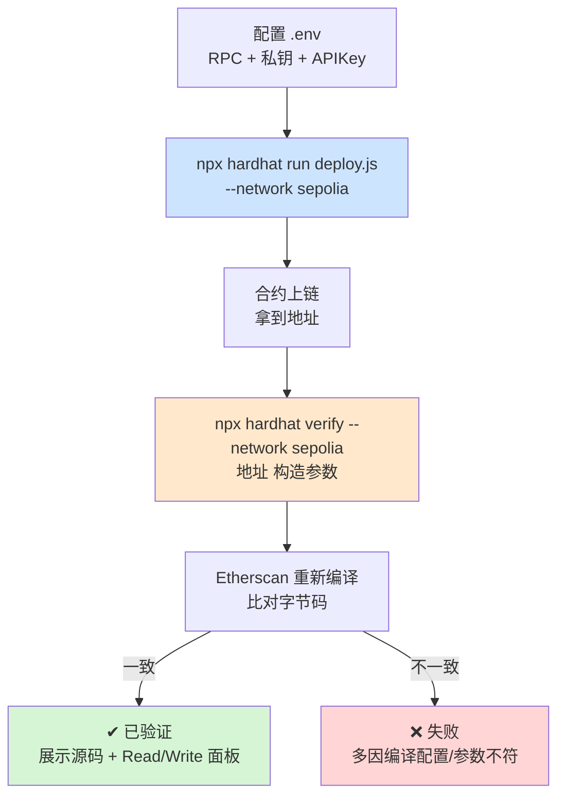

# 07 · 部署测试网并在 Etherscan 验证源码（Verify on Etherscan）
> 把合约部署到 **Sepolia 测试网**，再用 `npx hardhat verify` 把源码提交到 **Etherscan**，让任何人都能在浏览器上读到经过校验的合约代码、直接调用它的读写方法。

## 📖 知识讲解

链上存的是**字节码**，普通人看不懂。**验证（verify）** = 把源码 + 编译配置提交给区块浏览器，浏览器重新编译并比对字节码，一致就给合约打上“已验证”✔ 标记，并展示可读源码 + Read/Write 交互面板。这是 DeFi/开源合约的**信任基础**。

Hardhat 用 `hardhat-verify`（toolbox 内置）完成，两步：
1. `npx hardhat run scripts/deploy.js --network sepolia` —— 部署。
2. `npx hardhat verify --network sepolia <合约地址> <构造参数...>` —— 验证。

### 三样必备信息（全部放 `.env`）
| 变量 | 用途 | 来源 |
|------|------|------|
| `SEPOLIA_RPC_URL` | 连 Sepolia 的节点端点 | Alchemy / Infura 免费注册 |
| `PRIVATE_KEY` | 部署账户私钥（**测试小号**） | 你的测试钱包，需先领测试币 |
| `ETHERSCAN_API_KEY` | 提交验证的凭证 | https://etherscan.io/myapikey 免费申请 |

测试币水龙头：https://sepoliafaucet.com 、https://www.alchemy.com/faucets/ethereum-sepolia 。

## 🔄 流程图 / 原理图



## 💻 代码说明

- `hardhat.config.js`：用 `dotenv` 从工程根 `.env` 读 RPC/私钥/APIKey；`networks.sepolia`（chainId `11155111`）+ `etherscan.apiKey`。私钥为空时传空数组，避免报错。
- `scripts/deploy.js`：部署后**直接打印现成的 verify 命令**（含构造参数 `42`）。
- 敏感信息只在 `.env`（见工程根 `.env.example`），已被 `.gitignore` 忽略。

## ▶️ 运行方式

```bash
# （首次）在工程根目录 07-dev-tools-hardhat 执行 npm install
# 1) 准备 .env（在工程根目录）
cd /path/to/07-dev-tools-hardhat
cp .env.example .env      # 然后填入你的 RPC / 私钥(测试小号) / Etherscan APIKey

# 2) 部署到 Sepolia（账户需先领测试币）
cd 07-verify-etherscan
npx hardhat run scripts/deploy.js --network sepolia

# 3) 用上一步打印的命令验证源码（把地址替换成你的）
npx hardhat verify --network sepolia 0x你的合约地址 42
```
验证成功后，去 `https://sepolia.etherscan.io/address/0x你的地址#code` 就能看到源码和交互面板。

## ⚠️ 常见坑 / 安全提示

- 🔑 **私钥安全是第一位**：只用没有真实资产的**测试小号**；私钥只放 `.env`；确认 `.env` 已被 gitignore（本工程已配）。**任何时候都不要把私钥写进代码、粘进聊天、提交仓库。**
- **构造参数必须原样传给 verify**：`Box` 部署传了 `42`，verify 也要跟 `42`，否则字节码对不上、验证失败。
- **编译配置必须与部署时一致**：优化器开关、`runs`、`evmVersion` 改了都会导致验证失败。
- 无测试币无法部署——先去水龙头领 Sepolia ETH。
- Etherscan 新版 API（V2）可能要求账号已验证邮箱；`hardhat-verify` 也支持 `sourcify` 作为备选验证方案。

## 🔗 官方文档

- 验证合约 / hardhat-verify：https://v2.hardhat.org/hardhat-runner/plugins/nomicfoundation-hardhat-verify
- 部署到实时网络：https://v2.hardhat.org/hardhat-runner/docs/guides/deploying
- Sepolia 水龙头：https://www.alchemy.com/faucets/ethereum-sepolia
