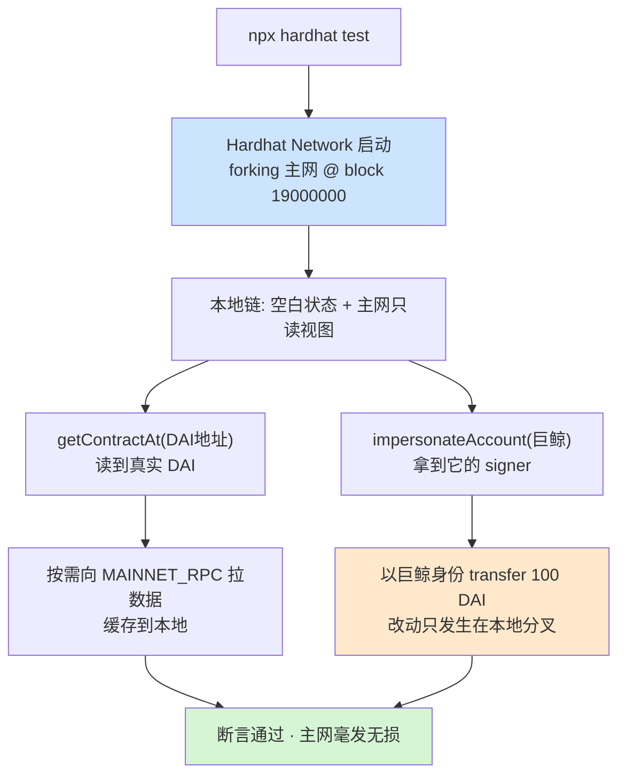

# 08 · 分叉主网状态测试（Mainnet Forking）
> 把主网某个区块的完整状态“克隆”到本地内存链：不部署、不花真钱，就能在本地读写真实存在的主网合约（DAI、Uniswap、Aave…），还能伪装成巨鲸账户测试集成。

## 📖 知识讲解

**主网分叉（forking）** 让 Hardhat Network 在启动时以主网某区块为起点：本地链空白，但任何对主网已有合约/账户的读取，都会**按需**通过 `MAINNET_RPC_URL` 拉取真实数据缓存到本地。于是你能：

- 直接 `getContractAt(DAI_ABI, DAI地址)` 拿到**真实的主网 DAI 合约**并调用它。
- 配合 `impersonateAccount` **伪装成任意主网地址**（比如某巨鲸），用它真实的余额去做转账、授权、swap——全部在本地，不影响主网。
- 测试你的合约与 Uniswap/Aave/Compound 等主流协议的集成，而无需在测试网重新部署一整套依赖。

关键配置在 `networks.hardhat.forking`：
- `url`：主网端点（需归档/全节点，Alchemy/Infura）。
- `blockNumber`：**固定分叉区块**，让测试可复现（不写则跟随最新块，结果会漂移）。

## 🔄 流程图 / 原理图



## 💻 代码说明

- `hardhat.config.js`：`forking.url` 从 `.env` 读 `MAINNET_RPC_URL`，`blockNumber: 19000000` 固定分叉点，未配 RPC 时 `enabled:false` 自动禁用。
- `test/fork.test.js`：
  - 读主网 DAI 的 `symbol/decimals/name`；
  - `setBalance` 给巨鲸充 gas → `impersonateAccount` 伪装 → 以巨鲸身份 `transfer` 100 DAI，断言接收方到账。

## ▶️ 运行方式

```bash
# （首次）在工程根目录 07-dev-tools-hardhat 执行 npm install
# 1) 在工程根 .env 配好 MAINNET_RPC_URL（Alchemy/Infura 的主网端点）
cd 08-mainnet-forking

# 2) 跑分叉测试
npx hardhat test
```
> 没有主网 RPC 也没关系：配置里 `enabled:!!MAINNET_RPC_URL` 会自动关掉分叉，此时读主网合约的用例会失败——这是预期的，配上 RPC 即可跑通。

## ⚠️ 常见坑 / 安全提示

- **需要归档节点级 RPC**：读历史区块状态时，普通节点可能返回缺失；Alchemy/Infura 的端点通常够用。
- **务必固定 `blockNumber`**：不固定则每次分叉最新块，巨鲸余额/价格变化会让测试时好时坏、无法复现。
- **RPC 端点里含 API Key，属敏感信息**——放 `.env`、别提交。
- 分叉是**本地沙盒**：所有改动只在本地，绝不会动到主网；但也别误以为“在分叉里赚到的钱是真的”。
- 首次拉数据较慢，测试超时可调大 `this.timeout(...)`。

## 🔗 官方文档

- 主网分叉：https://v2.hardhat.org/hardhat-network/docs/guides/forking-other-networks
- impersonateAccount：https://v2.hardhat.org/hardhat-network-helpers/docs/reference#impersonateaccount
