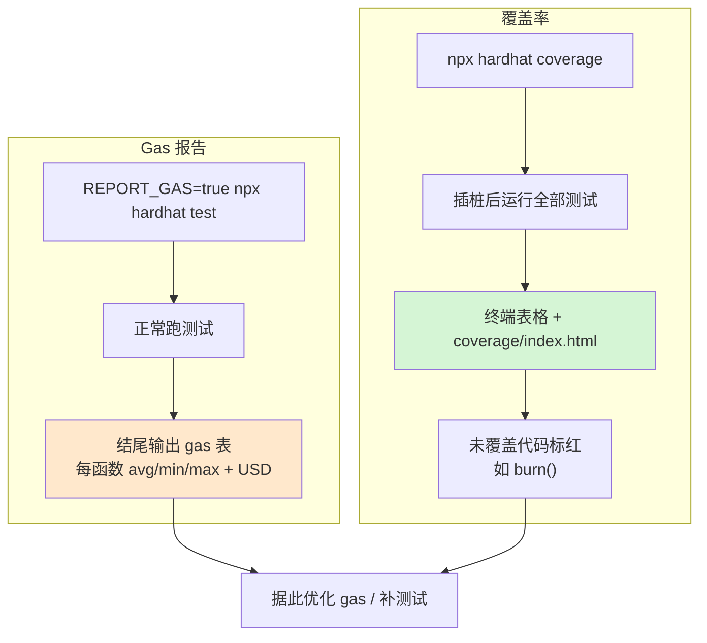

# 09 · Gas 报告与测试覆盖率（Gas Reporter & Coverage）
> 两个质量度量工具：`hardhat-gas-reporter` 在测试后打印每个函数的 **gas 消耗**（可折算法币），`solidity-coverage` 生成**测试覆盖率**报告，告诉你哪些代码还没被测到。

## 📖 知识讲解

### Gas Reporter
每次调用合约都要花 gas（= 用户真金白银）。`hardhat-gas-reporter`（toolbox 内置）会在 `npx hardhat test` 结束后，输出一张表：每个函数的**平均/最小/最大 gas**、部署成本，配 CoinMarketCap key 还能折算成 **USD**。用来对比“优化前后省了多少 gas”。

- 用 `REPORT_GAS=true` 环境变量控制开关（默认关，避免拖慢日常测试）。

### Coverage（覆盖率）
`solidity-coverage`（toolbox 内置）跑 `npx hardhat coverage`，统计测试覆盖了多少**语句/分支/函数/行**，生成终端表格 + `coverage/index.html` 可视化报告。未覆盖的代码会**标红**——那往往是 bug 藏身处。目标是关键逻辑接近 100% 覆盖。

> 本模块的 `Token.sol` **故意留了个没被测试的 `burn()`**，好让你在 coverage 报告里亲眼看到它显示为“未覆盖”。

## 🔄 流程图 / 原理图



## 💻 代码说明

- `hardhat.config.js`：`gasReporter` 段，`enabled` 由 `REPORT_GAS` 控制，`currency:"USD"`，可选 `coinmarketcap` key。
- `contracts/Token.sol`：`transfer`（被测）+ `burn`（**故意不测**，用于展示覆盖率标红）。
- `test/Token.test.js`：覆盖部署、转账、回滚，但不碰 `burn`。

## ▶️ 运行方式

```bash
# （首次）在工程根目录 07-dev-tools-hardhat 执行 npm install
cd 09-gas-reporter-coverage

# 1) 带 gas 报告跑测试
REPORT_GAS=true npx hardhat test
#（Windows PowerShell：$env:REPORT_GAS="true"; npx hardhat test）

# 2) 生成覆盖率报告（会看到 burn() 未覆盖）
npx hardhat coverage
# 打开 coverage/index.html 看可视化报告
```

## ⚠️ 常见坑 / 安全提示

- 覆盖率工具会**给合约插桩**并临时重编译，gas 数字在 coverage 模式下不准——**别在 coverage 模式看 gas**，两者分开跑。
- 折算 USD 需要 `COINMARKETCAP_API_KEY`（放 `.env`）；不配也能看 gas 原始值。
- **高覆盖率 ≠ 没 bug**：它只说明“代码被执行过”，不保证断言充分。仍需覆盖边界/攻击场景（重入、溢出、权限）。
- `coverage/`、`gas-report.txt` 等产物应 gitignore（本工程已配 `coverage/`）。

## 🔗 官方文档

- hardhat-gas-reporter：https://github.com/cgewecke/hardhat-gas-reporter
- solidity-coverage：https://github.com/sc-forks/solidity-coverage
- 覆盖率与 gas 指南：https://v2.hardhat.org/hardhat-runner/plugins/nomicfoundation-hardhat-toolbox
