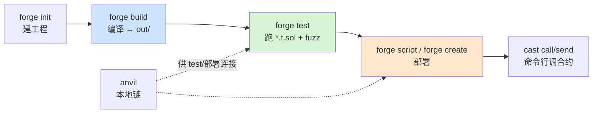

# 10 · Foundry 入门与对比（forge / cast / anvil / chisel）
> 认识 Rust 编写的高速开发框架 **Foundry**：用 **Solidity 本身写测试**、内置**模糊测试**、命令行秒级编译测试。与 Hardhat 对照理解，二者各有所长、常配合使用。

## 📖 知识讲解

**Foundry** 是与 Hardhat 齐名的以太坊开发框架，四件套：

| 工具 | 作用 | 对应 Hardhat |
|------|------|--------------|
| **forge** | 编译 / 测试 / 部署 | `hardhat compile/test` + 部署脚本 |
| **cast** | 命令行与链/合约交互（call/send/查数据） | ethers 脚本 / `hardhat console` |
| **anvil** | 本地测试链 | Hardhat Network / `hardhat node` |
| **chisel** | Solidity 交互式 REPL | 无直接对应 |

### Foundry vs Hardhat 核心差异
- **测试语言**：Foundry 用 **Solidity**（`*.t.sol`）写测试；Hardhat 用 **JS/TS**（Mocha+Chai）。
- **模糊测试（fuzzing）**：Foundry 原生支持 `testFuzz_*`，自动灌入大量随机入参找边界 bug——这是它的杀手锏。
- **速度**：Foundry 用 Rust，编译测试通常更快。
- **依赖管理**：Foundry 用 `forge install`（git submodule 到 `lib/`）；Hardhat 用 npm。
- **生态/前端**：Hardhat 的 JS 生态、插件、与前端（ethers/viem）衔接更顺。

实践中很多团队**两者并用**：合约层用 Foundry 做快速单测 + fuzz，集成/脚本/前端用 Hardhat。

## 🔄 流程图 / 原理图



## 💻 代码说明

- `foundry.toml`：Foundry 配置（`src/out/libs/solc/optimizer`），对应 `hardhat.config.js`。
- `src/Counter.sol`：脚手架自带计数器。
- `test/Counter.t.sol`：用 Solidity 写测试——`Test` 基类、`assertEq` 断言、`vm.*` 作弊码；含普通用例 `test_Increment` 与**模糊测试** `testFuzz_SetNumber(uint256 x)`。
- `script/Counter.s.sol`：Solidity 部署脚本，`vm.startBroadcast()` 之间的交易会真正上链。

## ▶️ 运行方式

Foundry 不走 npm，需单独安装工具链：

```bash
# 1) 安装 Foundry（一次性）
curl -L https://foundry.paradigm.xyz | bash
foundryup     # 下载/更新 forge cast anvil chisel

# 2) 本模块已是现成工程结构，但首次需装 forge-std 依赖库
cd 10-foundry-intro
forge install foundry-rs/forge-std   # 装标准库到 lib/（若已有可跳过）

# 3) 编译 & 测试（注意看 fuzz 会跑很多次随机输入）
forge build
forge test -vvv        # -v 越多日志越详细

# 4) 启本地链 + 用 cast 交互（另开终端）
anvil                                  # 起本地链，打印测试账户
cast block-number --rpc-url http://127.0.0.1:8545
cast call <合约地址> "number()(uint256)" --rpc-url http://127.0.0.1:8545

# 5) 部署脚本示例（连本地 anvil）
forge script script/Counter.s.sol --rpc-url http://127.0.0.1:8545 --broadcast
```

## ⚠️ 常见坑 / 安全提示

- **Foundry 独立于 Node/npm**：本工程根目录的 `npm install` 不会装 Foundry，需 `foundryup` 单独装。
- `forge test` 依赖 `forge-std`；缺 `lib/forge-std` 会编译失败，先 `forge install foundry-rs/forge-std`。
- `lib/`、`out/`、`broadcast/` 是产物/依赖，应 gitignore（本工程已配）。
- 部署 `--broadcast` 到测试网/主网需私钥：用 `--private-key $PRIVATE_KEY`（放 `.env`）或 `--interactive`，**绝不硬编码私钥**；只用测试小号 + 测试网。
- 模糊测试能发现边界 bug，但**不能替代**对已知攻击面（重入、权限、溢出）的针对性测试。

## 🔗 官方文档

- Foundry Book：https://getfoundry.sh/ （原 https://book.getfoundry.sh/）
- forge 测试 / fuzzing：https://getfoundry.sh/forge/tests/
- cast 参考：https://getfoundry.sh/cast/
- anvil：https://getfoundry.sh/anvil/
