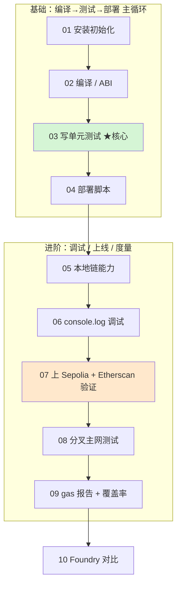

# 07 · Web3 开发工具：Hardhat / Foundry

> 智能合约的工程化开发框架。前面模块（01-06）学的是「链、EVM、Solidity、合约安全、标准」，本工程学的是**怎么把合约真正开发出来**：编译、写单测、部署、调试、上测试网验证、分叉主网测试、度量 gas 与覆盖率，最后对比 Foundry。

## 🧭 开发工具简介

**Hardhat** 是以太坊主流的 JavaScript/TypeScript 开发框架，核心是「任务 + 插件」架构，官方大礼包 `@nomicfoundation/hardhat-toolbox` 一次装齐 ethers v6、Mocha+Chai 测试、gas 报告、覆盖率、Etherscan 验证等日常所需。**Foundry**（模块 10）是 Rust 编写的另一主流框架，用 Solidity 写测试、内置模糊测试、速度快，常与 Hardhat 配合使用。

### 版本约定（对照官方，避免过时）
- **Hardhat 2.x**（写作时最新 v2.28.6）+ `hardhat-toolbox v5` + `ethers v6` + `Solidity 0.8.28`。这是本工程 10 个模块的统一技术栈，教程最成熟。Hardhat 2 官方支持至 2027-06-01。
- 官方已发布 **Hardhat 3**（默认改用 `viem` + Node 内置测试运行器，配置文件为 `.ts`），属较大范式变化，本教学暂不采用；掌握 HH2 后可平滑迁移。
- 所有涉及测试网的模块**只用 Sepolia + 水龙头测试币**，私钥放 `.env` 且已 gitignore，示例一律占位符——**绝不出现真实私钥/资产**。

## 📚 模块索引表

| 模块 | 主题 | 你将学到 | 关键命令 |
|------|------|----------|----------|
| [01-hardhat-setup](./01-hardhat-setup/) | 安装与初始化 | 安装、`init`、项目结构、toolbox | `npm install` / `npx hardhat compile` |
| [02-compile](./02-compile/) | 编译与产物 | artifacts、ABI、字节码、优化器 | `npx hardhat compile` |
| [03-testing](./03-testing/) | 单元测试 | Mocha+Chai+ethers、`loadFixture`、事件/回滚断言 | `npx hardhat test` |
| [04-deploy-scripts](./04-deploy-scripts/) | 部署脚本 | `getContractFactory→deploy→waitForDeployment` | `npx hardhat run scripts/deploy.js` |
| [05-hardhat-network](./05-hardhat-network/) | 内置本地链 | 测试账户、挖矿、时间旅行、改余额、伪装地址 | `npx hardhat node` |
| [06-console-log](./06-console-log/) | 合约内调试 | `import "hardhat/console.sol"` 打印日志 | `npx hardhat test` |
| [07-verify-etherscan](./07-verify-etherscan/) | 测试网 + 验证 | 部署 Sepolia、Etherscan 验证源码、`.env` 管私钥 | `npx hardhat verify --network sepolia` |
| [08-mainnet-forking](./08-mainnet-forking/) | 分叉主网 | fork 主网状态、操控真实 DAI、`impersonateAccount` | `npx hardhat test` |
| [09-gas-reporter-coverage](./09-gas-reporter-coverage/) | gas 与覆盖率 | gas 报告、`coverage` 报告、找未测代码 | `REPORT_GAS=true npx hardhat test` / `npx hardhat coverage` |
| [10-foundry-intro](./10-foundry-intro/) | Foundry 对比 | forge/cast/anvil/chisel、Solidity 测试、fuzzing | `forge test` |

## 🗺️ 学习路线



建议顺序：先吃透 **01→04 的「编译→测试→部署」主循环**（这是日常 80% 的工作），再学 05-09 的调试/上线/度量能力，最后用 10 建立对 Foundry 的认知。

## ⚙️ 运行说明

### 环境要求
- **Node.js v18+**（推荐 v20/v22 LTS）。`node -v` 检查。
- npm（或 pnpm/yarn）。
- 模块 10 的 Foundry 需另外用 `foundryup` 安装，与 npm 无关。

### 安装（只需一次）
本工程 **10 个模块共用工程根目录的一份依赖**：在根目录装一次，进入任意模块即可运行（Node 会自动向上层目录查找 `node_modules`）。
```bash
cd 07-dev-tools-hardhat
npm install
```

### 常用命令速查（进入任一模块目录后）
```bash
npx hardhat compile          # 编译合约
npx hardhat test             # 跑测试
npx hardhat node             # 启动常驻本地链 (:8545)
npx hardhat run scripts/deploy.js [--network localhost|sepolia]   # 运行脚本
npx hardhat coverage         # 覆盖率报告（09）
npx hardhat verify --network sepolia <地址> <构造参数>            # 验证源码（07）
npx hardhat clean            # 清编译缓存与产物
npx hardhat help             # 查看全部命令
```

### 测试网配置（07 / 08 模块需要）
```bash
cp .env.example .env         # 然后填入你的 RPC / 私钥(测试小号) / Etherscan APIKey
```
`.env` 已被 `.gitignore` 忽略，永不入库。

## 🔒 安全底线（强制）
- **只用测试网**（Sepolia）+ 水龙头测试币，**绝不使用主网真实资产**。
- **绝不在代码/仓库出现真实私钥、助记词、API Key**；一律 `.env`（占位符示例见 `.env.example`）。
- 部署账户请用**没有真实资产的测试小号**。
- 所有合约标注「教学用途，未经审计，勿直接上主网」。

## 🔗 官方文档
- Hardhat 2：https://v2.hardhat.org/ ｜ Hardhat 3：https://hardhat.org/docs
- Foundry Book：https://getfoundry.sh/
- ethers v6：https://docs.ethers.org/v6/
