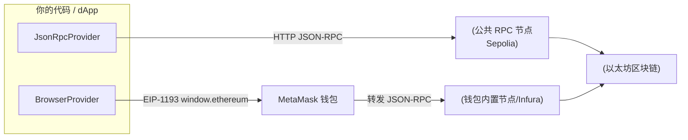

# 01 · Provider 连接（Provider Connect）

> Provider 是前端/脚本"读取区块链"的通道。它封装了与某个节点的 JSON-RPC 通信，让你无需自建节点就能查询链上数据。

## 📖 知识讲解

在 ethers 里，跟链交互分成两种角色：

| 角色 | 作用 | 能否发交易 | 是否需要私钥 |
| --- | --- | --- | --- |
| **Provider** | 只读连接（查余额、区块、调用 view 方法） | ❌ 不能 | 不需要 |
| **Signer** | 代表一个账户，能签名、发交易 | ✅ 能 | 需要（钱包托管） |

ethers v6 中常用的三种 Provider（都在顶层导出）：

- **`JsonRpcProvider(url)`**：给定一个节点的 RPC URL 直接连（Node 脚本、后端、只读前端首选）。
- **`BrowserProvider(window.ethereum)`**：包裹浏览器钱包（MetaMask 等）注入的 EIP-1193 对象；既能读，也能通过 `getSigner()` 拿到钱包账户去签名。v6 里它取代了 v5 的 `Web3Provider`。
- **`getDefaultProvider()`**：ethers 内置的多后端聚合（Infura/Alchemy 等），适合快速试验，不建议生产。

> 关键区别：`JsonRpcProvider` 连的是"某个节点"，私钥不在浏览器；`BrowserProvider` 连的是"用户钱包"，签名永远在 MetaMask 里完成，你的代码拿不到私钥。

## 🔄 流程图 / 原理图



## 💻 代码说明

- `demo.js`：Node 环境用 `JsonRpcProvider` 连公共 Sepolia RPC，读取 `getNetwork()` / `getBlockNumber()` / `getFeeData()`。**只读，无需钱包和私钥。**
- `index.html`：浏览器里用 `BrowserProvider(window.ethereum)` 连 MetaMask，`provider.getSigner()` 触发授权，读出当前账户地址与 chainId。**需要 MetaMask。**

## ▶️ 运行方式

Node 只读版：

```bash
cd 08-ethers-viem
npm install          # 首次运行安装 ethers / viem
node 01-provider-connect/demo.js
```

浏览器钱包版：

```bash
# 需要一个静态服务器（file:// 下 ESM 也可，但推荐 serve）
npx serve 08-ethers-viem/01-provider-connect
# 打开 http://localhost:3000 ，点击"连接 MetaMask"
```

## ⚠️ 常见坑 / 安全提示

- **公共 RPC 有限流**：`https://ethereum-sepolia-rpc.publicnode.com` 免费但可能限速；高频请用自己的 Infura/Alchemy Key。
- **v6 与 v5 命名不同**：v6 是 `BrowserProvider`（v5 叫 `Web3Provider`）、`JsonRpcProvider` 顶层导出；照抄 v5 教程会报错。
- **Provider 不持有私钥**：光有 Provider 无法发交易，别把它当钱包用。
- **只连测试网**：教学一律 Sepolia（chainId `11155111`）；绝不在示例里接主网真实资产。

## 🔗 官方文档

- ethers v6 快速上手：https://docs.ethers.org/v6/getting-started/
- Providers API：https://docs.ethers.org/v6/api/providers/
- EIP-1193（钱包注入标准）：https://eips.ethereum.org/EIPS/eip-1193
