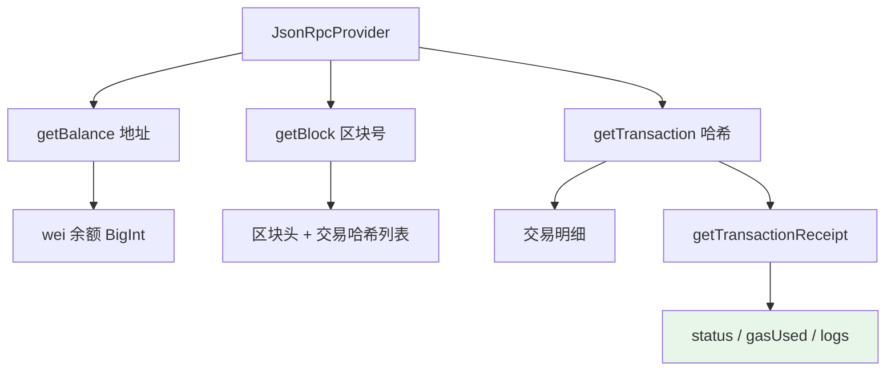

# 02 · 读取区块链数据（Read Blockchain）

> 用一个只读 Provider 就能查询链上几乎所有公开数据：账户余额、区块、交易、回执。这一步不花任何 Gas，也不需要钱包。

## 📖 知识讲解

区块链是一个公开账本，所有数据都能被任何人读取。常用读取方法（`provider.xxx`）：

| 方法 | 返回 | 说明 |
| --- | --- | --- |
| `getBalance(addr)` | `BigInt`（wei） | 账户 ETH 余额，需 `formatEther` 转可读 |
| `getTransactionCount(addr)` | `number` | 该地址已发交易数，即 **nonce** |
| `getBlockNumber()` | `number` | 当前最新区块高度 |
| `getBlock(n)` | `Block` | 区块头 + 交易哈希列表 |
| `getTransaction(hash)` | `Transaction` | 一笔交易的原始信息（from/to/value/data） |
| `getTransactionReceipt(hash)` | `Receipt` | 交易**执行结果**：状态、gasUsed、日志 |

> **交易 vs 回执**：`Transaction` 是"你发出去的意图"，`Receipt` 是"链上执行完的结果"。回执里的 `status`（1 成功 / 0 失败）和 `logs`（事件）只有上链后才有。

⚠️ ethers v6 里所有金额/余额都是 **原生 BigInt**（不再是 v5 的 BigNumber 对象），可以直接用 `+ - * /` 运算，但不能和普通 `number` 混算。

## 🔄 流程图 / 原理图



## 💻 代码说明

`demo.js` 依次演示：查一个 Sepolia 地址余额与 nonce → 取最新区块 → 若区块内有交易则打印首笔交易的明细与回执。全部只读。

## ▶️ 运行方式

```bash
cd 08-ethers-viem
npm install
node 02-read-blockchain/demo.js
```

## ⚠️ 常见坑 / 安全提示

- **单位是 wei**：`getBalance` 返回的是最小单位 wei（1 ETH = 10¹⁸ wei），直接打印会是一长串数字，务必 `formatEther`。
- **BigInt 不能和 number 相加**：`balance + 1` 会报错，要写 `balance + 1n`。
- **老区块可能被节点裁剪**：公共节点不一定保留全历史，查很旧的区块/交易可能返回 `null`。
- 只读操作**不需要私钥**，安全无风险；但不要把示例地址当成你自己的。

## 🔗 官方文档

- Provider 方法（getBalance / getBlock 等）：https://docs.ethers.org/v6/api/providers/#Provider
- 区块与交易类型：https://docs.ethers.org/v6/api/providers/#Block
