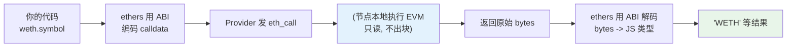

# 03 · 读取合约（Contract Read）

> 有了 ABI（合约接口描述）+ 合约地址 + Provider，就能在链下调用合约的 `view` / `pure` 方法。这类调用不花 Gas、不上链、瞬间返回。

## 📖 知识讲解

**ABI（Application Binary Interface）** 告诉 ethers：这个合约有哪些方法、参数和返回值类型。ethers v6 支持两种 ABI 写法：

1. **JSON ABI**：编译器（solc/Hardhat）输出的标准数组，字段最全。
2. **Human-Readable ABI**（本 demo 用的）：直接用函数签名字符串，如 `"function symbol() view returns (string)"`，简洁直观，教学首选。

构造合约：

```js
const contract = new Contract(地址, ABI, provider); // 只读用 Provider
const contract = new Contract(地址, ABI, signer);   // 要写方法则用 Signer
```

调用 `view` 方法就像调用一个返回 Promise 的普通方法：`await contract.symbol()`。ethers 会自动 ABI 编码请求、发 `eth_call`、再把返回数据解码成 JS 类型（`uint256` → BigInt，`string` → string）。

> **view/pure 方法为什么不花 Gas？** 因为它们不改变链上状态，节点在本地执行（`eth_call`）就能返回结果，无需打包进区块。

## 🔄 流程图 / 原理图



## 💻 代码说明

`demo.js` 连 Sepolia WETH（标准 ERC-20），并发读取 `name/symbol/decimals/totalSupply`，再用 `balanceOf` 查某地址余额。`totalSupply` 是 `uint256`（BigInt），必须用 `formatUnits(值, decimals)` 换算成可读数字。

## ▶️ 运行方式

```bash
cd 08-ethers-viem
npm install
node 03-contract-read/demo.js
```

想读别的合约？只要有它的地址和相关方法签名即可，无需完整源码。

## ⚠️ 常见坑 / 安全提示

- **ABI 与合约不匹配** → 调用报错或返回乱码。确认方法名、参数、返回类型完全一致。
- **decimals 不一定是 18**：USDC 是 6。展示金额一定要用合约自己的 `decimals()`，别写死 18。
- **地址要 checksum 正确**：ethers 会校验大小写混写的地址校验和，抄错一位会直接抛错。
- 只读调用**无风险**，但别把返回的 BigInt 直接当 number 用（大数会丢精度）。

## 🔗 官方文档

- Contract API：https://docs.ethers.org/v6/api/contract/
- Human-Readable ABI：https://docs.ethers.org/v6/api/abi/#about-abi
- ERC-20 标准：https://eips.ethereum.org/EIPS/eip-20
