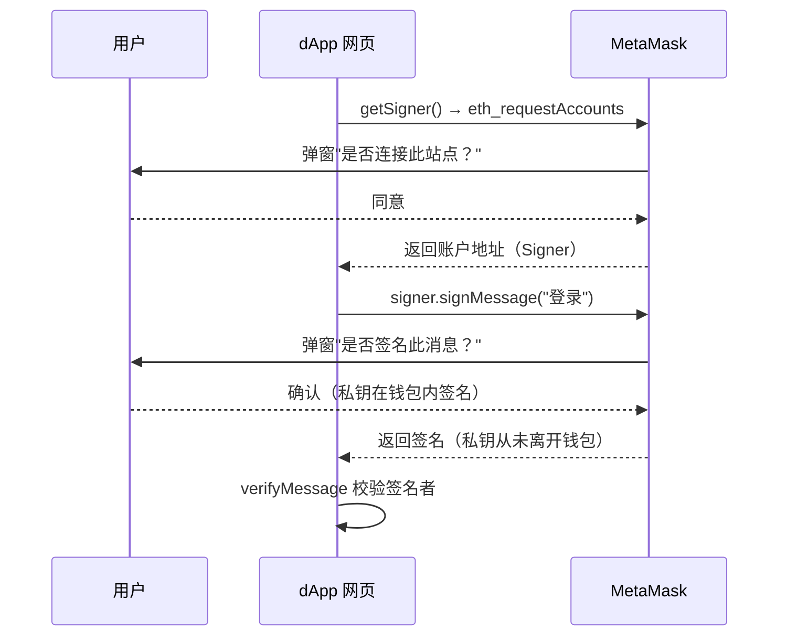

# 04 · Signer 与钱包账户（Signer / Wallet）

> Provider 只能读；要签名、发交易就需要 **Signer**——一个代表某个账户、能用其私钥签名的对象。在浏览器里 Signer 来自 MetaMask，私钥永远不出钱包。

## 📖 知识讲解

**Signer 是"账户的化身"**。它能做 Provider 做不到的事：

- `getAddress()`：拿到账户地址
- `signMessage(msg)`：对文本签名（EIP-191，链下、免费）
- `signTypedData(...)`：对结构化数据签名（EIP-712）
- `sendTransaction(tx)`：发交易（见模块 05）

两种拿到 Signer 的方式：

| 场景 | 写法 | 私钥在哪 |
| --- | --- | --- |
| 浏览器 dApp | `const signer = await browserProvider.getSigner()` | **MetaMask 里**，代码拿不到 |
| Node 脚本 | `const signer = new Wallet(privateKey, provider)` | 你自己保管（务必用 `.env`） |

> **安全核心**：`BrowserProvider.getSigner()` 只是拿到一个"代理"，每次签名/发交易都会弹 MetaMask 让用户确认，私钥从不暴露给网页。这是 dApp 安全的基石。

**签名 vs 发交易**：`signMessage` 是链下签名（证明"我是这个地址"，用于登录、授权凭证），完全免费；`sendTransaction` 才会上链花 Gas。

## 🔄 流程图 / 原理图



## 💻 代码说明

- `index.html`：浏览器里 `provider.getSigner()` 拿到钱包账户 → 读地址/余额 → `signMessage` 签名 → `verifyMessage` 反推签名者，验证一致。**需要 MetaMask。**
- `demo.js`：Node 里用 `Wallet.createRandom()` 生成一个临时钱包（余额恒为 0），演示"私钥 → Signer → 签名 → 验签"的完整链路。**不涉及真实资产。**

## ▶️ 运行方式

```bash
# 浏览器钱包版
npx serve 08-ethers-viem/04-signer-wallet     # 打开后先连接、再签名

# Node 概念版
cd 08-ethers-viem && npm install
node 04-signer-wallet/demo.js
```

## ⚠️ 常见坑 / 安全提示

- **私钥/助记词是最高机密**：demo.js 里打印助记词只是教学演示，真实代码**绝不能**打印、日志、提交仓库。用 `.env` + `.gitignore`。
- **签名也可能被钓鱼**：恶意站点可能诱导你签一条"看似无害"实为授权转账的消息。只在信任站点签名，看清 MetaMask 弹窗内容。
- **`Wallet.createRandom()` 出的钱包没有钱**：要发测试交易得先去水龙头领 Sepolia ETH（见模块 05）。
- 浏览器里**永远不要**用 `new Wallet(私钥)` 硬编码私钥，一律走 `BrowserProvider.getSigner()`。

## 🔗 官方文档

- Signer / Wallet：https://docs.ethers.org/v6/api/providers/#Signer
- Wallet 类：https://docs.ethers.org/v6/api/wallet/
- EIP-191 消息签名：https://eips.ethereum.org/EIPS/eip-191
