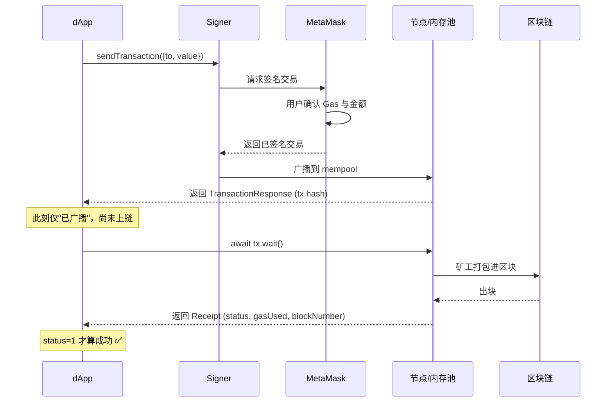

# 05 · 发送 ETH 交易（Send Transaction）

> 第一个"写"操作：用 Signer 把 ETH 从你的账户转给别人。交易需要签名、广播、被矿工打包上链，会消耗 Gas。本模块只在 **Sepolia 测试网** 用免费测试币演示。

## 📖 知识讲解

一笔 ETH 转账交易的关键字段：

| 字段 | 含义 |
| --- | --- |
| `to` | 收款地址 |
| `value` | 转账金额（**wei**，用 `parseEther("0.001")` 生成） |
| `nonce` | 账户交易序号（ethers 自动填） |
| `gasLimit` / `maxFeePerGas` | Gas 上限与单价（ethers/钱包自动估算） |

发送流程的两个关键点：

1. **`signer.sendTransaction(tx)`** 返回的是一个 `TransactionResponse`——此时交易**只是被广播了，还没上链**。`tx.hash` 已经有了。
2. **`await tx.wait()`** 才会阻塞等待交易被打包，返回 `TransactionReceipt`。回执里的 `status`（1/0）才是"成功与否"的最终答案。

> 常见误区：拿到 `tx.hash` 不等于交易成功！必须 `await tx.wait()` 并检查 `receipt.status === 1`。交易也可能上链但执行失败（status=0，Gas 照扣）。

## 🔄 流程图 / 原理图（发交易必须配时序图）

## 💻 代码说明

`index.html`：连钱包 → 校验必须是 Sepolia（`chainId === 11155111n`）→ `parseEther` 把金额转 wei → `sendTransaction` 广播 → `tx.wait()` 等回执 → 给出 Etherscan 链接。被用户拒绝时会捕获 `ACTION_REJECTED`。

## ▶️ 运行方式

1. MetaMask 切到 **Sepolia**，去水龙头领测试币：[sepoliafaucet.com](https://sepoliafaucet.com) 或 [Alchemy Faucet](https://www.alchemy.com/faucets/ethereum-sepolia)。
2. 启动页面：`npx serve 08-ethers-viem/05-send-transaction`
3. 填收款地址（可填你自己的另一个测试地址）、金额，点发送，在 MetaMask 确认。

## ⚠️ 常见坑 / 安全提示

- **只用测试网**：代码里已强制校验 `chainId === 11155111n`，防止手滑发主网真钱。
- **`tx.hash` ≠ 成功**：务必 `await tx.wait()` 且检查 `status`。
- **余额要够付 金额 + Gas**：否则报 `insufficient funds`。
- **金额单位是 wei**：一定用 `parseEther`，别手写一串 0。
- **被拒绝是正常的**：用户点 MetaMask 的"拒绝"会抛 `ACTION_REJECTED`，要 `try/catch` 友好提示。
- 教学演示，**绝不硬编码私钥**，签名一律走 MetaMask。

## 🔗 官方文档

- 发送交易 / TransactionResponse：https://docs.ethers.org/v6/api/providers/#TransactionResponse
- Signer.sendTransaction：https://docs.ethers.org/v6/api/providers/#Signer-sendTransaction
- parseEther：https://docs.ethers.org/v6/api/utils/#parseEther
