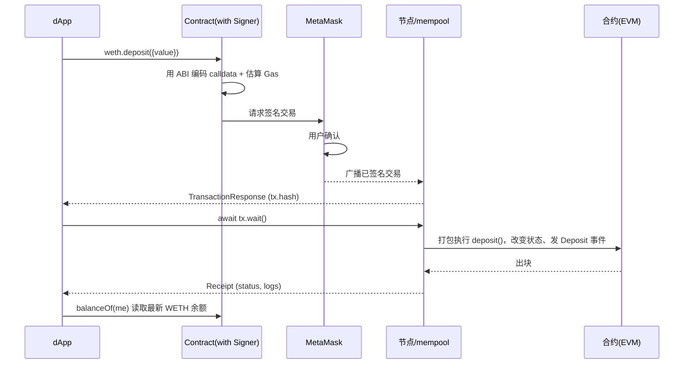

# 06 · 调用合约写方法（Contract Write）

> 与模块 03 的"只读"相对，写方法会**改变合约状态**（转账、铸币、授权…），必须用 Signer 发交易、花 Gas、等确认。本模块调用 Sepolia WETH 的 `deposit()`：把 ETH 换成 WETH。

## 📖 知识讲解

读方法与写方法在 ethers 里的调用写法几乎一样，但底层完全不同：

| | 读方法（view/pure） | 写方法（改状态） |
| --- | --- | --- |
| 用什么构造 Contract | Provider | **Signer** |
| 底层 RPC | `eth_call`（本地执行） | `eth_sendTransaction`（上链） |
| 返回值 | 直接是方法返回值 | **`TransactionResponse`**（不是返回值！） |
| 花 Gas | 否 | 是 |
| 拿"真正结果" | 立即得到 | 靠 `await tx.wait()` + 再读状态/事件 |

关键点：

1. **必须用 Signer 构造合约**：`new Contract(addr, abi, signer)`。用 Provider 构造只能读，调写方法会报错。
2. **写方法返回的是交易对象**，不是函数返回值。想知道结果要么 `await tx.wait()` 后再读状态，要么解析回执里的**事件**（模块 07）。
3. **payable 方法**（如 `deposit()`）用第二个 overrides 参数传 `value`：`weth.deposit({ value: amount })`。
4. **Gas 估算**：ethers 会自动 `estimateGas`；若合约会 revert，这一步就会提前抛错（省得白花 Gas）。

## 🔄 流程图 / 原理图（写合约/监听必须配时序图）

## 💻 代码说明

`index.html`：用 **signer** 构造 WETH 合约 → 调 `deposit({ value })` 把 ETH 铸成 WETH → `tx.wait()` 等确认 → 再 `balanceOf` 读出新的 WETH 余额验证成功。全程 Sepolia。

## ▶️ 运行方式

1. MetaMask 切 Sepolia，确保有测试 ETH（模块 05 有水龙头链接）。
2. `npx serve 08-ethers-viem/06-contract-write`，输入金额，点按钮，在 MetaMask 确认。
3. 想换回 ETH 可自行加 `withdraw(uint256)` 方法调用（WETH 支持）。

## ⚠️ 常见坑 / 安全提示

- **用 Provider 构造却调写方法** → 报错。写方法一律 `new Contract(addr, abi, signer)`。
- **别把 tx 当返回值**：写方法返回交易对象，真正结果要 `wait()` 后读状态或解析事件。
- **approve 授权风险**：许多写方法（如 ERC-20 `approve`）会授权别的合约动你的币。**警惕无限授权（`MaxUint256`）与钓鱼**，只授权可信合约、按需授权额度。
- **交易可能上链但失败**（`status=0`），Gas 照扣；`wait()` 后务必检查 `status`。
- 合约"教学用途，未经审计"，示例只在测试网跑。

## 🔗 官方文档

- 合约写方法 / 交易：https://docs.ethers.org/v6/api/contract/#BaseContractMethod
- overrides（value/gasLimit）：https://docs.ethers.org/v6/api/contract/#ContractTransaction
- WETH9 源码参考：https://etherscan.io/address/0xC02aaA39b223FE8D0A0e5C4F27eAD9083C756Cc2#code
