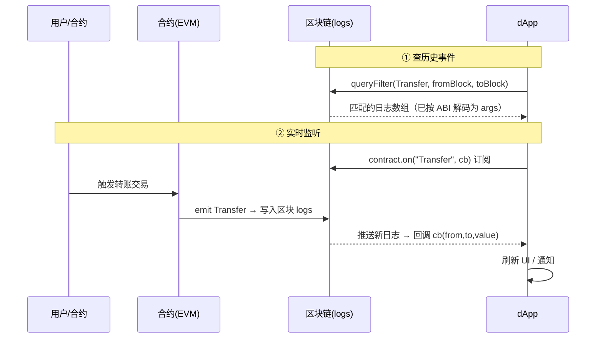

# 07 · 事件与日志（Events & Logs）

> 合约用 `emit` 把状态变化记进交易日志（logs）。前端靠事件来"知道链上发生了什么"——刷新余额、更新 UI、做通知。既能查历史，也能实时监听。

## 📖 知识讲解

- **事件（Event）** 是合约声明的一种"日志结构"，`emit Transfer(from, to, value)` 会把这条记录写进交易回执的 `logs` 里，**存在区块链上、可被检索，但合约自身读不到**（它是给链下用的）。
- **`indexed` 参数**：事件里标了 `indexed` 的参数会进入日志的 `topics`，**可以按值高效过滤**（最多 3 个 indexed）。没标 indexed 的进 `data`，不能直接过滤。

两种消费方式：

| 方式 | API | 用途 | 需要 |
| --- | --- | --- | --- |
| 查历史 | `contract.queryFilter(filter, fromBlock, toBlock)` | 拉取过去的事件（分页/回填） | HTTP RPC 即可 |
| 实时监听 | `contract.on("Event", cb)` | 新事件推送、实时刷新 UI | 最好用 WebSocket Provider（HTTP 会退化为轮询） |

过滤器：`contract.filters.Transfer(from, to)`，传 `null` 表示该位不限。

> 记得 `contract.off(...)` / `removeAllListeners()` 移除监听，否则组件卸载后仍在跑，造成内存泄漏与重复回调。

## 🔄 流程图 / 原理图（监听事件必须配时序图）



## 💻 代码说明

`demo.js`：连 Sepolia WETH → `queryFilter` 查最近 500 个区块的 `Transfer` 并打印前 5 条 → 用 `filters.Transfer(null, addr)` 演示按 `indexed` 过滤 → 最后 `contract.on` 实时监听 10 秒后 `removeAllListeners` 退出。

## ▶️ 运行方式

```bash
cd 08-ethers-viem
npm install
node 07-events-logs/demo.js
```

## ⚠️ 常见坑 / 安全提示

- **区块范围别太大**：公共 RPC 常限制 `queryFilter` 跨度（如 ≤ 每次几千/一万区块），一次查全历史会报错，要**分页**。
- **HTTP 下的 `.on` 是轮询**：延迟高、耗请求。要低延迟实时性请用 `WebSocketProvider`。
- **忘记移除监听**会内存泄漏；组件卸载/脚本结束前 `removeAllListeners()`。
- **重组（reorg）**：极新的事件可能因链重组被回滚，关键场景要等几个确认再采信。
- 只读监听**无资金风险**。

## 🔗 官方文档

- 事件与过滤器：https://docs.ethers.org/v6/api/contract/#ContractEvent
- queryFilter：https://docs.ethers.org/v6/api/contract/#BaseContract-queryFilter
- 日志与 Filter：https://docs.ethers.org/v6/api/providers/#Log
