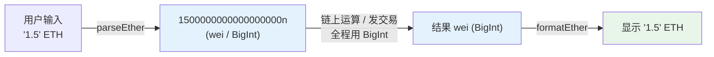

# 08 · 单位换算（Units & Utils）

> 以太坊内部所有金额都是整数 **wei**（无小数）。前端要在"人类可读的 ETH/代币数量"与"链上 wei"之间来回换算。用错单位 = 金额差 10¹⁸ 倍的严重 Bug。

## 📖 知识讲解

单位阶梯：

```
1 ETH  = 1 000 000 000 000 000 000 wei  (10^18)
1 gwei =             1 000 000 000 wei  (10^9)   ← Gas 单价常用
1 wei  = 最小单位，不可再分
```

ethers v6 的四个核心函数（顶层导出）：

| 函数 | 方向 | 例子 |
| --- | --- | --- |
| `parseEther(str)` | ETH 字符串 → wei（BigInt） | `parseEther("1.5")` → `1500000000000000000n` |
| `formatEther(wei)` | wei → ETH 字符串 | `formatEther(1500000000000000000n)` → `"1.5"` |
| `parseUnits(str, decimals)` | 任意精度 → 最小单位 | `parseUnits("30","gwei")`、`parseUnits("12.34", 6)` |
| `formatUnits(v, decimals)` | 最小单位 → 可读 | `formatUnits(usdc, 6)` |

**为什么必须用它们**：JS 的 `number` 是双精度浮点，`0.1 + 0.2 !== 0.3`，处理钱一定丢精度。ethers 让金额全程以 **BigInt（整数 wei）** 存在，只在最后**显示**时才 `format`。

## 🔄 流程图 / 原理图



## 💻 代码说明

`demo.js` 演示：ETH↔wei、gwei（Gas 单价）、6 位小数的 USDC、BigInt 直接相加（`+ 1n`）、以及浮点误差反例。纯本地计算，不联网。

## ▶️ 运行方式

```bash
cd 08-ethers-viem
npm install
node 08-units-utils/demo.js
```

## ⚠️ 常见坑 / 安全提示

- **decimals 不都是 18**：USDC/USDT 是 6，展示代币金额要用合约的 `decimals()`，写死 18 会错 10¹² 倍。
- **BigInt 不能和 number 混算**：`parseEther("1") + 1` 抛错，要 `+ 1n`。
- **别把 wei 当 ETH 显示**：忘了 `formatEther` 会显示一长串天文数字。
- **金额别经过浮点**：不要 `Number(formatEther(x))` 再做加减，留在 BigInt 里算。
- 纯计算，**无资金风险**。

## 🔗 官方文档

- Unit 换算工具：https://docs.ethers.org/v6/api/utils/#about-units
- parseUnits / formatUnits：https://docs.ethers.org/v6/api/utils/#parseUnits
