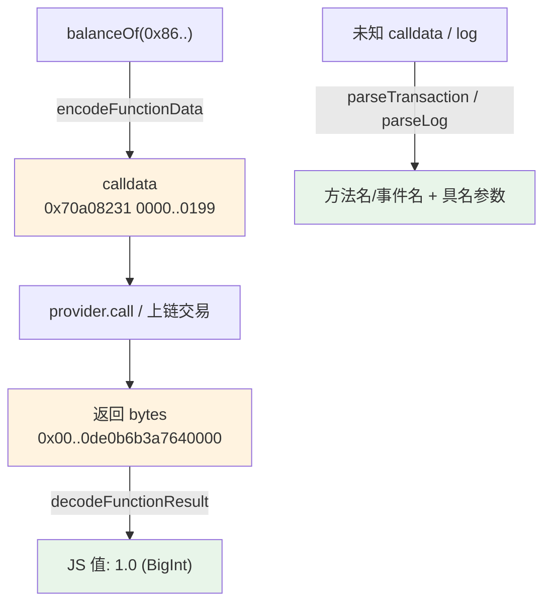

# 09 · ABI 与 Interface 编解码（ABI / Interface）

> `Contract` 帮你自动 ABI 编解码，但底层是 `Interface` 在干活。理解它，你就能手工拼 calldata、反解任意交易、解析未知日志——调试、逆向、拼交易都靠它。

## 📖 知识讲解

链上只认字节。任何合约调用最终都是一段 **calldata**（`0x` 开头的十六进制）：

```
0x  70a08231  0000…0199
    ↑函数选择器  ↑ABI 编码的参数
    (4 字节)
```

- **函数选择器** = `keccak256("balanceOf(address)")` 的前 4 字节，用来定位调哪个方法。
- **参数** 按 ABI 规则编码（每个 slot 32 字节）。

`Interface` 提供的核心方法：

| 方法 | 作用 |
| --- | --- |
| `encodeFunctionData(name, args)` | 方法+参数 → calldata |
| `decodeFunctionResult(name, bytes)` | 返回 bytes → JS 值 |
| `parseTransaction({ data })` | 反解 calldata → 方法名 + 参数 |
| `parseLog({ topics, data })` | 反解日志 → 事件名 + 参数 |
| `getFunction / getEvent` | 取某个片段（Fragment）的元信息 |

> `Contract` 内部就是把你的 `contract.balanceOf(x)` 翻译成 `iface.encodeFunctionData` → `provider.call` → `iface.decodeFunctionResult`。手工做一遍能彻底看清"合约调用到底发了什么"。

## 🔄 流程图 / 原理图



## 💻 代码说明

`demo.js`：① `encodeFunctionData` 生成 calldata 并看函数选择器 → ② `decodeFunctionResult` 解码返回 → ③ `parseTransaction` 反解一段 calldata 出方法名/参数 → ④ `parseLog` 解析一条 `Transfer` 日志 → ⑤ 绕过 `Contract`，用手工 calldata + `provider.call` 发一次真实只读调用。

## ▶️ 运行方式

```bash
cd 08-ethers-viem
npm install
node 09-abi-interface/demo.js
```

## ⚠️ 常见坑 / 安全提示

- **ABI 必须匹配**：选择器由函数签名算出，签名差一个字（含参数类型）就是另一个方法。
- **重载方法要写全签名**：如 `iface.getFunction("transfer(address,uint256)")`。
- **反解不认识的 calldata 会抛错**：`parseTransaction` 只能解 ABI 里已声明的方法，选择器对不上返回 `null` 或抛错。
- **安全用途**：签名前用 `parseTransaction` 把 calldata 解成人类可读的方法+参数，能帮你识破"看不懂的授权/转账"钓鱼交易。
- 本模块基本纯本地，仅第 5 步一次只读调用，**无资金风险**。

## 🔗 官方文档

- Interface：https://docs.ethers.org/v6/api/abi/#Interface
- ABI 编码器：https://docs.ethers.org/v6/api/abi/
- 函数选择器/ABI 规范：https://docs.soliditylang.org/en/latest/abi-spec.html
