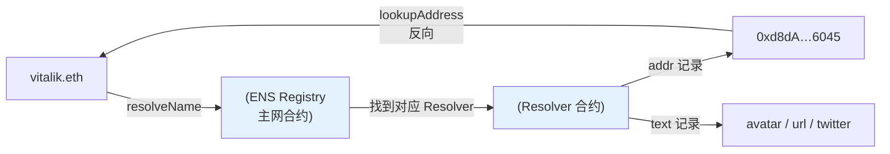

# 10 · ENS 域名解析（Ethereum Name Service）

> ENS 把难记的 `0x` 地址映射成人类可读的域名（`vitalik.eth`），还能挂头像、社交等资料。前端用它把地址显示成域名、把用户输入的域名解析成地址。

## 📖 知识讲解

ENS 是一套部署在**主网**的合约系统（Registry + Resolver）。ethers 内置了对它的支持：

| 方法 | 方向 | 说明 |
| --- | --- | --- |
| `provider.resolveName("x.eth")` | 域名 → 地址 | 正向解析，未配置返回 `null` |
| `provider.lookupAddress(addr)` | 地址 → 域名 | 反向解析，需该地址设了 primary name |
| `provider.getResolver(name)` | → Resolver | 拿到解析器读更多记录 |
| `resolver.getText("avatar")` | → 文本记录 | 头像、twitter、url 等 |

**贴心之处**：ethers 大量方法能直接吃 ENS 名——`getBalance("vitalik.eth")`、`new Contract("dai.tokens.ethers.eth", ...)`，内部自动帮你 `resolveName`。

> 正向 vs 反向：正向解析（域名→地址）任何人配了就有；反向解析（地址→域名）需要地址所有者**主动设置 primary name**，所以很多地址 `lookupAddress` 返回 `null`，属正常。

## 🔄 流程图 / 原理图



## 💻 代码说明

`demo.js` 连**主网只读** RPC：`resolveName("vitalik.eth")` 拿地址 → `lookupAddress` 反查主域名 → `getResolver` + `getText` 读 avatar/url → 演示 `getBalance("vitalik.eth")` 直接传域名。全程只读、不花钱。

## ▶️ 运行方式

```bash
cd 08-ethers-viem
npm install
node 10-ens/demo.js
```

## ⚠️ 常见坑 / 安全提示

- **ENS 在主网**：Sepolia 上的 ENS 数据稀少，正经解析要连主网**只读**节点（本模块特意用主网 RPC，但只读、零风险）。
- **返回 null 很常见**：域名没配地址、或地址没设 primary name，都会返回 `null`，UI 要做兜底（回退显示 `0x…`）。
- **别信任未校验的反向解析**：`lookupAddress` 的结果应再 `resolveName` 正向验证一次是否指回同一地址，防伪造。
- **域名可能被抢注仿冒**（`vitaIik.eth` 用大写 I 冒充 l），显示时注意同形字钓鱼。

## 🔗 官方文档

- ENS 解析（ethers）：https://docs.ethers.org/v6/api/providers/#Provider-resolveName
- EnsResolver：https://docs.ethers.org/v6/api/providers/#EnsResolver
- ENS 官方文档：https://docs.ens.domains/
