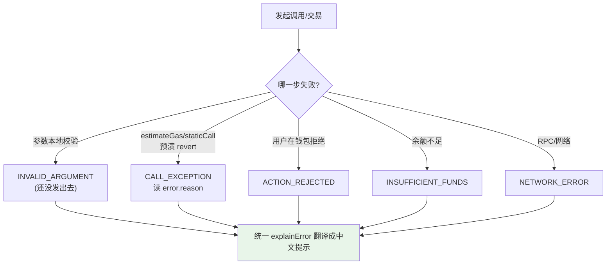

# 11 · 错误处理与 revert 解析（Error Handling）

> 交易会因余额不足、合约 revert、用户拒绝、网络异常等各种原因失败。ethers v6 把错误结构化，带 `code / shortMessage / reason` 等字段，让你能给用户友好的提示，而不是抛一堆看不懂的十六进制。

## 📖 知识讲解

ethers v6 错误对象的关键字段：

| 字段 | 含义 |
| --- | --- |
| `error.code` | 机器可读错误码（见下表），**判断逻辑用这个** |
| `error.shortMessage` | 一句话人类可读描述 |
| `error.reason` | 合约 `require(cond, "原因")` 里的原因字符串 |
| `error.info` / `error.data` | 原始 RPC 数据、revert data（可含自定义错误） |

常见 `code`：

| code | 什么时候 | 给用户的话 |
| --- | --- | --- |
| `ACTION_REJECTED` | 用户在钱包点了"拒绝" | "你取消了操作" |
| `INSUFFICIENT_FUNDS` | 余额不够付金额+Gas | "余额不足，请领测试币" |
| `CALL_EXCEPTION` | 合约执行 revert | 展示 `reason` |
| `INVALID_ARGUMENT` | 参数类型/格式错（本地就抛） | "地址/金额格式错误" |
| `NETWORK_ERROR` | RPC/网络问题 | "网络异常，请重试" |

**提前发现 revert**：写方法调用前，ethers 会先 `estimateGas`；若会 revert 这一步就抛 `CALL_EXCEPTION`，省得白花 Gas。你也可以主动用 **`contract.方法.staticCall(...)`** 干跑一次（像 `eth_call`，不上链）预检查。

> **自定义错误（Solidity `error Xxx()`）**：0.8.4+ 合约常用自定义错误替代字符串。若把该 ABI 传给合约/Interface，ethers 能把 revert data 解成 `error.revert.name` + 参数，比纯字符串更省 Gas 也更结构化。

## 🔄 流程图 / 原理图



## 💻 代码说明

`demo.js`：用 `transfer.staticCall` 干跑触发 `CALL_EXCEPTION`（超额转账）→ 传非法地址触发 `INVALID_ARGUMENT` → 给出一个可复用的 `explainError(err)` 把 `code` 翻译成中文提示。只读、不发交易、不花钱。

## ▶️ 运行方式

```bash
cd 08-ethers-viem
npm install
node 11-error-handling/demo.js
```

## ⚠️ 常见坑 / 安全提示

- **用 `code` 判断，别正则匹配 message**：message 文案会随版本变，`code` 稳定。
- **`ACTION_REJECTED` 不是 Bug**：用户拒绝很正常，别当异常报错吓人，友好提示即可。
- **写方法前用 `staticCall` 预检**：能在不花 Gas 的情况下拿到 revert 原因，UI 体验更好。
- **交易上链仍可能失败**（`receipt.status === 0`），`wait()` 后要检查状态，不要只看有没有抛错。
- 本模块只读，**无资金风险**。

## 🔗 官方文档

- 错误类型与 code：https://docs.ethers.org/v6/api/utils/#errors
- CallExceptionError：https://docs.ethers.org/v6/api/utils/#CallExceptionError
- staticCall：https://docs.ethers.org/v6/api/contract/#BaseContractMethod-staticCall
