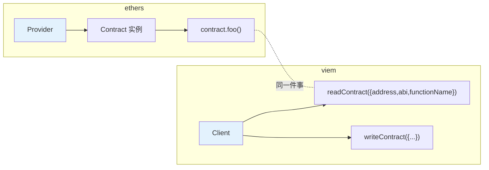
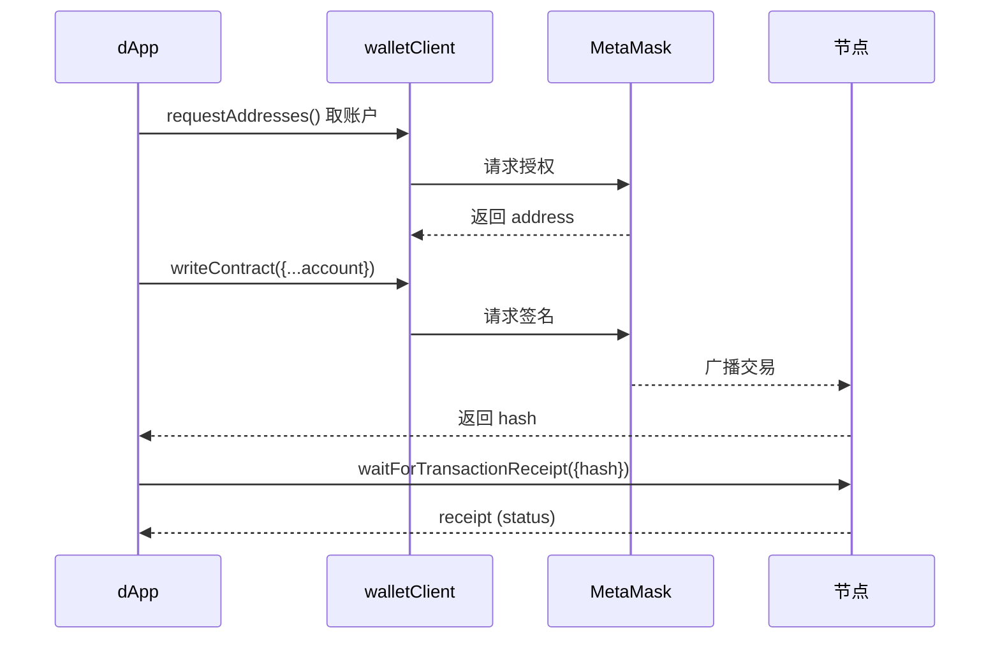

# 12 · viem 现代替代（viem Modern）

> viem 是比 ethers 更新的以太坊 TypeScript 库：类型极强、体积小、Tree-shakable、无状态函数式设计。是 wagmi v2 的底层。本模块用 viem 重做前面的"连节点 + 读合约"，与 ethers 逐一对照。

## 📖 知识讲解

viem 的心智模型和 ethers 不同：不是"Provider/Signer + Contract 实例"，而是 **Client（客户端） + Actions（动作）**。

| 概念 | ethers v6 | viem |
| --- | --- | --- |
| 只读连接 | `new JsonRpcProvider(url)` | `createPublicClient({ chain, transport: http(url) })` |
| 钱包连接 | `new BrowserProvider(window.ethereum)` | `createWalletClient({ chain, transport: custom(window.ethereum) })` |
| 取账户 | `await provider.getSigner()` | `await walletClient.requestAddresses()` |
| 读合约 | `new Contract(a, abi, provider).foo()` | `client.readContract({ address, abi, functionName })` |
| 写合约 | `new Contract(a, abi, signer).foo()` | `walletClient.writeContract({ address, abi, functionName, account })` |
| 等待确认 | `await tx.wait()` | `await client.waitForTransactionReceipt({ hash })` |
| 查事件 | `contract.queryFilter(...)` | `client.getLogs({...})` / `client.watchContractEvent({...})` |
| 单位换算 | `parseEther / formatEther` | `parseEther / formatEther`（用法基本一致） |
| 链信息 | 自己填 chainId | `import { sepolia } from 'viem/chains'` 内置 |

**取舍**：

- **ethers**：老牌、教程多、API 直观（合约实例像普通对象），生态成熟。
- **viem**：类型推导顶级（ABI 里的方法名/参数/返回值都有类型）、包更小、性能更好、函数式无状态；配 wagmi 做 React 是当下主流。

> 二者不是替代关系里的"谁淘汰谁"——ethers 仍广泛使用。新项目尤其是 TS + React 栈，社区更多推荐 viem + wagmi。

## 🔄 流程图 / 原理图



写操作时序（viem，与 ethers 模块 06 一一对应）：



## 💻 代码说明

`demo.js`：`createPublicClient` 连 Sepolia（`viem/chains` 内置链）→ `getBlockNumber` → `readContract` 读 WETH 的 `name/symbol/totalSupply` → 用 `formatEther` 展示，并逐行对照等价的 ethers 写法。只读、不花钱。

浏览器写操作（要点，需 MetaMask）：

```js
import { createWalletClient, custom, parseEther } from "viem";
import { sepolia } from "viem/chains";
const wallet = createWalletClient({ chain: sepolia, transport: custom(window.ethereum) });
const [account] = await wallet.requestAddresses();
const hash = await wallet.sendTransaction({ account, to: "0x…", value: parseEther("0.001") });
```

## ▶️ 运行方式

```bash
cd 08-ethers-viem
npm install
node 12-viem-modern/demo.js
```

## ⚠️ 常见坑 / 安全提示

- **viem 无"合约实例"**：每次调用都要传 `address + abi + functionName`（可用 `getContract` 包一层减少重复）。
- **写操作要显式传 `account`**：viem 不会自动帮你选账户（除非在 client 里 hoist 了 account）。
- **ABI 建议 `as const` 或 `parseAbi`**：才能触发 viem 的类型推导，享受"方法名/参数补全"。
- 安全底线同前：**只测试网、绝不硬编码私钥、浏览器走钱包**。

## 🔗 官方文档

- viem 官网：https://viem.sh/
- Public Client：https://viem.sh/docs/clients/public
- Wallet Client：https://viem.sh/docs/clients/wallet
- 从 ethers 迁移：https://viem.sh/docs/ethers-migration
