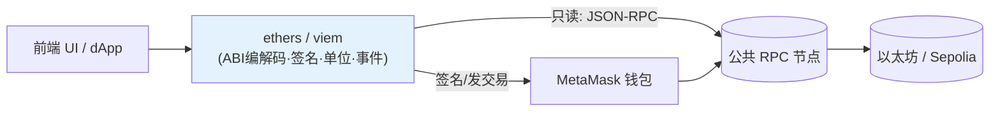
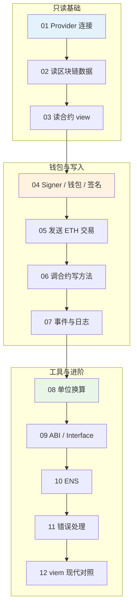

# 08 · 前端连接区块链（ethers.js v6 / viem）

> 本工程讲解 **dApp 前端如何与区块链交互**：连节点/连钱包、读链上数据、读写合约、监听事件、单位换算、错误处理、ENS，最后用现代库 **viem** 做对照。以 **ethers v6** 为主线，关键模块附 viem 写法。

## 一、这层库解决什么问题？

浏览器/Node 无法直接说以太坊的 JSON-RPC，更不会 ABI 编解码、签名、单位换算。**ethers / viem 就是这层"翻译官 + 工具箱"**：



- **只读**（查余额、读合约、查事件）：连一个公共 RPC 节点即可，不需要钱包、不花钱。
- **写入**（转账、调合约写方法）：必须经钱包（MetaMask）签名，上链花 Gas。

## 二、ethers vs viem 对比

| 维度 | ethers.js v6 | viem |
| --- | --- | --- |
| 定位 | 老牌全能库，API 直观 | 新一代 TS 优先库，类型极强 |
| 心智模型 | Provider/Signer + **Contract 实例** | Client + **Actions**（函数式无状态） |
| 只读连接 | `new JsonRpcProvider(url)` | `createPublicClient({ transport: http() })` |
| 钱包连接 | `new BrowserProvider(window.ethereum)` | `createWalletClient({ transport: custom(...) })` |
| 读合约 | `contract.foo()` | `client.readContract({...})` |
| 类型推导 | 一般 | **顶级**（ABI 驱动全链路类型） |
| 打包体积 | 较大 | 小、Tree-shakable |
| 生态 | 教程多、老项目多 | wagmi v2 底层，新项目主流 |
| 单位工具 | `parseEther/formatEther` | 同名，用法几乎一致 |

一句话：**先用 ethers 把概念学透（本工程主线），再理解 viem 的现代写法**（模块 12）。两者当下都在大量使用。

## 三、模块索引

| 模块 | 知识点 | demo 形式 | 是否需钱包 |
| --- | --- | --- | --- |
| [01 provider-connect](./01-provider-connect/) | Provider 概念 / JsonRpcProvider / BrowserProvider | `demo.js` + `index.html` | 只 html 需 |
| [02 read-blockchain](./02-read-blockchain/) | 查余额 / 区块 / 交易 / 回执（只读） | `demo.js` | 否 |
| [03 contract-read](./03-contract-read/) | 用 ABI 读合约 view 方法 | `demo.js` | 否 |
| [04 signer-wallet](./04-signer-wallet/) | Signer / 连接钱包 / 消息签名 | `index.html` + `demo.js` | 只 html 需 |
| [05 send-transaction](./05-send-transaction/) | 发送 ETH 交易（含时序图） | `index.html` | ✅ 是 |
| [06 contract-write](./06-contract-write/) | 调合约写方法 / 等确认（含时序图） | `index.html` | ✅ 是 |
| [07 events-logs](./07-events-logs/) | 查询 / 监听合约事件（含时序图） | `demo.js` | 否 |
| [08 units-utils](./08-units-utils/) | parseEther/formatEther/parseUnits 单位换算 | `demo.js` | 否 |
| [09 abi-interface](./09-abi-interface/) | ABI / Interface 编解码 | `demo.js` | 否 |
| [10 ens](./10-ens/) | ENS 域名正/反向解析（连主网只读） | `demo.js` | 否 |
| [11 error-handling](./11-error-handling/) | 交易失败 / revert 原因解析 | `demo.js` | 否 |
| [12 viem-modern](./12-viem-modern/) | viem 入门 + 对照 ethers | `demo.js` | 否 |

## 四、学习路线



建议顺序：**只读基础（01-03）→ 钱包与写入（04-07）→ 工具与进阶（08-12）**。只读模块随时能跑；写入模块要先领 Sepolia 测试币。

## 五、运行说明

### 1. 安装依赖（Node demo 需要）

```bash
cd 08-ethers-viem
npm install            # 安装 ethers v6 + viem
```

### 2. 运行 Node 只读 demo（无需钱包）

```bash
node 01-provider-connect/demo.js
node 03-contract-read/demo.js
# 或用快捷脚本：npm run 03
```

所有只读 demo 默认连公共 Sepolia RPC `https://ethereum-sepolia-rpc.publicnode.com`（ENS 模块连主网只读）。想换节点：复制 `config.example.env` 为 `.env` 填 `SEPOLIA_RPC_URL` / `MAINNET_RPC_URL`。

### 3. 运行浏览器钱包 demo（需 MetaMask）

```bash
npx serve .            # 在 08-ethers-viem 目录起静态服务器
# 浏览器打开对应模块的 index.html，如 05-send-transaction/index.html
```

浏览器 demo 用 ethers v6 的 ESM CDN（`https://cdn.jsdelivr.net/npm/ethers@6.13.4/+esm`），无需本地安装。

### 4. 领测试币（写操作前）

MetaMask 切到 **Sepolia**，去水龙头领免费测试 ETH：

- https://sepoliafaucet.com
- https://www.alchemy.com/faucets/ethereum-sepolia

## 六、安全底线（务必遵守）

- **只用测试网**：一律 Sepolia（chainId `11155111`）+ 水龙头测试币，**绝不接主网真实资产**；写操作 demo 已强制校验 chainId。
- **绝不硬编码私钥/助记词**：浏览器一律走 `BrowserProvider.getSigner()`，私钥留在 MetaMask；Node 若需私钥用 `.env`（已 gitignore），且只用测试小号。
- **警惕签名/授权钓鱼**：`approve` 无限授权、看不懂的签名都可能是陷阱，签名前用模块 09 的 `parseTransaction` 看清内容。
- 示例合约"教学用途，未经审计，勿上主网"。

## 七、官方文档

- ethers v6：https://docs.ethers.org/v6/
- viem：https://viem.sh/
- MetaMask / EIP-1193：https://eips.ethereum.org/EIPS/eip-1193
- Etherscan（Sepolia）：https://sepolia.etherscan.io/
