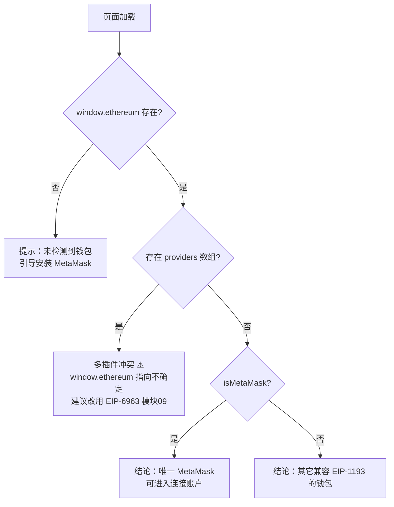

# 01 · 检测 Provider（Detect Provider）
> 判断浏览器里到底有没有注入钱包，以及它是谁 —— 这是所有 dApp 与钱包交互的第 0 步。

## 📖 知识讲解

### 什么是 Provider 与 EIP-1193
浏览器本身不懂区块链。你安装 MetaMask 这类钱包插件后，插件会往每个网页里**注入一个全局对象 `window.ethereum`**，这个对象就是 dApp 与钱包（以及背后区块链节点）通信的桥梁，术语叫 **Provider（提供者）**。

所有主流钱包都遵循 **[EIP-1193](https://eips.ethereum.org/EIPS/eip-1193)** 标准，因此不管用户装的是 MetaMask、Coinbase Wallet 还是 Rabby，dApp 都可以用同一套 API 交互。EIP-1193 的核心只有一个方法：

```js
provider.request({ method, params }) // 返回一个 Promise
```

所有链上操作（查账户、查链、查余额、发交易…）都通过给这个方法传不同的 `method` 来完成。本模块暂时还不调用它，只做「有没有钱包」的检测。

### 怎么判断装没装钱包
最基础的做法就是判断 `window.ethereum` 存不存在：

```js
if (typeof window.ethereum !== 'undefined') {
  // 有钱包
} else {
  // 没装钱包，引导用户去 https://metamask.io/download/
}
```

### isMetaMask 与多插件冲突
- `window.ethereum.isMetaMask === true` 可以粗略判断当前 provider 是不是 MetaMask。但它**只是个自我声明的布尔标记，不能当安全依据**，其它钱包也可能设置它。
- **多插件冲突**：当用户同时装了多个钱包插件时，它们都想占用 `window.ethereum` 这个唯一的全局变量，最后谁生效是不确定的，甚至会出现 `window.ethereum.providers` 这样一个「所有 provider 的数组」。这会导致 dApp 连错钱包。
- 解决这个乱象的现代标准是 **[EIP-6963](https://eips.ethereum.org/EIPS/eip-6963)**（多钱包发现），它让每个钱包各自广播自己的身份，dApp 再列出来让用户选。**本系列在模块 09 专门细讲 EIP-6963**，这里先知道有这个坑即可。

## 🔄 流程图 / 原理图



## 💻 代码说明

`index.html` 的核心是 `detect()` 函数，它按上面的决策流程逐步判断：

1. `typeof window.ethereum !== 'undefined'` —— 判断 provider 是否被注入，没有就提示安装 MetaMask。
2. `window.ethereum.isMetaMask` —— 判断是否为 MetaMask。
3. `Array.isArray(window.ethereum.providers)` —— 检查是否存在多插件冲突，若有则逐个打印每个 provider 的身份，并提示改用 EIP-6963。
4. 展示 `navigator.userAgent`，辅助判断是否处于移动端内置浏览器。

页面加载即自动 `detect()` 一次，「重新检测」按钮可再次触发（例如你刚装完钱包刷新后）。所有结果通过 `log()` 追加到日志区。

## ▶️ 运行方式

1. 用装有 **MetaMask** 的桌面浏览器（Chrome / Brave / Firefox）直接打开本目录的 `index.html`。
2. 页面会立刻显示检测结果；点「重新检测」可重跑。
3. 想体验「未检测到钱包」的分支，可以在无痕窗口（未启用扩展）或没装钱包的浏览器里打开。
4. 想体验多插件冲突分支，可再装一个钱包插件（如 Coinbase Wallet），观察 `providers` 数组。

> 提示：本模块纯前端、纯只读，用 `file://` 直接打开即可，无需起服务器。

## ⚠️ 常见坑 / 安全提示

- **检测 ≠ 连接**：本模块只读 `window.ethereum` 的属性，不调用任何 RPC，不会弹窗、不会暴露地址，是完全安全的。
- **isMetaMask 不可作为安全判断**：它是钱包自我声明的标记，可被伪造。真正需要区分钱包时用 EIP-6963。
- **多插件冲突是常见事故源**：同时装多个钱包时 `window.ethereum` 指向不确定，可能连到你不想用的钱包。现代做法用 EIP-6963。
- **安全埋点**：从下一模块起你会真正「连接钱包」。连接会暴露你的地址与余额；再往后钓鱼站点还会诱导你**签名 / 授权（approve）**，那才是真正能造成资产损失的步骤。本系列全程只用 **Sepolia 测试网（chainId `0xaa36a7` = 11155111）**，请勿在主网上练手。

## 🔗 官方文档

- MetaMask 钱包开发文档：https://docs.metamask.io/wallet/
- 检测 MetaMask provider：https://docs.metamask.io/wallet/how-to/connect/detect-metamask/
- EIP-1193（Provider JavaScript API）：https://eips.ethereum.org/EIPS/eip-1193
- EIP-6963（多钱包发现）：https://eips.ethereum.org/EIPS/eip-6963
