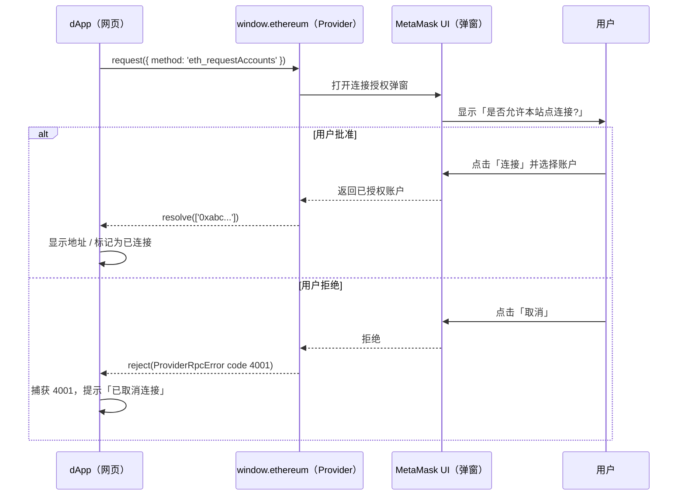

# 02 · 请求连接账户（Connect Accounts）
> 用 `eth_requestAccounts` 向钱包发起一次连接握手，拿到用户授权访问的地址。

## 📖 知识讲解

### 什么是「连接钱包」
dApp 无法凭空知道你的地址 —— 必须由你**主动授权**。「连接钱包」就是 dApp 请求钱包：「请把你的账户地址告诉我」。这一步通过 EIP-1193 的方法完成：

```js
const accounts = await window.ethereum.request({ method: 'eth_requestAccounts' });
// accounts 形如 ['0xabc...'], 第 0 个通常是当前账户
```

- **会弹窗**：`eth_requestAccounts` 会触发 MetaMask 弹出授权窗口，等用户点「连接」。
- **返回地址数组**：用户批准后返回已授权账户列表；用户拒绝则抛错，错误码 **4001**。
- **有记忆**：一旦批准，钱包会记住「本站点已连接」。之后再调用 `eth_requestAccounts` 或只读的 `eth_accounts` 就不必再弹窗（除非用户手动断开）。

### eth_requestAccounts 与 wallet_requestPermissions 的关系
`eth_requestAccounts` 本质是 `wallet_requestPermissions` 针对 `eth_accounts` 权限的一个便捷封装：

```js
// 等价的显式写法（用于强制重新弹出账户选择框）
await window.ethereum.request({
  method: 'wallet_requestPermissions',
  params: [{ eth_accounts: {} }],
});
```

区别在于：`eth_requestAccounts` 若已连接则直接静默返回已有账户；而 `wallet_requestPermissions` 每次都会弹出权限/账户选择框，常用于「切换账户」按钮。

### 连接暴露了什么？
连接后站点能看到你的**地址**，进而能查询你的**余额、交易历史、持有的代币/NFT**（这些都是链上公开数据）。但**连接不等于授权花费** —— 站点无法凭连接动用你的任何资产。真正危险的是后续的**签名**和**授权（`approve`）**，那些会在后面的模块专门讲。

## 🔄 流程图 / 原理图



## 💻 代码说明

`index.html` 的核心是 `connect()` 函数：

1. 先判断 `window.ethereum` 是否存在，没有就提示安装。
2. `await window.ethereum.request({ method: 'eth_requestAccounts' })` 发起握手并等待用户批准。
3. 成功：取 `accounts[0]` 作为当前账户，更新 UI 为「已连接」并打印地址。
4. 失败：用 `explainError(code)` 把错误码翻成中文；对 **4001（用户拒绝）** 单独给出友好提示。

还额外监听了 `accountsChanged` 事件：当你在钱包里切换账户或断开时，页面会实时同步（`accounts` 为空数组代表已断开）。

「清空本页状态」按钮只复位页面 UI —— 因为**授权保存在钱包侧，dApp 无法主动断开**，真正撤销要在 MetaMask 的「已连接的网站」里操作。

## ▶️ 运行方式

1. 用装有 MetaMask 的浏览器打开本目录 `index.html`。
2. 建议先把 MetaMask 网络切到 **Sepolia 测试网**。
3. 点「连接钱包」→ 在弹窗中点「连接」→ 日志显示你的地址、状态变「已连接」。
4. 再点一次可复现「已连接则不再弹窗」；在弹窗里点「取消」可复现 **4001** 分支。
5. 在 MetaMask 里切换账户，观察页面通过 `accountsChanged` 自动更新。

## ⚠️ 常见坑 / 安全提示

- **4001 是正常的用户取消**，不是程序 bug，务必 `try/catch` 优雅处理，别把它当致命错误。
- **不要在页面加载时自动调用 `eth_requestAccounts`**：未经用户点击就弹窗是很差的体验，也容易被浏览器拦截。应由用户点击「连接」按钮触发。
- **已连接就不再弹窗**：`eth_requestAccounts` 在已授权时会静默返回，想强制重新选账户请用 `wallet_requestPermissions`。
- **dApp 不能主动断开连接**：撤销授权只能由用户在钱包里做。
- **安全埋点（重要）**：钓鱼站点的惯用套路是——先用一个人畜无害的「连接钱包」骗你连上（连接本身没损失），**随后立刻弹出一个签名或 `approve` 授权请求**，那一步才会真正转走资产。看到「连接」后紧跟着要你「签名 / 授权无限额度」，要高度警惕。本练习只在 **Sepolia（`0xaa36a7`）** 进行。

## 🔗 官方文档

- MetaMask 连接账户指南：https://docs.metamask.io/wallet/how-to/connect/access-accounts/
- `eth_requestAccounts`（MetaMask JSON-RPC）：https://docs.metamask.io/wallet/reference/json-rpc-methods/eth_requestaccounts/
- `wallet_requestPermissions`：https://docs.metamask.io/wallet/reference/json-rpc-methods/wallet_requestpermissions/
- EIP-1193 错误码与事件：https://eips.ethereum.org/EIPS/eip-1193
