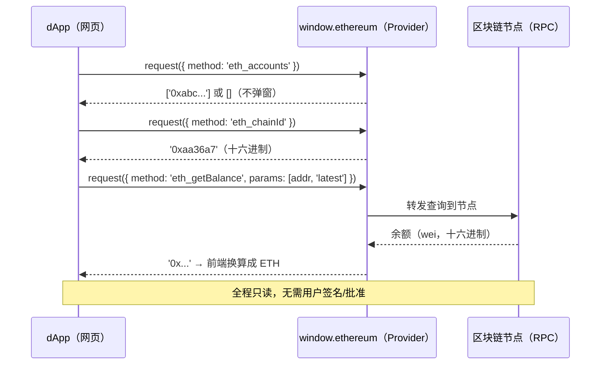

# 03 · 读账户 / 链 / 余额（Read Account, Chain, Balance）
> 用三个只读 RPC 查询已授权账户、当前网络和地址余额 —— 全程不弹窗、不动资产。

## 📖 知识讲解

连接钱包之后，dApp 最常做的就是「读状态」。本模块用三个只读方法：

### 1. eth_accounts vs eth_requestAccounts
| 方法 | 会弹窗吗 | 作用 | 未连接时 |
| --- | --- | --- | --- |
| `eth_requestAccounts` | ✅ 会弹窗 | **请求授权**连接（模块 02） | 弹窗让用户批准 |
| `eth_accounts` | ❌ 不弹窗 | **只读**已授权账户 | 返回空数组 `[]` |

```js
const accounts = await window.ethereum.request({ method: 'eth_accounts' });
// 已连接 → ['0xabc...']；未连接 → []
```

`eth_accounts` 常用于**页面加载时静默判断「用户之前是否已连接过」**：如果返回非空数组，就能直接恢复已连接状态，不必再弹窗打扰用户。

### 2. eth_chainId —— 当前在哪条链
```js
const chainIdHex = await window.ethereum.request({ method: 'eth_chainId' });
// 返回十六进制字符串，如 '0xaa36a7'
const chainIdDec = parseInt(chainIdHex, 16); // → 11155111
```

chainId 是**十六进制**的，要用 `parseInt(hex, 16)` 转十进制，再映射成网络名：

| chainId(hex) | 十进制 | 网络 |
| --- | --- | --- |
| `0x1` | 1 | Ethereum 主网 |
| **`0xaa36a7`** | **11155111** | **Sepolia 测试网（本系列使用）** |
| `0x89` | 137 | Polygon |
| `0x2105` | 8453 | Base |

### 3. eth_getBalance —— 查余额，以及 wei → ether 换算
```js
const weiHex = await window.ethereum.request({
  method: 'eth_getBalance',
  params: [address, 'latest'],   // 'latest' = 最新区块
});
```

返回的是 **wei**（以太坊最小单位）的**十六进制**值。换算关系：

```
1 ETH = 10^18 wei
```

因为 `10^18` 远超 JS `Number` 的安全整数范围，**必须用 `BigInt` 做换算**，否则精度会丢失：

```js
const wei = BigInt(weiHex);        // 十六进制字符串可被 BigInt 直接解析
const ether = wei / (10n ** 18n);  // 整数部分；小数部分用取余得到
```

## 🔄 流程图 / 原理图

只读查询不需要用户在弹窗里批准（授权在模块 02 已经给过），因此流程非常简单：



## 💻 代码说明

`index.html` 提供三个按钮，分别对应三个方法：

- `readAccounts()` → `eth_accounts`：返回空数组时提示「尚未连接」，并对比说明它与 `eth_requestAccounts` 的区别；读到地址后顺手填进余额输入框。
- `readChain()` → `eth_chainId`：`parseInt(hex,16)` 转十进制，查 `CHAIN_NAMES` 映射网络名；若不是 Sepolia 会提醒切换。
- `readBalance()` → `eth_getBalance`：先做地址格式校验（`0x` + 40 位十六进制），再用 `weiHexToEther()` 通过 **BigInt** 精确换算成 ETH。

另外监听了 `chainChanged` 事件：在钱包里切换网络时页面会实时刷新（`chainId` 为十六进制字符串）。

## ▶️ 运行方式

1. 先完成模块 02 的连接（或在本页点「读账户」，若返回 `[]` 说明还没连接）。
2. 用装有 MetaMask 的浏览器打开本目录 `index.html`，把网络切到 **Sepolia**。
3. 点「读账户」→ 显示已授权地址；点「读网络」→ 显示 `Sepolia（0xaa36a7 = 11155111）`。
4. 在输入框填地址（或用自动填入的账户）→ 点「查询余额」→ 看到换算后的 ETH。
5. 没有测试币可到 Sepolia 水龙头领取（如 https://sepoliafaucet.com/ ）观察余额变化。

## ⚠️ 常见坑 / 安全提示

- **只读方法是最安全的一类**：`eth_accounts` / `eth_chainId` / `eth_getBalance` 都不会弹签名窗、不会花费资产，可放心调用。
- **chainId 是十六进制**：直接拿去和十进制比较（如 `=== 11155111`）会永远为假，要么比字符串 `'0xaa36a7'`，要么先 `parseInt(x,16)`。
- **余额换算必须用 BigInt**：`10^18` 超出 `Number.MAX_SAFE_INTEGER`，用普通浮点数除会丢精度、显示出错误余额。
- **eth_accounts 返回 `[]` 不是报错**：它只是表示「本站尚未获授权」，应引导用户去连接，而不是当异常抛出。
- **安全埋点**：读余额、读账户虽安全，但它揭示了钓鱼的第一步逻辑——站点连接后能看到你「有多少钱」，从而**挑肥羊下手**诱导你签名/授权。记住风险不在「读」，而在后续要你「签名 / approve」的写操作。本系列只在 **Sepolia（`0xaa36a7`）** 练习。

## 🔗 官方文档

- MetaMask 管理账户/网络：https://docs.metamask.io/wallet/how-to/manage-networks/
- `eth_getBalance`（以太坊 JSON-RPC）：https://ethereum.org/en/developers/docs/apis/json-rpc/#eth_getbalance
- `eth_accounts` / `eth_chainId` 参考：https://docs.metamask.io/wallet/reference/json-rpc-methods/
- 单位换算（wei / gwei / ether）：https://docs.metamask.io/wallet/how-to/send-transactions/
- EIP-1193（Provider API 与事件）：https://eips.ethereum.org/EIPS/eip-1193
