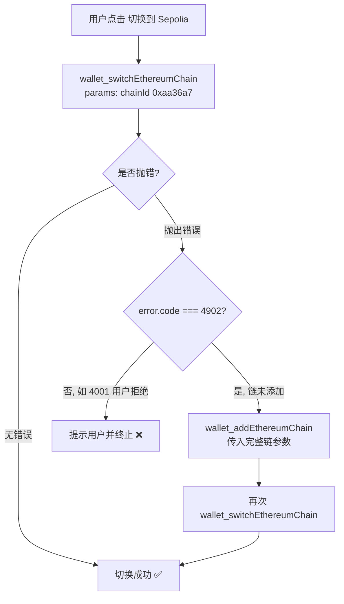

# 04 · 切换 / 添加网络（Switch / Add Network）

> 教 dApp 如何请求钱包切换到指定链（Sepolia），以及当钱包里没有这条链时（错误码 4902）如何先添加再切换。

## 📖 知识讲解

一个 dApp 通常只在特定链上运行。用户的 MetaMask 当前可能停在以太坊主网或别的网络上，dApp 需要引导用户切换到正确的链。这就用到两个钱包级 RPC 方法：

- **`wallet_switchEthereumChain`**（EIP-3326）：请求钱包切换当前激活的链。
  - 参数：`[{ chainId: '0xaa36a7' }]`，只需要一个 `chainId`。
  - **关键点：`chainId` 必须是十六进制字符串**，不能传十进制数字。Sepolia 的 chainId 十进制是 `11155111`，十六进制是 `0xaa36a7`。
  - 如果目标链尚未添加到钱包，会抛出 **错误码 4902**。

- **`wallet_addEthereumChain`**（EIP-3085）：向钱包添加一条新链。
  - 参数是一个完整的链描述对象：`chainId`、`chainName`、`nativeCurrency{ name, symbol, decimals }`、`rpcUrls[]`、`blockExplorerUrls[]`。

**经典模式（4902 → add → switch）**：先尝试 `switch`，用 `try/catch` 捕获错误；如果 `error.code === 4902`，说明钱包里没有这条链，就先调用 `add` 添加，再重新 `switch`。这是几乎所有主流 dApp 的标准做法。

常见错误码：`4001` 用户拒绝、`4100` 未授权、`4200` 不支持、`4902` 链未添加。

## 🔄 流程图 / 原理图

## 💻 代码说明

`index.html` 的核心逻辑：

- `SEPOLIA_CHAIN_ID = '0xaa36a7'`：十六进制的 chainId 常量。
- `SEPOLIA_PARAMS`：`wallet_addEthereumChain` 需要的完整链参数对象。
- `switchToSepolia()`：先 `wallet_switchEthereumChain`；`catch` 中判断 `err.code === 4902`，若是则调用 `addSepolia()` 后再切一次。
- `refreshChain()`：用 `eth_chainId` 读取当前链并展示网络名。
- `provider.on('chainChanged', ...)`：监听用户在钱包里手动切链，实时刷新界面。
- `explainError()`：把 4001/4100/4200/4902 翻译成中文。

## ▶️ 运行方式

1. 浏览器安装 [MetaMask](https://metamask.io/) 扩展。
2. 直接用浏览器打开本目录的 `index.html`（或用任意静态服务器，如 `npx serve`）。
3. 点击「连接 MetaMask」授权账户。
4. 若你的钱包没有 Sepolia，点「切换到 Sepolia」会自动触发添加流程；随后再次弹窗请求切换。

## ⚠️ 常见坑 / 安全提示

- **chainId 忘了转十六进制**：传 `11155111`（十进制）会失败，必须传 `'0xaa36a7'`。
- **忘处理 4902**：新钱包里没有该链，直接 `switch` 会报错，务必 `catch` 后补 `add`。
- **params 必须是数组**：`switch` 传 `[{ chainId }]`，`add` 传 `[chainParams]`，别漏了外层数组。
- **公共 RPC 不稳定**：`https://rpc.sepolia.org` 适合教学，生产请换成自己的 Infura/Alchemy 节点。
- **只用测试网**：本模块固定 Sepolia，避免在主网误操作。切换网络本身不花 Gas。

## 🔗 官方文档

- MetaMask - Switch/Add network：https://docs.metamask.io/wallet/how-to/manage-networks/
- EIP-3326 wallet_switchEthereumChain：https://eips.ethereum.org/EIPS/eip-3326
- EIP-3085 wallet_addEthereumChain：https://eips.ethereum.org/EIPS/eip-3085
- MetaMask JSON-RPC API 错误码：https://docs.metamask.io/wallet/reference/json-rpc-methods/
