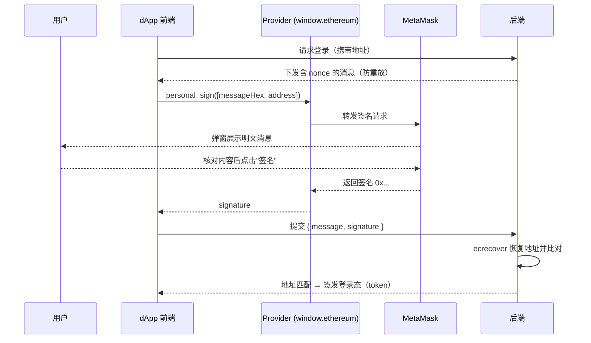

# 05 · 签名登录（personal_sign / Sign Message）

> 用 personal_sign 让用户对一段明文消息签名，从而证明钱包地址的所有权。签名不上链、不花 Gas，是"用钱包登录"（SIWE）的基础。

## 📖 知识讲解

传统网站用"账号+密码"登录，Web3 里可以用**钱包签名**登录：既然只有私钥持有者才能对消息产生有效签名，那么一段有效签名就等于"我拥有这个地址"的证明。

- **`personal_sign`**：请求用户对一段消息签名。
  - 参数顺序：**`[messageHex, address]`**（消息在前，地址在后）。
  - `message` 需要转成十六进制字符串：
    `'0x' + [...new TextEncoder().encode(msg)].map(b => b.toString(16).padStart(2, '0')).join('')`
  - 返回值是 `0x...` 开头的签名。
  - 钱包在签名时会给消息加上 `"\x19Ethereum Signed Message:\n" + len` 前缀，因此这个签名**无法**被当作一笔真实交易执行——这正是它比 `eth_sign` 安全的原因。

**SIWE（Sign-In With Ethereum）思路**：后端生成一个一次性的 `nonce` 并下发给前端 → 前端把包含域名/nonce/时间的消息交给 `personal_sign` 签名 → 后端用 `ecrecover(message, signature)` 从签名中恢复出签名者地址，与用户声称的地址比对，一致就放行。`nonce` 用完即弃，防止签名被重放。

**为什么 `eth_sign` 危险（已废弃）**：`eth_sign` 让用户对**任意 32 字节哈希**签名，钱包无法展示可读内容。攻击者可以把"一笔转账交易的哈希"伪装成随机数据让你签，签完就能拿去执行——等于盗你的钱。所以**永远不要用 `eth_sign`**，登录场景一律用 `personal_sign`。

## 🔄 流程图 / 原理图

## 💻 代码说明

`index.html` 的核心逻辑：

- `toHex(str)`：用 `TextEncoder` 把 UTF-8 消息转成 `0x` 十六进制。
- `buildSiweMessage(address)`：生成一段含域名、Chain ID、nonce、时间戳的 SIWE 风格文案（演示里 nonce 前端随机生成；**生产必须由后端下发**）。
- `signIn()`：调用 `personal_sign`，`params: [messageHex, currentAccount]`，拿到签名后展示，并提示下一步应把 `message + signature` 交给后端 `ecrecover` 验签。
- `explainError()`：重点处理 `4001`（用户拒绝签名）。

## ▶️ 运行方式

1. 浏览器安装 [MetaMask](https://metamask.io/) 扩展并切到 Sepolia。
2. 用浏览器打开本目录的 `index.html`。
3. 点「连接 MetaMask」→ 文本框自动填入 SIWE 风格消息 → 点「签名登录」→ 在钱包弹窗中核对明文后确认。
4. 观察日志里返回的签名（`0x...`）。签名过程不产生任何链上交易，也不花 Gas。

## ⚠️ 常见坑 / 安全提示

- **params 顺序别搞反**：`personal_sign` 是 `[messageHex, address]`；注意与 `eth_signTypedData_v4` 的 `[address, data]` 相反。
- **nonce 必须一次性**：否则签名会被重放，攻击者可拿旧签名反复登录。
- **盲签 / 钓鱼签名**：`personal_sign` 会显示明文，相对安全，但仍要逐字核对**域名、动作、金额**。看到看不懂的内容不要签。
- **绝不使用 `eth_sign`**：它对任意哈希签名，钱包无法展示可读内容，极易被诱导签出一笔交易授权。
- **验签在后端做**：前端拿到签名只是第一步，真正的身份校验（ecrecover 比对）必须在后端完成。

## 🔗 官方文档

- MetaMask - Sign data（personal_sign 等）：https://docs.metamask.io/wallet/how-to/sign-data/
- EIP-191 Signed Data Standard：https://eips.ethereum.org/EIPS/eip-191
- Sign-In With Ethereum（EIP-4361）：https://eips.ethereum.org/EIPS/eip-4361
- SIWE 官方文档：https://docs.login.xyz/
