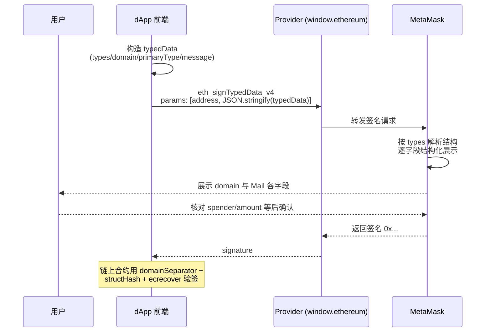

# 06 · 结构化签名（EIP-712 / signTypedData_v4）

> EIP-712 让钱包把签名内容以结构化、可读的字段展示出来，替代 personal_sign 的"不透明字符串"盲签；domain 里的 chainId 与 verifyingContract 还能防止跨链/跨合约重放。是 Permit（ERC-2612）等 gasless 授权的基础。

## 📖 知识讲解

**为什么需要 EIP-712？** `personal_sign` 签的是一整段字符串，用户看不出它到底对应什么操作，很容易被诱导盲签。EIP-712 把要签的数据定义成**有类型的结构体**，钱包据此把每个字段解析出来、逐项展示给用户，让人"看得懂自己在签什么"。

**typedData 的四大组成部分**：

- **`types`**：所有结构体的字段定义。其中**必须包含 `EIP712Domain`**（描述 domain 的字段）；此外是你自己的业务结构体（示例中的 `Person`、`Mail`）。
- **`domain`**：签名的"作用域"，一般含 `name`、`version`、`chainId`、`verifyingContract`。
  - **`chainId` + `verifyingContract` 是防重放的关键**：一份签名只对指定链、指定合约有效，攻击者无法把它拿到别的链或别的合约上重放。
- **`primaryType`**：本次签名的主结构体名（示例是 `'Mail'`）。
- **`message`**：实际数据。

**调用方式**：`eth_signTypedData_v4`，参数顺序 **`[address, JSON字符串]`**。

> ⚠️ 第二个参数必须是 `JSON.stringify(typedData)` 之后的**字符串**，不是对象！注意这个顺序（地址在前）与 `personal_sign`（消息在前）正好相反。

**Permit（ERC-2612）与 gasless 授权**：传统 ERC-20 授权要发一笔 `approve` 交易、花 Gas。Permit 用 EIP-712 签名代替这笔交易：用户离线签一个包含 `owner / spender / value / nonce / deadline` 的结构，任何人（通常是 dApp/中继）把这个签名连同操作一起提交上链，合约在 `permit()` 里验签后直接完成授权——用户本人**无需为授权花 Gas**。正因如此，Permit 也成了钓鱼重灾区。

## 🔄 流程图 / 原理图

## 💻 代码说明

`index.html` 的核心逻辑：

- `buildTypedData(chainId)`：构造官方经典 **Mail 示例**（`from`/`to` 是 `Person`，加 `contents`）。`types` 里带 `EIP712Domain`，`domain.chainId` 用当前链动态填入。
- `signTyped()`：调用 `eth_signTypedData_v4`，`params: [currentAccount, JSON.stringify(typedData)]`。
- `connect()`：连接后用 `eth_chainId`（十六进制）`parseInt(_, 16)` 转成十进制填入 `domain.chainId`。
- `provider.on('chainChanged', ...)`：切链时同步更新 `domain.chainId`，保证签名始终绑定当前链。
- 页面上直接把 `typedData` 以 JSON 展示，方便对照钱包弹窗里的字段。

## ▶️ 运行方式

1. 浏览器安装 [MetaMask](https://metamask.io/) 并切到 Sepolia（chainId 11155111 = 0xaa36a7）。
2. 用浏览器打开本目录的 `index.html`。
3. 点「连接 MetaMask」→ 预览 typedData → 点「结构化签名」→ **在钱包弹窗里逐字段核对** domain 和 Mail 内容后确认。
4. 观察返回的签名（`0x...`）。此操作不上链、不花 Gas。

## ⚠️ 常见坑 / 安全提示

- **params 顺序 / 类型**：`eth_signTypedData_v4` 是 `[address, JSON字符串]`，第二个参数要 `JSON.stringify`，别传对象、别写反顺序。
- **`types` 必须含 `EIP712Domain`**：漏了钱包会报错。
- **`domain.chainId` 用当前链**：写死了 chainId 可能与用户当前网络不符导致验签失败，或留下跨链重放隐患。
- **EIP-712 钓鱼（重点）**：结构化 ≠ 安全。`Permit`/`approve` 类授权签名可能被诱导——攻击者把 `spender` 设成自己、`value` 设成无限额度（`2^256-1`）。**即使字段是可读的，也必须逐项核对 spender 是谁、amount 是否无限、deadline 多久**。
- **签名同样有价值**：一个 Permit 签名等于一次链上授权，泄露即可能被盗币。不认识的站点让你签授权，一律拒绝。

## 🔗 官方文档

- MetaMask - Sign data（signTypedData_v4）：https://docs.metamask.io/wallet/how-to/sign-data/
- EIP-712 Typed structured data hashing and signing：https://eips.ethereum.org/EIPS/eip-712
- EIP-2612 Permit（gasless 授权）：https://eips.ethereum.org/EIPS/eip-2612
- MetaMask JSON-RPC API 参考：https://docs.metamask.io/wallet/reference/json-rpc-methods/
