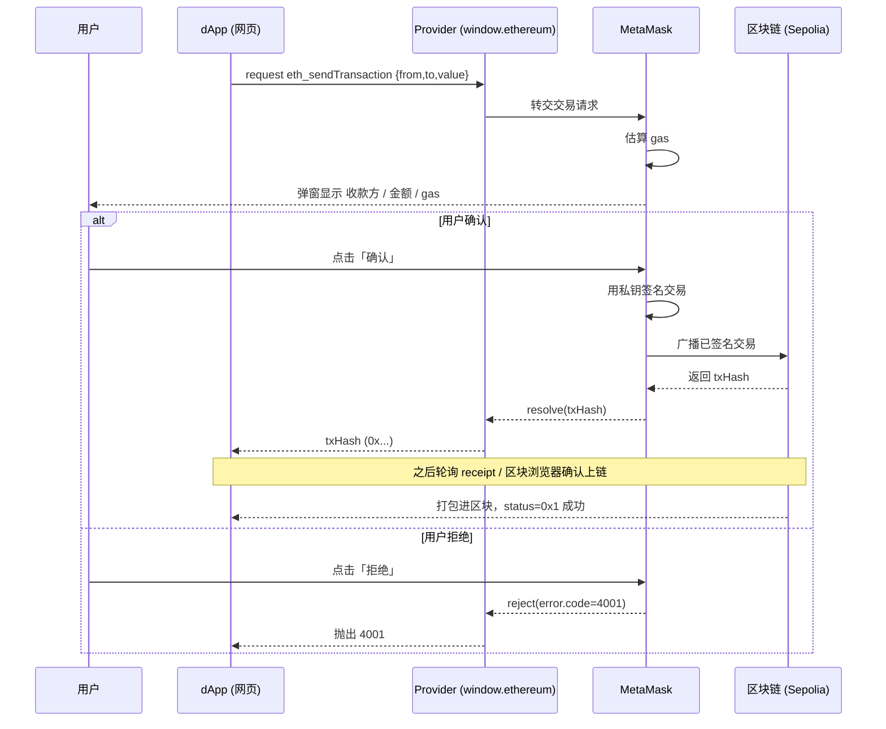

# 07 · 通过钱包发送交易（Send Transaction）

> 用 `eth_sendTransaction` 让 MetaMask 代替 dApp 完成签名与广播，用户在弹窗确认金额和 gas，dApp 只拿到一个交易哈希 `txHash`。

## 📖 知识讲解

前面几个模块（连接、读账户、签名）大多是**只读**或**离线签名**，不会改变链上状态。发交易则是**写操作**，它会真正花掉链上的 ETH（这里是 Sepolia 测试币）。

**为什么是钱包发，而不是 dApp 发？**
dApp 运行在网页里，**没有也不应该拿到用户的私钥**。交易必须用私钥签名才能被网络接受。于是流程被拆开：

- dApp 负责「组装交易参数」并调用 `provider.request({ method: 'eth_sendTransaction', params: [tx] })`；
- MetaMask 负责「估算 gas → 弹窗给用户看 → 用户确认后用私钥签名 → 广播到网络」；
- 返回值是 `txHash`（`0x` 开头的 66 位十六进制）。

**交易对象 `tx` 的字段：**

| 字段 | 说明 |
| --- | --- |
| `from` | 发起地址，必须是当前连接的账户 |
| `to` | 收款地址（转账）或合约地址（调用合约） |
| `value` | 金额，**十六进制的 wei**。1 ETH = 1e18 wei |
| `gas` | 可选，gas limit。不填则 MetaMask 自动估算 |
| `data` | 可选，调用合约时的 calldata。纯转账留空 |
| `maxFeePerGas` / `maxPriorityFeePerGas` | 可选，EIP-1559 手续费上限，一般交给钱包 |

**`value` 怎么算？** 例如 0.001 ETH：`0.001 * 1e18 = 1000000000000000` wei，转十六进制得 `0x38d7ea4c68000`。本页用 `BigInt` 做字符串换算，避免 JS 浮点精度丢失。

**`eth_sendTransaction` vs `eth_call`：**

- `eth_call`：只读地「模拟执行」一次调用，立即返回结果，不上链、不花钱、不弹窗。用于读合约。
- `eth_sendTransaction`：真正上链，改变状态，花 gas，需要用户弹窗确认。

**拿到 `txHash` 之后 ≠ 交易成功。** 此刻交易只是「已广播进内存池」，还没被打包。要确认结果：

- 轮询 `eth_getTransactionReceipt`：返回 `null` 表示还没上链；返回对象后看 `status`（`0x1` 成功、`0x0` 失败）。
- 或直接把 `txHash` 拼到区块浏览器：`https://sepolia.etherscan.io/tx/<txHash>`。

## 🔄 流程图 / 原理图

## 💻 代码说明

- **强制校验网络**：只有「已连接 + `chainId === 0xaa36a7`」时「发送交易」按钮才可用，避免误发到主网。
- **`ethToHexWei()`**：用字符串补齐 18 位小数再交给 `BigInt`，把 ETH 金额安全转成十六进制 wei。
- **`eth_sendTransaction`**：`params` 是「一个数组，里面装一个交易对象」，别写成直接传对象。
- **`pollReceipt()`**：拿到 `txHash` 后每 3 秒轮询一次回执，演示「广播 ≠ 上链」。
- **错误处理**：捕获 `error.code === 4001`（用户拒绝），其余错误打印 `message`。

## ▶️ 运行方式

1. 浏览器安装 MetaMask，切到 **Sepolia 测试网**，并领取一些测试币（搜索「Sepolia faucet」）。
2. 直接用浏览器打开本目录的 `index.html`（双击即可，无需服务器）。
3. 点「连接钱包」→ 若不在 Sepolia 点「切换到 Sepolia」。
4. 确认收款地址（默认填成你自己）和金额（默认 0.0001）→ 点「发送交易」→ 在 MetaMask 弹窗确认。
5. 观察日志里的 `txHash`、区块浏览器链接以及回执状态。

## ⚠️ 常见坑 / 安全提示

- **只用测试网**：本页写死校验 Sepolia。真实资产操作前务必反复确认网络。
- **发送前核对 `to` 和 `value`**：恶意/被劫持的 dApp 可能偷偷把收款地址或金额改掉。**永远以 MetaMask 弹窗显示的内容为准**，弹窗才是最后一道防线。
- **警惕 `data` 字段**：纯转账 `data` 应为空。若一个「转账」却带着一大段 `data`，可能是在偷偷调用合约（如授权代币），要高度警惕。
- **`value` 单位是 wei 且为十六进制**：写错单位可能多转 1e18 倍，测试网也要养成好习惯。
- **广播 ≠ 成功**：`txHash` 只代表已提交，`status=0x0` 说明上链但执行失败（gas 照扣）。

## 🔗 官方文档

- MetaMask Provider API：https://docs.metamask.io/wallet/reference/provider-api/
- `eth_sendTransaction` 参考：https://docs.metamask.io/wallet/reference/json-rpc-methods/eth_sendtransaction/
- EIP-1193（Provider 规范）：https://eips.ethereum.org/EIPS/eip-1193
- Sepolia 区块浏览器：https://sepolia.etherscan.io/
