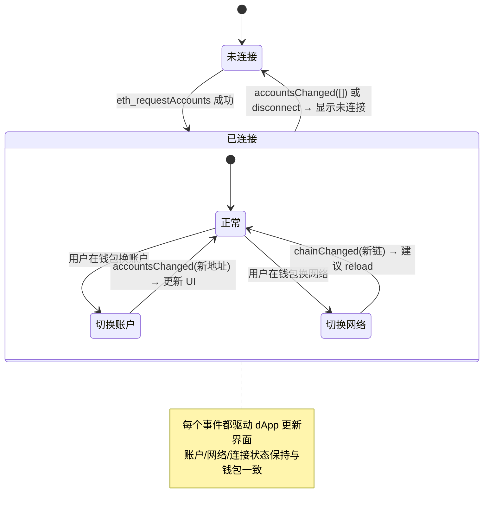

# 08 · 监听 Provider 事件（Provider Events）

> 用户随时可能在钱包里换账户、换网络或断开，dApp 通过 `provider.on(...)` 监听 EIP-1193 事件来实时同步 UI，而不是只在连接那一刻读一次。

## 📖 知识讲解

**为什么必须监听？**
连接钱包时你调用一次 `eth_requestAccounts` / `eth_chainId`，读到的只是「那一刻」的账户和网络。但用户完全可以在你不知情的情况下：

- 在 MetaMask 里切换到另一个账户；
- 从 Sepolia 切到主网（或反过来）；
- 在「已连接的网站」里点断开，或直接锁定钱包。

如果 dApp 不监听这些变化，就会拿着**过期的账户/网络**继续工作——查错余额、把交易发到错误的链上。所以正确做法是：连接后立刻注册事件监听，让 UI 随钱包状态变化。

**EIP-1193 定义的常用事件：**

| 事件 | 回调参数 | 含义与要点 |
| --- | --- | --- |
| `accountsChanged` | `accounts: string[]` | 账户变化。**空数组 `[]` = 用户断开/锁定**，要按「未连接」处理 |
| `chainChanged` | `chainId: string` | 网络变化。**官方建议收到后 `window.location.reload()`**，清空旧链状态 |
| `connect` | `{ chainId }` | Provider 首次能与某条链通信时触发 |
| `disconnect` | `error` | 与链断开（通常是网络中断），参数是 error 对象 |

**绑定与解绑：**
- `provider.on(event, handler)` 绑定；
- `provider.removeListener(event, handler)` 解绑，**必须传入同一个函数引用**才能解绑成功。所以要把 handler 独立命名，别用匿名函数。
- 在 SPA（React/Vue）里，组件卸载时一定要 `removeListener`，否则回调越堆越多，造成内存泄漏和重复响应。

> 关于 `chainChanged` 为什么建议 reload：切链后，之前读取的余额、合约地址、nonce 等都可能失效，直接刷新是最省心、最不容易出错的做法。本演示为了方便你连续观察事件，故意**不 reload**，只在日志里提示。

## 🔄 流程图 / 原理图

## 💻 代码说明

- **独立命名的 handler**：`onAccountsChanged` / `onChainChanged` / `onConnect` / `onDisconnect` 单独定义，这样 `removeListener` 能用同一引用解绑。
- **空数组判断**：`accountsChanged` 收到 `[]` 时按「断开」处理，把界面重置为未连接。
- **`chainChanged`**：更新界面并在日志里**提示**生产环境应 `reload`（演示里不真的刷新）。
- **`registerListeners` / `removeListeners`**：一键绑定、一键解绑，直观演示生命周期管理。

## ▶️ 运行方式

1. 浏览器安装 MetaMask。
2. 用浏览器直接打开本目录的 `index.html`。
3. 点「连接钱包并注册监听」。
4. **去 MetaMask 插件里操作**：切换账户、切换网络（Sepolia ↔ 主网）、在「已连接的网站」断开本站。
5. 回到本页观察日志里事件是否实时触发、账户/网络是否同步更新。
6. 点「解绑所有监听」后再操作，验证事件不再触发。

## ⚠️ 常见坑 / 安全提示

- **别只读一次**：只在连接时读账户/网络、之后不监听，是最常见的 bug 来源。
- **空数组别当异常**：`accountsChanged([])` 是正常的「断开」信号，不是错误。
- **`removeListener` 要用同一引用**：用匿名箭头函数绑定就无法解绑，务必用具名函数。
- **SPA 记得清理**：组件卸载不解绑 = 内存泄漏 + 事件重复触发。
- **`chainChanged` 后状态失效**：切链后旧余额、旧合约地址都可能不对，生产环境按官方建议 `reload` 最稳妥。

## 🔗 官方文档

- MetaMask Provider API（事件）：https://docs.metamask.io/wallet/reference/provider-api/
- EIP-1193（Events 规范）：https://eips.ethereum.org/EIPS/eip-1193
- MetaMask「监听事件」指南：https://docs.metamask.io/wallet/how-to/manage-networks/
